# Punto 1: Configuración de Jenkins, Docker y Kubernetes

## Resumen

Este documento describe la configuración del entorno de desarrollo para el proyecto CircleGuard, que incluye:

- **Jenkins**: servidor de CI/CD para orquestar pipelines de construcción y despliegue.
- **Docker**: containerización de los 6 microservicios seleccionados mediante Dockerfiles multi-stage.
- **Kubernetes**: clúster de Docker Desktop para el despliegue de los servicios e infraestructura.

Los 6 microservicios seleccionados son:

| Servicio | Puerto | Dependencias clave |
|---|---|---|
| `circleguard-file-service` | 8085 | Ninguna |
| `circleguard-gateway-service` | 8087 | Redis, JWT |
| `circleguard-dashboard-service` | 8084 | PostgreSQL |
| `circleguard-form-service` | 8086 | PostgreSQL, Kafka |
| `circleguard-notification-service` | 8082 | Kafka, SMTP |
| `circleguard-promotion-service` | 8088 | PostgreSQL, Neo4j, Redis, Kafka |

## 1. Configuración de Jenkins

Jenkins se ejecuta como un contenedor Docker standalone fuera del clúster de Kubernetes, lo que le permite:
- Construir imágenes Docker usando el daemon del host.
- Desplegar en Kubernetes usando el kubeconfig del host.

### 1.1 Arrancar Jenkins

La imagen oficial `jenkins/jenkins:lts` no incluye los binarios de `docker` ni `kubectl`, por lo que se usa un Dockerfile personalizado (`jenkins/Dockerfile`) que los instala sobre la imagen base.

**Construir la imagen personalizada** (desde la raíz del repositorio):

```bash
docker build -t circleguard/jenkins:latest jenkins/
```

**Preparar el kubeconfig para el contenedor** (cambia el server a `kubernetes.docker.internal` y desactiva la verificación TLS, ya que el certificado del API server de Docker Desktop no incluye `host.docker.internal` en sus SANs):

```bash
python3 -c "
import json, subprocess
result = subprocess.run(['kubectl', 'config', 'view', '--raw', '-o', 'json'], capture_output=True, text=True)
config = json.loads(result.stdout)
for cl in config.get('clusters', []):
    cl['cluster']['server'] = 'https://kubernetes.docker.internal:6443'
    cl['cluster']['insecure-skip-tls-verify'] = True
    cl['cluster'].pop('certificate-authority-data', None)
config['current-context'] = 'docker-desktop'
import json as j; open('/tmp/jenkins-kubeconfig','w').write(j.dumps(config, indent=2))
"
```

**Levantar el contenedor:**

```bash
docker run -d \
  --name jenkins \
  -p 8080:8080 \
  -p 50000:50000 \
  -v jenkins_home:/var/jenkins_home \
  -v /var/run/docker.sock:/var/run/docker.sock \
  --group-add 0 \
  -v /tmp/jenkins-kubeconfig:/var/jenkins_home/.kube/config:ro \
  circleguard/jenkins:latest
```

Los volúmenes y flags cumplen las siguientes funciones:

| Volumen / flag | Propósito |
|---|---|
| `jenkins_home` | Persistencia de configuración, jobs y plugins |
| `/var/run/docker.sock` | Acceso al Docker daemon del host para construir imágenes |
| `--group-add 0` | Agrega al usuario `jenkins` el grupo root (GID 0), requerido porque Docker Desktop Mac expone el socket con ese GID dentro del contenedor |
| `jenkins-kubeconfig` | Kubeconfig del host con dirección `host.docker.internal` para llegar al API de K8s desde el contenedor |

Obtener la contraseña inicial de administrador:

```bash
docker exec jenkins cat /var/jenkins_home/secrets/initialAdminPassword
```

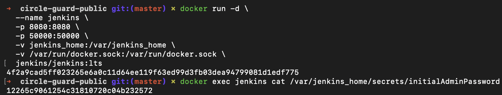

### 1.2 Configuración inicial del wizard

1. Abrir `http://localhost:8080` en el navegador.
2. Ingresar la contraseña obtenida en el paso anterior.

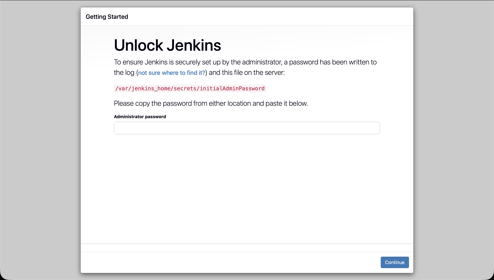

3. Seleccionar **"Install suggested plugins"** para instalar los plugins recomendados.

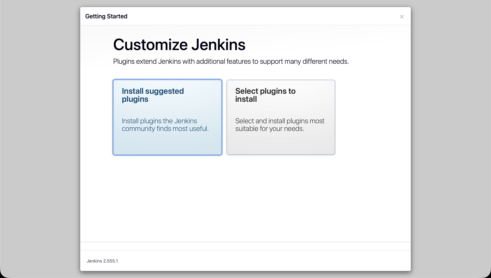

4. Crear el usuario administrador con las credenciales deseadas.

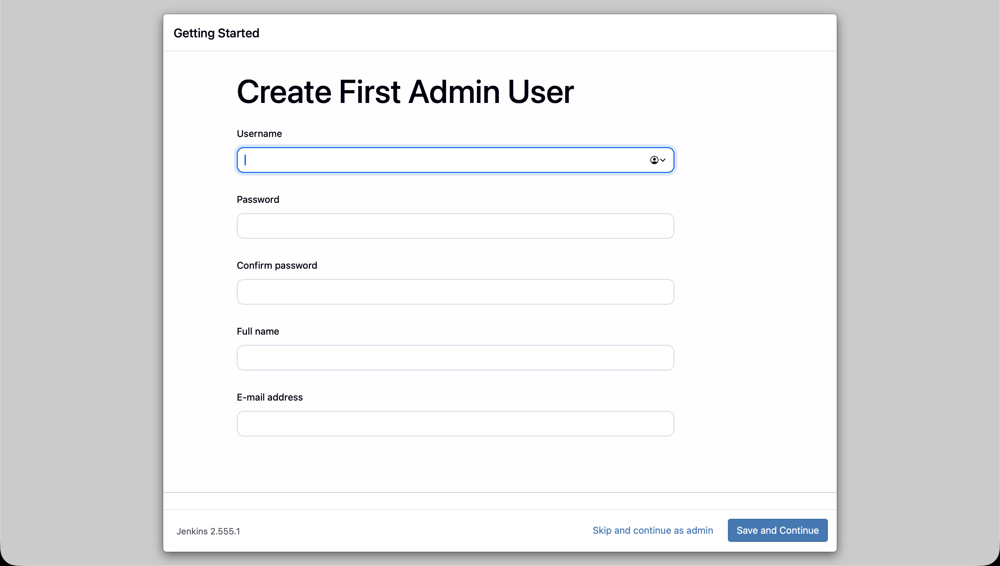

5. Confirmar la URL de Jenkins (`http://localhost:8080`) y finalizar el wizard.

### 1.3 Instalar plugins adicionales

Ir a **Manage Jenkins → Plugins → Available plugins** y buscar e instalar los siguientes plugins:

| Plugin | Función |
|---|---|
| `Docker Pipeline` | Permite construir y publicar imágenes Docker desde un Jenkinsfile |
| `Kubernetes CLI` | Proporciona acceso a `kubectl` en los pipelines |

> **Nota:** Git, Pipeline, Pipeline Stage View y sus dependencias ya se instalan automáticamente al seleccionar "Install suggested plugins" en el wizard.

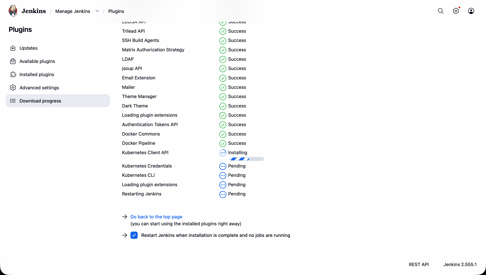

### 1.4 Verificar acceso a Docker y Kubernetes desde Jenkins

```bash
# Verificar que Jenkins puede ejecutar comandos Docker
docker exec jenkins docker ps

# Verificar que Jenkins puede conectarse al clúster de Kubernetes
docker exec jenkins kubectl get nodes
```

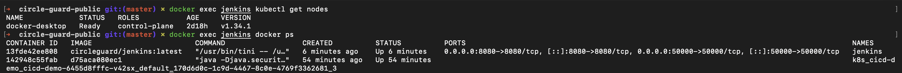

---

## 2. Dockerfiles — Containerización de los microservicios

### 2.1 Estrategia multi-stage

Cada uno de los 6 microservicios tiene su propio `Dockerfile` en su directorio (`services/<nombre>/Dockerfile`).

Todos siguen la misma estrategia **multi-stage**:

**Etapa 1 — builder** (`eclipse-temurin:21-jdk-alpine`):
- Copia el monorepo completo (necesario porque Gradle necesita ver todos los subproyectos).
- Ejecuta `./gradlew :services:<nombre>:bootJar -x test --no-daemon` para producir el JAR ejecutable.

**Etapa 2 — runtime** (`eclipse-temurin:21-jre-alpine`):
- Imagen final mínima (~200 MB vs ~600 MB con Debian).
- Copia únicamente el JAR generado.
- Ejecuta como usuario no-root (`appuser`) por seguridad.
- Expone el puerto del servicio.

El **contexto de build siempre es la raíz del repositorio** porque `settings.gradle.kts` y `build.gradle.kts` residen ahí y Gradle debe poder ver todos los módulos del monorepo.

### 2.2 Construir las imágenes

Desde la raíz del repositorio (el punto es importante — indica el contexto de build):

```bash
docker build -t circleguard/file-service:latest \
  -f services/circleguard-file-service/Dockerfile .

docker build -t circleguard/gateway-service:latest \
  -f services/circleguard-gateway-service/Dockerfile .

docker build -t circleguard/dashboard-service:latest \
  -f services/circleguard-dashboard-service/Dockerfile .

docker build -t circleguard/form-service:latest \
  -f services/circleguard-form-service/Dockerfile .

docker build -t circleguard/notification-service:latest \
  -f services/circleguard-notification-service/Dockerfile .

docker build -t circleguard/promotion-service:latest \
  -f services/circleguard-promotion-service/Dockerfile .
```

### 2.3 Verificar las imágenes construidas

```bash
docker images | grep circleguard
```

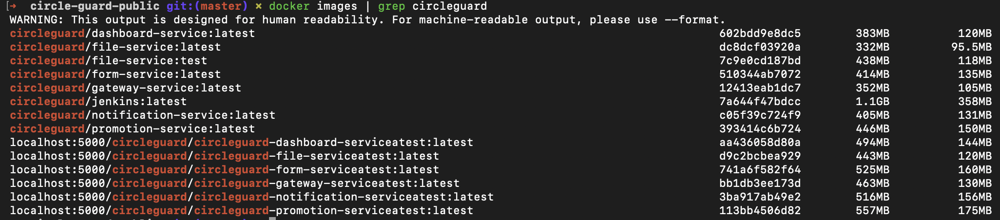

### 2.4 Uso con Docker Compose

El archivo `docker-compose.yml` en la raíz del repositorio unifica toda la infraestructura (PostgreSQL, Neo4j, Kafka, Redis, OpenLDAP, MailHog) y los 6 microservicios en un único stack:

```bash
# Levantar todo (construye las imágenes automáticamente si no existen)
docker compose up --build -d

# Solo construir imágenes sin levantar
docker compose build
```

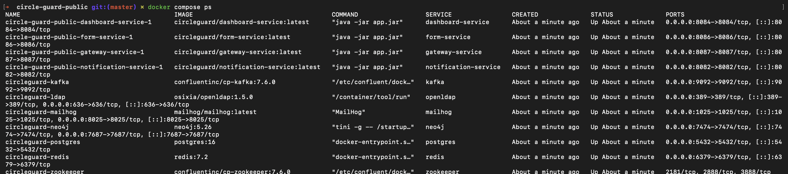

---

## 3. Kubernetes — Despliegue en el clúster de Docker Desktop

### 3.1 Estructura de los manifests

Los manifests de Kubernetes están organizados en `k8s/`:

```
k8s/
├── 00-namespace.yml              # Namespace "circleguard"
├── infra/
│   ├── 01-configmap.yml          # Variables de entorno no-secretas
│   ├── 02-secrets.yml            # Contraseñas y claves (base64)
│   ├── 03-postgres.yml           # PostgreSQL 16 + init-db.sql
│   ├── 04-neo4j.yml              # Neo4j 5.26 con plugin APOC
│   ├── 05-zookeeper.yml          # Zookeeper (requerido por Kafka)
│   ├── 06-kafka.yml              # Apache Kafka 7.6
│   ├── 07-redis.yml              # Redis 7.2
│   └── 08-mailhog.yml            # MailHog (SMTP de desarrollo)
└── services/
    ├── 09-file-service.yml
    ├── 10-gateway-service.yml
    ├── 11-dashboard-service.yml
    ├── 12-form-service.yml
    ├── 13-notification-service.yml
    └── 14-promotion-service.yml
```

### 3.2 Aplicar los manifests al clúster

```bash
# Asegurarse de usar el contexto de Docker Desktop
kubectl config use-context docker-desktop

# Crear el namespace primero
kubectl apply -f k8s/00-namespace.yml

# Desplegar la infraestructura (en orden numérico)
kubectl apply -f k8s/infra/

# Esperar a que la infraestructura esté lista antes de desplegar servicios
kubectl wait --for=condition=ready pod -l app=postgres -n circleguard --timeout=120s
kubectl wait --for=condition=ready pod -l app=neo4j -n circleguard --timeout=120s

# Desplegar los 6 microservicios
kubectl apply -f k8s/services/
```

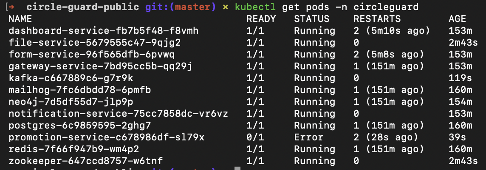

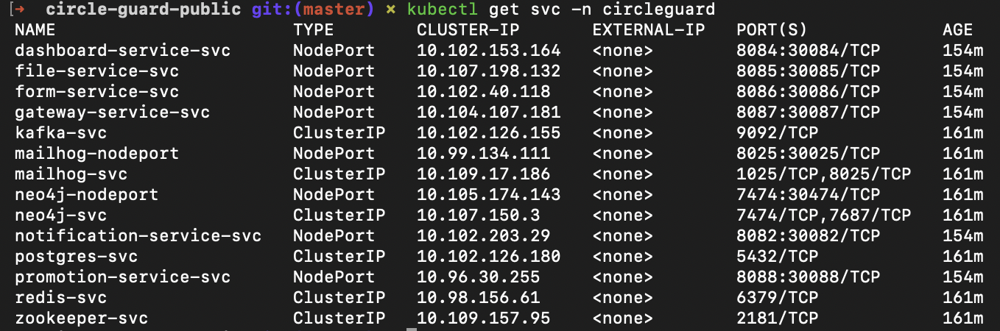

### 3.3 Verificación de la infraestructura

**PostgreSQL — verificar las bases de datos creadas:**

```bash
kubectl exec -n circleguard deploy/postgres -- psql -U admin -d postgres -c "\l"
```

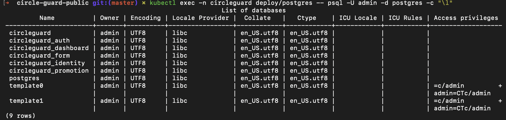

**Neo4j Browser:**

Abrir en el navegador: `http://localhost:30474`
- Usar credenciales: `neo4j` / `password`

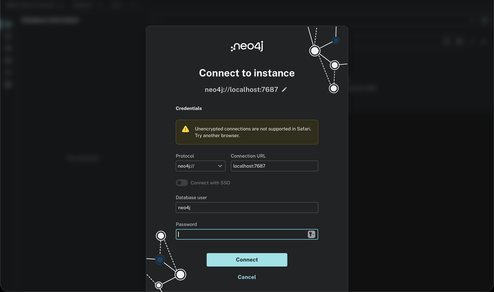

**MailHog UI — verificar el servidor SMTP de desarrollo:**

Abrir en el navegador: `http://localhost:30025`

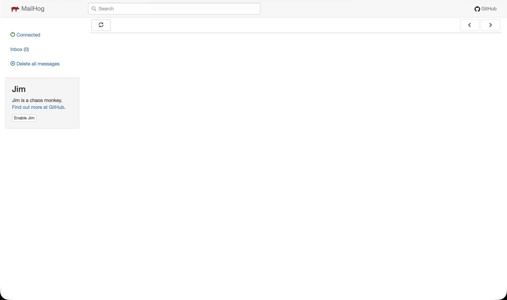

### 3.4 Verificación de los microservicios

Desde el host, verificar que cada microservicio responde via sus NodePorts:

```bash
curl -s -o /dev/null -w "file-service:       %{http_code}\n" http://localhost:30085/
curl -s -o /dev/null -w "gateway-service:    %{http_code}\n" http://localhost:30087/
curl -s -o /dev/null -w "dashboard-service:  %{http_code}\n" http://localhost:30084/
curl -s -o /dev/null -w "form-service:       %{http_code}\n" http://localhost:30086/
curl -s -o /dev/null -w "notification-svc:   %{http_code}\n" http://localhost:30082/
curl -s -o /dev/null -w "promotion-service:  %{http_code}\n" http://localhost:30088/
```

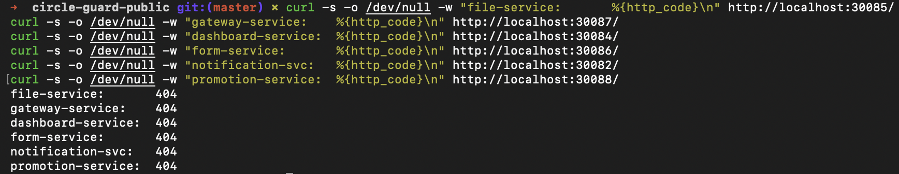

