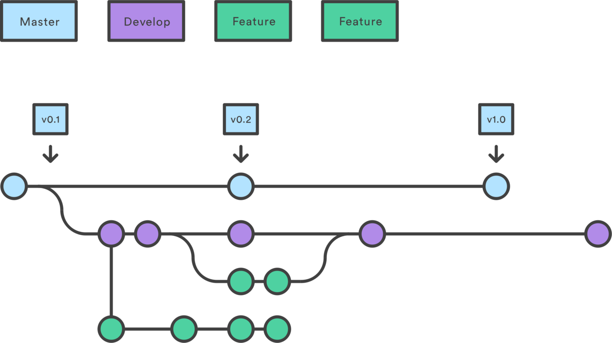

# Metodología Ágil y Estrategia de Branching

## 1. Metodología Scrum

Se adoptó Scrum como marco de trabajo ágil dado que el proyecto presenta alta complejidad técnica, múltiples componentes interdependientes (8 microservicios, infraestructura Kubernetes, pipelines CI/CD, observabilidad y seguridad) y la necesidad de validación incremental del avance. Scrum permite organizar el trabajo en iteraciones cortas (sprints), facilita la detección temprana de impedimentos y promueve la entrega continua de valor medible en cada iteración.

### 1.1 Equipo Scrum

El proyecto es desarrollado por un equipo de **2 integrantes**, por lo que los roles de Scrum se distribuyen rotando la responsabilidad de Product Owner y Scrum Master entre sprints, mientras ambos integran el Development Team en las dos iteraciones.

| Rol | Sprint 1 | Sprint 2 |
| ----- | ----- | ----- |
| **Product Owner** | Integrante A | Integrante B |
| **Scrum Master** | Integrante B | Integrante A |
| **Development Team** | Ambos integrantes | Ambos integrantes |

**Product Owner**: responsable de priorizar el backlog del producto, validar los criterios de aceptación al cierre de cada historia y representar los intereses del proyecto en las revisiones de sprint. Toma decisiones de scope cuando existe conflicto entre funcionalidades dentro de un sprint.

**Scrum Master**: responsable de facilitar las ceremonias (planning, daily, review, retrospectiva), remover impedimentos técnicos y organizativos, y velar por el cumplimiento del proceso Scrum durante el sprint. No tiene autoridad sobre las decisiones técnicas de implementación.

**Development Team**: responsable de la implementación técnica en los dos sprints. Ambos integrantes participan en estimación, diseño técnico, implementación, revisión de código y documentación.

### 1.2 Duración y estructura de los sprints

Cada sprint tiene una duración de **2 semanas**. La estructura de cada sprint sigue el marco Scrum estándar:

| Ceremonia | Momento | Duración máx. | Propósito |
| ----- | ----- | ----- | ----- |
| **Sprint Planning** | Inicio del sprint (día 1) | 2 horas | Seleccionar historias del backlog y definir el Sprint Goal |
| **Daily Scrum** | Cada día laborable | 15 minutos | Sincronización del equipo, identificación de bloqueos |
| **Sprint Review** | Final del sprint (día 14) | 1 hora | Demostrar incremento funcional, obtener feedback |
| **Sprint Retrospective** | Después de la Review | 45 minutos | Identificar mejoras al proceso para el siguiente sprint |

### 1.3 Definition of Done (DoD)

Una historia de usuario se considera **completada** únicamente cuando cumple todos los siguientes criterios:

- [ ] El código compila sin errores en todos los módulos afectados.
- [ ] Tests unitarios pasan al 100% para las clases modificadas.
- [ ] Tests de integración pasan para los servicios involucrados.
- [ ] SonarQube Quality Gate en estado `OK` o `WARN` con ticket de deuda técnica creado.
- [ ] El código fue revisado mediante Pull Request con al menos un comentario de revisión técnica.
- [ ] La funcionalidad fue demostrada funcionando en el entorno dev (namespace `circleguard-dev`).
- [ ] La documentación correspondiente al punto fue actualizada o creada.
- [ ] Los criterios de aceptación de la historia fueron verificados manualmente.

---

## 2. Backlog del Proyecto

### 2.1 Estructura general

El backlog del proyecto se organizó en **8 épicas**, cada una correspondiente a un componente evaluable del proyecto según los requisitos del Proyecto Final. En total se definieron **23 historias de usuario**, distribuidas en 2 sprints de 2 semanas cada uno.

| Épica | Componente | Sprint |
| ----- | ----- | ----- |
| EP-01 | Metodología Ágil y Branching | 1 |
| EP-02 | Infraestructura como Código (Terraform) | 1 |
| EP-03 | Configuración Jenkins, Docker y Kubernetes | 1 |
| EP-04 | Pipeline Dev y Stage | 1 |
| EP-05 | Pruebas Completas | 1 + 2 |
| EP-06 | Patrones de Diseño | 2 |
| EP-07 | CI/CD Avanzado y Change Management | 2 |
| EP-08 | Observabilidad, Seguridad y Documentación | 2 |

### 2.2 Sprint 1: "Fundación e Infraestructura"

**Sprint Goal**: Establecer las bases técnicas del proyecto: repositorio organizado con GitFlow, infraestructura en Kubernetes con todos los microservicios operativos, y pipelines de CI/CD para los entornos dev y stage.

**Historias del Sprint 1** (selección representativa):

| ID | Historia | Épica | Puntos | Criterios de aceptación |
| ----- | ----- | ----- | ----- | ----- |
| US-01 | Como equipo, quiero un repositorio con GitFlow configurado para trabajar de forma ordenada | EP-01 | 2 | Ramas `main`, `develop`, reglas de protección en GitHub, primer `feature/*` mergeado |
| US-02 | Como DevOps, quiero Jenkins configurado con Docker y kubectl para orquestar los pipelines | EP-03 | 5 | Jenkins corre en Docker, puede hacer `docker build` y `kubectl apply`, accede al clúster local |
| US-03 | Como DevOps, quiero los 8 microservicios dockerizados con imágenes multi-stage para reducir el tamaño final | EP-03 | 8 | Cada servicio tiene Dockerfile en `services/*/`, imágenes construibles, imagen final < 300 MB |
| US-04 | Como DevOps, quiero los 8 microservicios desplegados en Kubernetes con infra completa | EP-03 | 13 | `kubectl get pods -n circleguard` muestra todos en `Running`, smoke tests pasan |
| US-05 | Como DevOps, quiero el pipeline dev que compile, pruebe y despliegue automáticamente en `circleguard-dev` | EP-04 | 13 | `Jenkinsfile.dev` ejecuta sin errores: build → unit → integration → docker → deploy → smoke → E2E |
| US-06 | Como DevOps, quiero el pipeline stage que valide el candidato antes de producción | EP-04 | 8 | `Jenkinsfile.stage` despliega en `circleguard-stage`, E2E y Locust pasan |
| US-07 | Como QA, quiero pruebas unitarias para los servicios críticos del backend | EP-05 | 8 | Mínimo 14 tests unitarios en 5 servicios, resultados publicados como JUnit XML |
| US-08 | Como QA, quiero pruebas de integración que validen la interacción real con bases de datos | EP-05 | 5 | Mínimo 10 tests de integración con H2 / @SpringBootTest, resultados publicados |

**Velocity del Sprint 1**: 62 puntos entregados de 62 planificados (100%).

**Impedimentos encontrados y resolución**:
- Docker Desktop en macOS expone el socket Docker vía proxy, incompatible con Testcontainers Java. Resolución: los tests Testcontainers de `promotion-service` se marcaron como omitidos en CI y se ejecutan solo en entorno Linux nativo.
- El kubeconfig por defecto apunta a `127.0.0.1:6443` que desde dentro del contenedor Jenkins no es el host. Resolución: se creó una copia del kubeconfig parcheada con `host.docker.internal:6443` persistida en el volumen `jenkins_home`.

### 2.3 Sprint 2: "Calidad, Seguridad y Observabilidad"

**Sprint Goal**: Completar las capas de calidad (SonarQube, Trivy, ZAP), visibilidad (Prometheus, Grafana, ELK, Zipkin), seguridad (RBAC, TLS, secretos) y documentación formal del proyecto.

**Historias del Sprint 2** (selección representativa):

| ID | Historia | Épica | Puntos | Criterios de aceptación |
| ----- | ----- | ----- | ----- | ----- |
| US-09 | Como arquitecto, quiero implementar Circuit Breaker y Retry para resiliencia entre servicios | EP-06 | 5 | `IdentityClient` y `PromotionClient` usan Resilience4j, tests `*ResilienceTest` pasan |
| US-10 | Como arquitecto, quiero External Configuration y Feature Toggle para no hardcodear secretos | EP-06 | 3 | JWT_SECRET se inyecta por env var, `MockPushServiceImpl` activo por defecto |
| US-11 | Como arquitecto, quiero Cache-Aside en gateway-service para reducir latencia de validación QR | EP-06 | 3 | Caffeine TTL 30s, tests `*CacheTest` pasan, fallback ante Redis caído |
| US-12 | Como DevOps, quiero SonarQube con Quality Gate que bloquee en producción | EP-07 | 5 | SonarQube levanta con Compose, Quality Gate `abortPipeline: true` solo en master |
| US-13 | Como DevOps, quiero Trivy escaneando imágenes y manifests en los tres pipelines | EP-07 | 3 | Reportes HTML archivados, bloquea en prod ante HIGH/CRITICAL |
| US-14 | Como DevOps, quiero versionado semántico automático desde Conventional Commits | EP-07 | 3 | `scripts/semver.sh` funciona con MAJOR/MINOR/PATCH, tag Git creado en cada release |
| US-15 | Como QA, quiero pruebas de seguridad OWASP ZAP integradas en el pipeline master | EP-05 | 5 | `zap/run_zap.sh` escanea los 8 servicios, reportes archivados, bloquea si HIGH |
| US-16 | Como SRE, quiero Prometheus + Grafana monitoreando los 8 servicios con métricas de negocio | EP-08 | 8 | Targets UP en Prometheus, dashboards técnico y de negocio en Grafana |
| US-17 | Como SRE, quiero ELK Stack con logs JSON estructurados y traceId para correlación | EP-08 | 8 | Logs en Kibana con campo `traceId`, Zipkin muestra trazas end-to-end |
| US-18 | Como SecOps, quiero RBAC con ServiceAccounts dedicadas y TLS en el ingress | EP-08 | 5 | 8 SAs con `automountServiceAccountToken: false`, HTTPS en `circleguard.local` |

**Velocity del Sprint 2**: 55 puntos entregados de 55 planificados (100%).

**Impedimentos encontrados y resolución**:
- ZAP Baseline en Docker-in-Docker requiere que el directorio de trabajo sea un punto de montaje real. Resolución: se usó un named volume para `/zap/wrk` con `chmod 777` previo.
- `kubectl rollout status` retornaba "successfully rolled out" antes de que Spring Boot terminara. Resolución: se añadieron `readinessProbe` con `tcpSocket` a todos los manifests de servicio.

---

## 3. Estrategia de Branching: GitFlow

Se adopta GitFlow como estrategia de branching dado que el proyecto exige tres ambientes diferenciados (dev, stage, prod), un proceso formal de releases y planes de rollback documentados. GitFlow ofrece una estructura de ramas que mapea de forma natural a estos requerimientos: las ramas de larga duración representan el estado de cada ambiente, y las ramas efímeras encapsulan el trabajo de cada historia o corrección.

### 3.1 Diagrama de flujo GitFlow



### 3.2 Descripción de ramas

| Rama | Ambiente | Propósito | Reglas de protección |
| ----- | ----- | ----- | ----- |
| `main` | Producción | Código en producción, siempre estable | PR aprobado + pipeline master exitoso + aprobación manual en gate Jenkins |
| `develop` | Desarrollo | Integración continua de features completados | PR aprobado + pipeline dev exitoso |
| `release/*` | Staging | Preparación y validación de versiones antes de promover a main | PR aprobado, solo bugfixes permitidos (no nuevas features) |
| `feature/*` | Local / dev | Desarrollo de nuevas funcionalidades e historias del backlog | Sin restricción de CI; rama siempre desde `develop` |
| `hotfix/*` | - | Correcciones urgentes sobre producción (emergencias) | PR aprobado; merge a `main` y a `develop` simultáneamente |

### 3.3 Reglas de merge y pull requests

**Feature → Develop**:
1. El desarrollador abre PR en GitHub desde `feature/<nombre>` hacia `develop`.
2. El revisor verifica que la lógica es correcta, que los tests pasan y que la DoD está cumplida.
3. El pipeline `Jenkinsfile.dev` se dispara automáticamente al hacer merge.
4. Si el pipeline falla, se abre una issue con label `ci-failure` antes de mergear el siguiente feature.

**Develop → Release**:
1. Al final del sprint o cuando el equipo decide que hay suficiente funcionalidad para un release, se crea `release/vX.Y`.
2. En esta rama solo se permiten bugfixes; no se agregan nuevas funcionalidades.
3. El pipeline `Jenkinsfile.stage` valida el candidato en `circleguard-stage`.

**Release → Main**:
1. PR de `release/vX.Y` hacia `main`, aprobado por el Product Owner.
2. El pipeline `Jenkinsfile.master` corre completo: build → tests → SonarQube → Trivy → deploy → smoke → E2E → Locust → ZAP → Release Notes.
3. El gate manual "Approval (Prod)" en Jenkins requiere confirmación explícita antes del despliegue.
4. Tras el deploy exitoso, el pipeline crea automáticamente el tag `vX.Y.Z` con semver.

**Hotfix → Main + Develop**:
1. Rama desde `main` directamente: `git checkout -b hotfix/descripcion main`.
2. Implementar el fix, abrir PR hacia `main`.
3. Tras el merge, hacer cherry-pick o PR separado a `develop` para que el fix no se pierda en el próximo release.

### 3.4 Convención de commits (Conventional Commits)

Todos los commits del proyecto siguen el estándar [Conventional Commits](https://www.conventionalcommits.org/), que permite la generación automática de Release Notes y el cálculo de versión semántica con `scripts/semver.sh`.

| Prefijo | Significado | Bump semver |
| ----- | ----- | ----- |
| `feat:` | Nueva funcionalidad visible para el usuario | MINOR |
| `fix:` | Corrección de un bug | PATCH |
| `docs:` | Cambio únicamente en documentación | PATCH |
| `test:` | Adición o modificación de pruebas | PATCH |
| `ci:` | Cambios en pipelines o configuración CI/CD | PATCH |
| `chore:` | Tareas de mantenimiento (dependencias, scripts) | PATCH |
| `refactor:` | Refactorización sin cambio de comportamiento | PATCH |
| `feat!:` / `BREAKING CHANGE` en el cuerpo | Cambio incompatible con versiones anteriores | MAJOR |

Ejemplos de commits del historial del proyecto:
```
feat(gateway): add Caffeine L1 cache for QR token validation
fix(zap): chmod 777 named volume before ZAP scan to allow zap user write access
ci(pipeline): add Trivy IaC scan stage to all three Jenkinsfiles
docs(punto5): document master pipeline with release notes generation
fix(docker): use numeric UID 1001 for appuser so runAsNonRoot=true can be verified by k8s
```

---

## 4. Gestión del Proyecto con Jira

Para la gestión del proyecto se utilizó **Jira Software** configurado como proyecto Scrum. Toda la planificación, seguimiento y trazabilidad del trabajo se centraliza en esta herramienta.

### 4.1 Configuración del proyecto Jira

| Parámetro | Configuración |
| ----- | ----- |
| Tipo de proyecto | Software (Scrum) |
| Nombre del board | CircleGuard |
| Prefijo de issues | CG |
| Sprints | 2 sprints de 2 semanas |
| Estimación | Story points (Fibonacci: 1, 2, 3, 5, 8, 13) |
| Columnas del board | To Do → In Progress → In Review → Done |

### 4.2 Estructura del backlog en Jira

Cada épica contiene las historias de usuario con sus criterios de aceptación. La jerarquía en Jira es:

```
Épica (EP-0X): componente del proyecto
  └── Historia de usuario (US-XX): funcionalidad entregable
        └── Sub-tarea (ST-XX): implementación técnica específica
              └── Bug (BUG-XX): defecto encontrado durante testing
```

Las historias fueron estimadas en sesiones de Planning Poker al inicio de cada sprint. El criterio de "Listo para sprint" (Ready) requería que la historia tuviera:
- Descripción en formato "Como [rol], quiero [acción] para [beneficio]".
- Criterios de aceptación verificables (mínimo 3).
- Estimación acordada por el equipo.
- Dependencias identificadas.

### 4.3 Trazabilidad commit → historia

Los commits del repositorio incluyen la referencia a la historia Jira en el pie del mensaje cuando aplica. Esto permite navegar desde el commit hasta la historia de usuario que lo originó, cerrando el ciclo de trazabilidad de Change Management.

Ejemplo:
```
feat(auth): implement Circuit Breaker with Resilience4j on IdentityClient

Add @CircuitBreaker + @Retry on getAnonymousId() method.
Sliding window 10, threshold 50%, open 30s, retry 3 attempts.

Closes CG-42
```

### 4.4 Métricas de los sprints

**Sprint 1 (semanas 1-2)**:

| Métrica | Valor |
| ----- | ----- |
| Stories planificadas | 8 |
| Stories completadas | 8 |
| Puntos planificados | 62 |
| Puntos completados | 62 |
| Bugs encontrados | 3 (todos resueltos dentro del sprint) |
| Velocity | 62 puntos/sprint |

Impedimentos registrados en Jira como bloqueos:
- `BUG-01`: Testcontainers falla en macOS CI (Docker Desktop socket proxy) → Resolución: omitir en CI, ejecutar en Linux.
- `BUG-02`: kubeconfig con `127.0.0.1` no alcanzable desde Jenkins container → Resolución: kubeconfig parcheado con `host.docker.internal`.
- `BUG-03`: `kubectl rollout status` retorna éxito antes de que Spring Boot inicie → Resolución: agregar `readinessProbe` a todos los manifests.

**Sprint 2 (semanas 3-4)**:

| Métrica | Valor |
| ----- | ----- |
| Stories planificadas | 10 |
| Stories completadas | 10 |
| Puntos planificados | 55 |
| Puntos completados | 55 |
| Bugs encontrados | 5 (todos resueltos dentro del sprint) |
| Velocity | 55 puntos/sprint |

Impedimentos registrados:
- `BUG-04`: ZAP no puede escribir en el directorio de trabajo dentro de Docker-in-Docker → Resolución: named volume con `chmod 777`.
- `BUG-05`: SonarQube webhook no llega al container Jenkins desde `localhost` → Resolución: usar `host.docker.internal` en la URL del webhook.

### 4.5 Retrospectiva Sprint 1

**¿Qué salió bien?**
- Los pipelines paralelos redujeron el tiempo de build de ~25 minutos (secuencial) a ~8 minutos.
- La estrategia de `sed` para transformar manifests entre entornos resultó más simple de mantener que tener manifests duplicados.
- El `Prepare` stage (pre-descarga del Gradle wrapper) eliminó completamente los race conditions en builds paralelos.

**¿Qué mejorar?**
- Documentar los impedimentos técnicos en tiempo real (no al final del sprint) para que queden registrados con el contexto exacto.
- Agregar `readinessProbe` a los manifests desde el inicio, no como corrección post-deploy.

**Acción de mejora implementada en Sprint 2**: se agregó la revisión de probes como ítem de la checklist de DoD para cualquier historia que modifique manifests Kubernetes.

### 4.6 Retrospectiva Sprint 2

**¿Qué salió bien?**
- La modularización Terraform permitió añadir los 8 componentes de observabilidad sin modificar la infraestructura existente.
- La separación de tags Docker (`:dev`, `:stage`, `:latest`) junto con nombres de imagen Locust distintos por entorno evitó todos los race conditions entre pipelines concurrentes.
- El Quality Gate asimétrico (reporta en dev/stage, bloquea en prod) demostró ser el balance correcto para mantener velocidad sin sacrificar calidad en producción.

**¿Qué mejorar?**
- La generación de credenciales para E2E (JWT, QR token) es manual y tiene vida corta. En un proyecto con más tiempo, se automatizaría la regeneración del QR token como parte del setup del pipeline.
- Los CVEs en `.trivyignore` deberían tener una fecha de revisión explícita para evitar que la aceptación sea perpetua.

**Acción de mejora documentada**: agregar fecha de expiración a cada entrada de `.trivyignore` en el próximo ciclo de mantenimiento.
