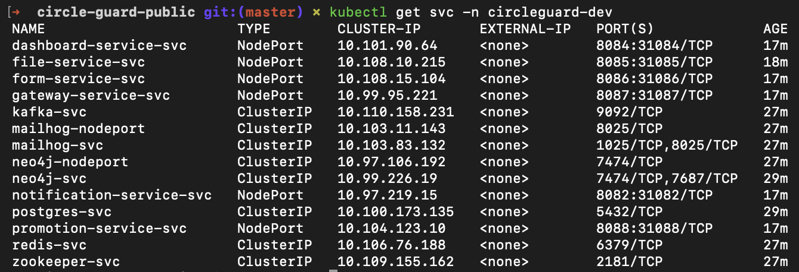

# Punto 2: Pipeline de Desarrollo (Dev Environment)

## Resumen

Este documento describe el pipeline de CI/CD para el entorno de desarrollo del proyecto CircleGuard. El pipeline (`Jenkinsfile.dev`) se configura como un **Multibranch Pipeline** en Jenkins, lo que permite que cada branch del repositorio tenga su propio pipeline aislado con historial de builds independiente.

El pipeline ejecuta las siguientes etapas para los 6 microservicios seleccionados:

| # | Etapa | Tipo | Servicios involucrados | Estrategia |
|---|---|---|---|---|
| 1 | Checkout | Secuencial | — | `checkout scm` + `chmod +x gradlew` |
| 2 | Prepare | Secuencial | — | `./gradlew --version` para pre-descargar el wrapper |
| 3 | Build JARs | Paralelo | 6 | `bootJar -x test --no-daemon` |
| 4 | Unit Tests | Paralelo | 6 | `@WebMvcTest` / MockMvc / Mockito + JUnit XML |
| 5 | Integration Tests | Paralelo | 1 (promotion) | Testcontainers con Neo4j y Redis |
| 6 | Docker Build `:dev` | Paralelo | 6 | `docker build`, tag `:dev`, contexto raíz |
| 7 | Deploy Dev | Secuencial | 6 + infra | `kubectl apply` con `sed` para namespace e imagen |
| 8 | Smoke Tests | Secuencial | 6 | `curl` a NodePorts 30082–30088 |
| 9 | E2E Tests | Placeholder | — | Implementado en Punto 3 |
| 10 | Performance Tests | Placeholder | — | Implementado en Punto 3 |

---

## 1. Namespace de Desarrollo

### 1.1 Separación de entornos

El entorno de desarrollo se despliega en el namespace `circleguard-dev`, completamente aislado del namespace de producción `circleguard`. Esto garantiza que los builds del pipeline no afecten el entorno principal.

| Atributo | Producción | Desarrollo |
|---|---|---|
| Namespace | `circleguard` | `circleguard-dev` |
| Tag de imagen | `:latest` | `:dev` |
| Origen del build | Manual / docker compose | Pipeline Jenkins |
| NodePorts | 30082–30088 | 30082–30088 (uno a la vez) |
| Manifests | `k8s/infra/` + `k8s/services/` | Mismos manifests, namespace reemplazado con `sed` |

### 1.2 Crear el manifest del namespace dev

El archivo `k8s/00-namespace-dev.yml` define el namespace de desarrollo:

```yaml
apiVersion: v1
kind: Namespace
metadata:
  name: circleguard-dev
```

Para crearlo manualmente:

```bash
kubectl apply -f k8s/00-namespace-dev.yml
kubectl get ns circleguard-dev
```


---

## 2. Configurar el Multibranch Pipeline en Jenkins

### 2.1 ¿Qué es un Multibranch Pipeline?

Un **Multibranch Pipeline** escanea automáticamente el repositorio Git y crea un sub-pipeline por cada branch que contenga el archivo `Jenkinsfile.dev`. Esto permite:

- Builds **aislados por branch**: `master`, `dev`, `feature/*` tienen su propio Stage View e historial.
- **Detección automática**: al crear un nuevo branch con el Jenkinsfile, Jenkins lo descubre en el próximo escaneo y crea el job sin intervención manual.
- **Limpieza automática**: cuando se elimina un branch, Jenkins puede eliminar el sub-pipeline correspondiente (Orphaned Item Strategy).

```
circleguard-dev-pipeline/
├── master    sub-pipeline para el branch master
├── dev       sub-pipeline para el branch dev (si existe)
└── feature/* sub-pipeline por cada feature branch
```

### 2.2 Crear el job en Jenkins

1. Abrir Jenkins en `http://localhost:8080`.
2. Ir a **New Item**.
3. Ingresar el nombre `circleguard-dev-pipeline`.
4. Seleccionar **Multibranch Pipeline** y hacer clic en **OK**.


### 2.3 Configurar Branch Sources

En la pestaña **Branch Sources**:

1. Hacer clic en **Add source** → seleccionar **Git**.
2. Completar los campos:

| Campo | Valor |
|---|---|
| Project Repository | URL del repositorio |
| Credentials | Ninguna para repo local; configurar credenciales si es remoto |

1. En **Behaviours** → **Discover branches** → estrategia: **All branches**.


### 2.4 Configurar Build Configuration

En la pestaña **Build Configuration**:

| Campo | Valor |
|---|---|
| Mode | by Jenkinsfile |
| Script Path | `Jenkinsfile.dev` |

> **Nota:** El Script Path apunta a `Jenkinsfile.dev` (nombre personalizado) en lugar del `Jenkinsfile` convencional. Jenkins buscará este archivo en la raíz de cada branch al escanear.


### 2.5 Guardar y ejecutar el escaneo

1. Hacer clic en **Save**.
2. Jenkins ejecuta automáticamente un **Branch Indexing** (escaneo del repositorio).
3. Se crea un sub-pipeline por cada branch que contenga `Jenkinsfile.dev`.
4. Para forzar un escaneo manual: **Scan Multibranch Pipeline Now**.


---

## 3. Descripción de las Etapas del Pipeline

El pipeline completo se encuentra en `Jenkinsfile.dev` en la raíz del repositorio.

### 3.1 Checkout

```groovy
stage('Checkout') {
    steps {
        checkout scm
        sh 'chmod +x gradlew'
        echo "Branch: ${env.GIT_BRANCH} | Commit: ${env.GIT_COMMIT?.take(8)}"
    }
}
```

`checkout scm` usa la configuración del Multibranch Pipeline para hacer checkout del branch correcto. El `chmod +x gradlew` es necesario porque Jenkins clona el repo sin preservar permisos de ejecución del Gradle wrapper.

### 3.2 Prepare

```groovy
stage('Prepare') {
    steps {
        sh './gradlew --version --no-daemon'
    }
}
```

Descarga `gradle-8.14-bin.zip` una sola vez antes de que los builds paralelos comiencen. Sin esta etapa, los 6 procesos compiten por el lock exclusivo del archivo ZIP y hacen timeout a los 120 segundos. Al ejecutar primero un comando trivial (`--version`) de forma secuencial, el wrapper queda cacheado en `jenkins_home/.gradle/wrapper/dists/` y los builds en paralelo lo encuentran disponible inmediatamente.

### 3.3 Build JARs (paralelo)

```groovy
stage('Build JARs') {
    parallel {
        stage('build:file-service') {
            steps { sh './gradlew :services:circleguard-file-service:bootJar -x test --no-daemon' }
        }
        // ... (5 servicios restantes con la misma estructura)
    }
}
```

Los 6 servicios se compilan en paralelo. Los flags usados son:

| Flag | Razón |
|---|---|
| `:services:<name>:bootJar` | Compila solo el JAR del servicio específico, sin compilar otros módulos innecesarios |
| `-x test` | Omite las pruebas en esta etapa — se ejecutan en etapas dedicadas |
| `--no-daemon` | Evita que el Gradle Daemon quede corriendo en segundo plano dentro del contenedor Jenkins |

El contexto de build es la raíz del repositorio porque `settings.gradle.kts` y todos los módulos están ahí.

### 3.3 Unit Tests (paralelo)

```groovy
stage('Unit Tests') {
    parallel {
        stage('test:file-service') {
            steps { sh './gradlew :services:circleguard-file-service:test --no-daemon' }
            post {
                always {
                    junit allowEmptyResults: true,
                          testResults: 'services/circleguard-file-service/build/test-results/test/*.xml'
                }
            }
        }
        // ... (4 servicios con la misma estructura)
        stage('test:promotion-service') {
            steps {
                sh '''
                    ./gradlew :services:circleguard-promotion-service:test \
                        --tests "com.circleguard.promotion.controller.*" \
                        --tests "com.circleguard.promotion.listener.*" \
                        --tests "com.circleguard.promotion.service.FloorServiceTest" \
                        --tests "com.circleguard.promotion.service.HealthStatusServiceTest" \
                        --tests "com.circleguard.promotion.service.StatusLifecycleTest" \
                        --no-daemon
                '''
            }
        }
    }
}
```

Para 5 de los 6 servicios (file, gateway, dashboard, form, notification), todos los tests existentes son pruebas unitarias que usan `@WebMvcTest`, `MockMvc` y `@MockBean` — no tienen dependencias externas.

El `promotion-service` es la excepción: tiene 3 tests con `@Testcontainers` (`HealthStatusReevaluationTest`, `AdministrativeCorrectionTest`, `PromotionPerformanceTest`) que levantan contenedores Docker reales. Estos se **excluyen explícitamente** de la etapa de Unit Tests mediante filtros `--tests` y se ejecutan en la siguiente etapa.

El bloque `post { always { junit ... } }` publica los resultados XML de JUnit en Jenkins, habilitando el reporte de pruebas en la UI.

### 3.4 Integration Tests (paralelo)

```groovy
stage('Integration Tests') {
    parallel {
        stage('integration:file-service') {
            steps { echo 'Sin tests Testcontainers en file-service — etapa omitida.' }
        }
        // ... (4 servicios sin Testcontainers)
        stage('integration:promotion-service') {
            options { timeout(time: 15, unit: 'MINUTES') }
            steps {
                sh '''
                    ./gradlew :services:circleguard-promotion-service:test \
                        --tests "com.circleguard.promotion.service.HealthStatusReevaluationTest" \
                        --tests "com.circleguard.promotion.service.AdministrativeCorrectionTest" \
                        --tests "com.circleguard.promotion.performance.PromotionPerformanceTest" \
                        --no-daemon
                '''
            }
        }
    }
}
```

Solo `circleguard-promotion-service` tiene Testcontainers como dependencia (`build.gradle.kts`). Al ejecutarse dentro del contenedor Jenkins (que tiene acceso al Docker socket via `-v /var/run/docker.sock:/var/run/docker.sock`), Testcontainers detecta automáticamente el daemon Docker del host y descarga las imágenes necesarias:

| Imagen | Uso |
|---|---|
| `neo4j:5.12` | Grafo de contactos para tests de `HealthStatusReevaluationTest` y `AdministrativeCorrectionTest` |
| `redis:7.2.1` | Caché de sesiones para los mismos tests |

El timeout de 15 minutos es necesario porque `PromotionPerformanceTest` crea hasta 10,000 nodos en Neo4j para simular una cascada de promociones de estado.

Los 5 servicios restantes tienen stages que pasan inmediatamente con un `echo`, manteniendo el paralelismo visual en el Stage View.

### 3.5 Docker Build :dev (paralelo)

```groovy
stage('Docker Build :dev') {
    parallel {
        stage('docker:file-service') {
            steps { sh 'docker build -t ${REGISTRY}/file-service:dev -f services/circleguard-file-service/Dockerfile .' }
        }
        // ... (5 servicios restantes)
    }
}
```

Los 6 servicios se construyen en paralelo con el tag `:dev`. El punto (`.`) al final indica que el contexto de build es la raíz del repositorio — necesario porque los `Dockerfile` multi-stage copian el monorepo completo para que Gradle pueda resolver todas las dependencias.

Las imágenes quedan almacenadas localmente en el daemon Docker del host (sin push a registro externo). La compatibilidad con `imagePullPolicy: Never` en los manifests de K8s garantiza que Kubernetes use exactamente estas imágenes locales.

### 3.6 Deploy Dev (secuencial)

```groovy
stage('Deploy Dev') {
    steps {
        sh '''
            kubectl apply -f k8s/00-namespace-dev.yml

            for f in k8s/infra/*.yml; do
                sed 's/namespace: circleguard$/namespace: circleguard-dev/g' "$f" \
                    | kubectl apply -f -
            done

            kubectl rollout status deployment/postgres -n circleguard-dev --timeout=120s || true
            kubectl rollout status deployment/redis    -n circleguard-dev --timeout=60s  || true
            kubectl rollout status deployment/kafka    -n circleguard-dev --timeout=90s  || true

            for f in k8s/services/*.yml; do
                sed -E \
                    -e 's/namespace: circleguard$/namespace: circleguard-dev/g' \
                    -e 's|image: circleguard/(.*):latest|image: circleguard/\\1:dev|g' \
                    "$f" | kubectl apply -f -
            done

            kubectl get all -n circleguard-dev
        '''
    }
}
```

Esta etapa aplica una **doble transformación con `sed`** sobre los manifests existentes de `k8s/`:

| Transformación | Patrón `sed` | Efecto |
|---|---|---|
| Namespace | `s/namespace: circleguard$/namespace: circleguard-dev/g` | Todos los recursos van al namespace dev |
| Tag de imagen | `s\|image: circleguard/(.*):latest\|image: circleguard/\1:dev\|g` | Los Deployments usan las imágenes `:dev` construidas en la etapa anterior |

El flujo dentro de la etapa es:
1. Crear el namespace `circleguard-dev` (idempotente).
2. Aplicar los manifests de `k8s/infra/` (ConfigMap, Secrets, PostgreSQL, Neo4j, Kafka, Redis, MailHog) al namespace dev.
3. Esperar a que PostgreSQL, Redis y Kafka estén listos antes de desplegar los servicios (los `initContainers` de los services ya hacen esto a nivel de K8s, pero el `rollout status` en el pipeline lo hace explícito y visible).
4. Aplicar los manifests de `k8s/services/` con namespace e imagen reemplazados.
5. Imprimir el resumen de recursos en el namespace dev.

### 3.7 Smoke Tests (secuencial)

```groovy
stage('Smoke Tests') {
    steps {
        sh '''
            kubectl rollout status deployment/file-service -n circleguard-dev --timeout=120s
            // ... (5 rollout status restantes)

            for port_svc in "30085:file-service" ... "30088:promotion-service"; do
                CODE=$(curl -s -o /dev/null -w "%{http_code}" --max-time 10 http://localhost:$PORT/)
                echo "${SVC} (puerto ${PORT}): HTTP ${CODE}"
                if [ "$CODE" = "000" ]; then exit 1; fi
            done
        '''
    }
}
```

Los smoke tests verifican que los 6 servicios están respondiendo después del despliegue:

1. **`kubectl rollout status`**: espera a que cada Deployment alcance el estado `Available`. Los servicios con `initContainers` (promotion, notification) pueden tardar más.
2. **`curl` HTTP**: realiza una petición GET a la raíz de cada servicio vía su NodePort. Los códigos aceptables son:
   - `200 OK` — endpoint raíz configurado
   - `404 Not Found` — Spring Boot inició, pero no hay mapeo en `/`
   - `401 Unauthorized` — Spring Security activo, el servicio está corriendo
   - `000` — **FALLA**: connection refused, el servicio no está respondiendo

### 3.8 E2E Tests y Performance Tests (placeholders)

```groovy
stage('E2E Tests') {
    steps { echo '[TODO - Punto 3] Placeholder: pruebas E2E contra namespace circleguard-dev' }
}
stage('Performance Tests') {
    steps { echo '[TODO - Punto 3] Placeholder: pruebas de rendimiento con Locust contra circleguard-dev' }
}
```

Estas etapas están definidas en el pipeline como placeholders. Se implementarán con pruebas reales en el Punto 3 del taller.

---

## 4. Verificación del Pipeline

### 4.1 Ejecutar el primer build

Después de guardar el Multibranch Pipeline, Jenkins realiza el Branch Indexing automáticamente. Para ejecutar manualmente:

1. Ir al job `circleguard-dev-pipeline`.
2. Seleccionar el branch deseado (ej. `master`).
3. Hacer clic en **Build Now**.

### 4.2 Monitorear el Stage View

El Stage View muestra cada etapa con su estado (verde/rojo) y duración. Las etapas paralelas aparecen en columnas:


### 4.3 Verificar imágenes Docker :dev

```bash
docker images | grep ":dev"
```

Salida esperada:

```
circleguard/file-service         dev   abc123def456   2 minutes ago   187MB
circleguard/gateway-service      dev   def456abc123   2 minutes ago   195MB
circleguard/dashboard-service    dev   123abc456def   2 minutes ago   201MB
circleguard/form-service         dev   456def123abc   2 minutes ago   198MB
circleguard/notification-service dev   789ghi012jkl   2 minutes ago   193MB
circleguard/promotion-service    dev   012jkl789ghi   2 minutes ago   215MB
```


### 4.4 Verificar pods en el namespace dev

```bash
kubectl get pods -n circleguard-dev
```


```bash
kubectl get svc -n circleguard-dev
```



### 4.5 Verificar resultados de pruebas en Jenkins

1. Ir al build → **Test Result**.
2. Los reportes JUnit muestran los resultados por servicio.


### 4.6 Smoke tests manuales desde el host

```bash
curl -s -o /dev/null -w "file-service:        %{http_code}\n" http://localhost:30085/
curl -s -o /dev/null -w "gateway-service:     %{http_code}\n" http://localhost:30087/
curl -s -o /dev/null -w "dashboard-service:   %{http_code}\n" http://localhost:30084/
curl -s -o /dev/null -w "form-service:        %{http_code}\n" http://localhost:30086/
curl -s -o /dev/null -w "notification-svc:    %{http_code}\n" http://localhost:30082/
curl -s -o /dev/null -w "promotion-service:   %{http_code}\n" http://localhost:30088/
```


---