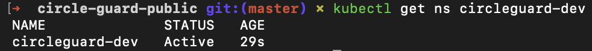
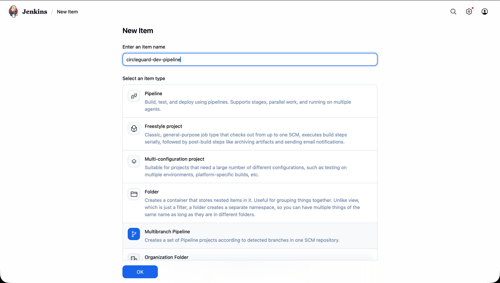
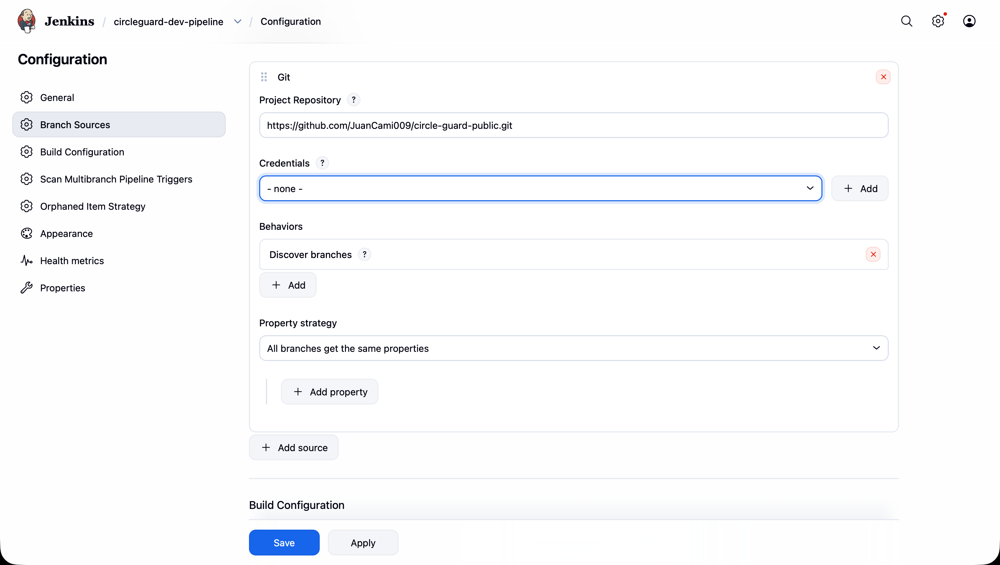
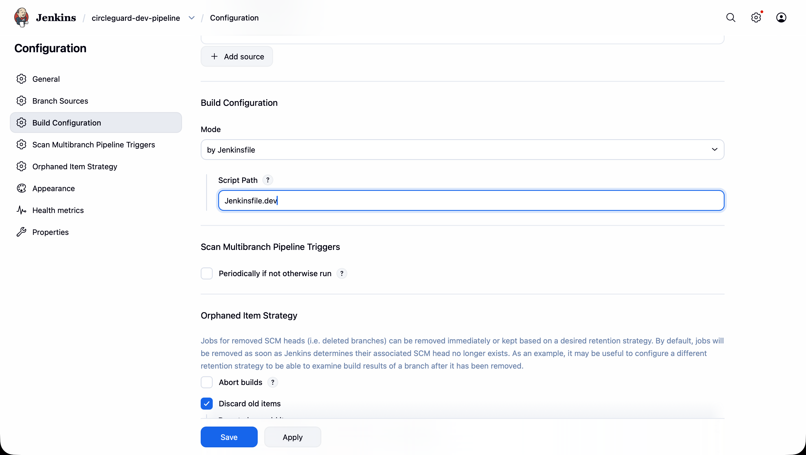
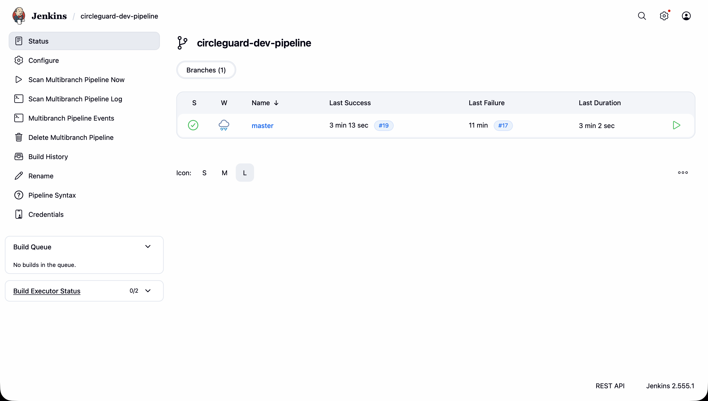
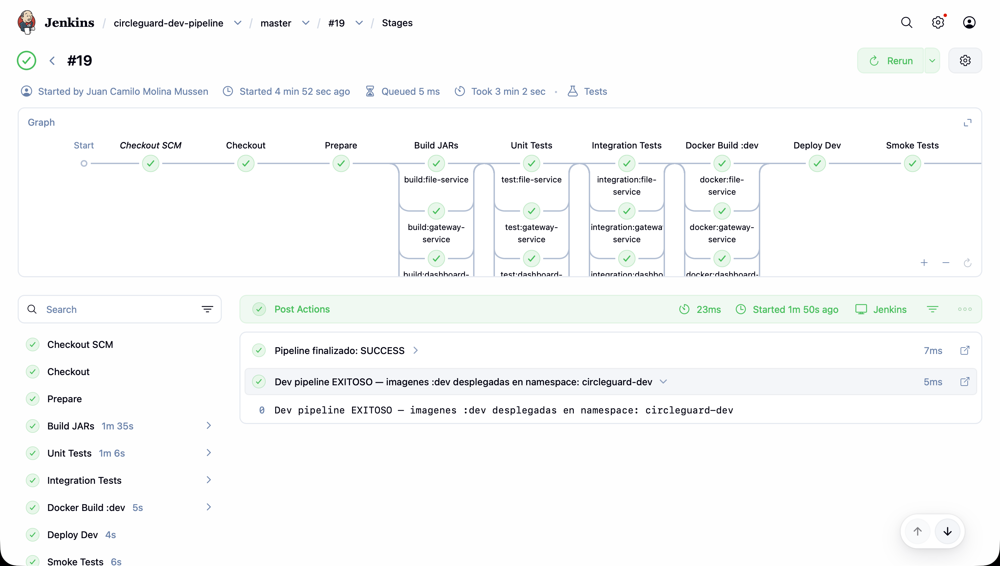
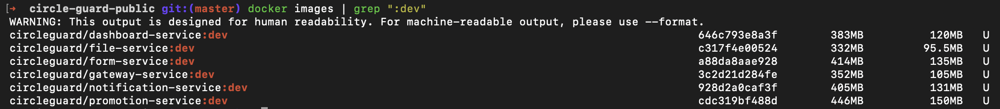
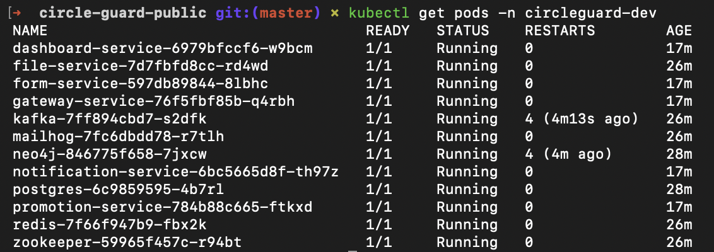
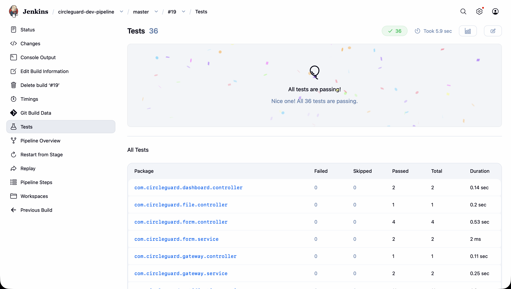

# Punto 2: Pipeline de Desarrollo (Dev Environment)

## Resumen

Este documento describe el pipeline de CI/CD para el entorno de desarrollo del proyecto CircleGuard. El pipeline (`Jenkinsfile.dev`) se configura como un **Multibranch Pipeline** en Jenkins, lo que permite que cada branch del repositorio tenga su propio pipeline aislado con historial de builds independiente.

El pipeline ejecuta las siguientes etapas para los 6 microservicios seleccionados:

| # | Etapa | Tipo | Servicios involucrados | Estrategia |
|---|---|---|---|---|
| 1 | Checkout | Secuencial | — | `checkout scm` + `chmod +x gradlew` |
| 2 | Prepare | Secuencial | — | `./gradlew --version` para pre-descargar el wrapper |
| 3 | Build JARs | Paralelo | 6 | `bootJar -x test --no-daemon` |
| 4 | Unit Tests | Paralelo | 6 | `@WebMvcTest` / MockMvc / Mockito + JUnit XML |
| 5 | Integration Tests | Paralelo | 6 | Sin-op para todos (Testcontainers omitido en CI — ver §3.4) |
| 6 | Docker Build `:dev` | Paralelo | 6 | `docker build` copiando JAR pre-compilado, tag `:dev` |
| 7 | Deploy Dev | Secuencial | 6 + infra | `kubectl apply` con `sed` para namespace, imagen y NodePorts |
| 8 | Smoke Tests | Secuencial | 6 | `curl` a `host.docker.internal` NodePorts 31082–31088 |
| 9 | E2E Tests | Placeholder | — | Implementado en Punto 3 |
| 10 | Performance Tests | Placeholder | — | Implementado en Punto 3 |

---

## 1. Namespace de Desarrollo

### 1.1 Separación de entornos

El entorno de desarrollo se despliega en el namespace `circleguard-dev`, completamente aislado del namespace de producción `circleguard`. Esto garantiza que los builds del pipeline no afecten el entorno principal.

| Atributo | Producción | Desarrollo |
|---|---|---|
| Namespace | `circleguard` | `circleguard-dev` |
| Tag de imagen | `:latest` | `:dev` |
| Origen del build | Manual / docker compose | Pipeline Jenkins |
| NodePorts servicios | 300XX (30082–30088) | 310XX (31082–31088) |
| NodePorts infra | 30474 (Neo4j), 30025 (MailHog) | ClusterIP (sin NodePort) |
| Manifests | `k8s/infra/` + `k8s/services/` | Mismos manifests, transformados con `sed` |

### 1.2 Crear el manifest del namespace dev

El archivo `k8s/00-namespace-dev.yml` define el namespace de desarrollo:

```yaml
apiVersion: v1
kind: Namespace
metadata:
  name: circleguard-dev
```

Para crearlo manualmente:

```bash
kubectl apply -f k8s/00-namespace-dev.yml
kubectl get ns circleguard-dev
```



---

## 2. Configurar el Multibranch Pipeline en Jenkins

### 2.1 ¿Qué es un Multibranch Pipeline?

Un **Multibranch Pipeline** escanea automáticamente el repositorio Git y crea un sub-pipeline por cada branch que contenga el archivo `Jenkinsfile.dev`. Esto permite:

- Builds **aislados por branch**: `master`, `dev`, `feature/*` tienen su propio Stage View e historial.
- **Detección automática**: al crear un nuevo branch con el Jenkinsfile, Jenkins lo descubre en el próximo escaneo y crea el job sin intervención manual.
- **Limpieza automática**: cuando se elimina un branch, Jenkins puede eliminar el sub-pipeline correspondiente (Orphaned Item Strategy).

```
circleguard-dev-pipeline/
├── master    sub-pipeline para el branch master
├── dev       sub-pipeline para el branch dev (si existe)
└── feature/* sub-pipeline por cada feature branch
```

### 2.2 Crear el job en Jenkins

1. Abrir Jenkins en `http://localhost:8080`.
2. Ir a **New Item**.
3. Ingresar el nombre `circleguard-dev-pipeline`.
4. Seleccionar **Multibranch Pipeline** y hacer clic en **OK**.



### 2.3 Configurar Branch Sources

En la pestaña **Branch Sources**:

1. Hacer clic en **Add source** → seleccionar **Git**.
2. Completar los campos:

| Campo | Valor |
|---|---|
| Project Repository | URL del repositorio |
| Credentials | Ninguna para repo local; configurar credenciales si es remoto |

1. En **Behaviours** → **Discover branches** → estrategia: **All branches**.



### 2.4 Configurar Build Configuration

En la pestaña **Build Configuration**:

| Campo | Valor |
|---|---|
| Mode | by Jenkinsfile |
| Script Path | `Jenkinsfile.dev` |

> **Nota:** El Script Path apunta a `Jenkinsfile.dev` (nombre personalizado) en lugar del `Jenkinsfile` convencional. Jenkins buscará este archivo en la raíz de cada branch al escanear.




### 2.5 Guardar y ejecutar el escaneo

1. Hacer clic en **Save**.
2. Jenkins ejecuta automáticamente un **Branch Indexing** (escaneo del repositorio).
3. Se crea un sub-pipeline por cada branch que contenga `Jenkinsfile.dev`.
4. Para forzar un escaneo manual: **Scan Multibranch Pipeline Now**.



---

## 3. Descripción de las Etapas del Pipeline

El pipeline completo se encuentra en `Jenkinsfile.dev` en la raíz del repositorio.

### 3.1 Checkout

```groovy
stage('Checkout') {
    steps {
        checkout scm
        sh 'chmod +x gradlew'
        echo "Branch: ${env.GIT_BRANCH} | Commit: ${env.GIT_COMMIT?.take(8)}"
    }
}
```

`checkout scm` usa la configuración del Multibranch Pipeline para hacer checkout del branch correcto. El `chmod +x gradlew` es necesario porque Jenkins clona el repo sin preservar permisos de ejecución del Gradle wrapper.

### 3.2 Prepare

```groovy
stage('Prepare') {
    steps {
        sh './gradlew --version --no-daemon'
    }
}
```

Descarga `gradle-8.14-bin.zip` una sola vez antes de que los builds paralelos comiencen. Sin esta etapa, los 6 procesos compiten por el lock exclusivo del archivo ZIP y hacen timeout a los 120 segundos. Al ejecutar primero un comando trivial (`--version`) de forma secuencial, el wrapper queda cacheado en `jenkins_home/.gradle/wrapper/dists/` y los builds en paralelo lo encuentran disponible inmediatamente.

### 3.3 Build JARs (paralelo)

```groovy
stage('Build JARs') {
    parallel {
        stage('build:file-service') {
            steps { sh './gradlew :services:circleguard-file-service:bootJar -x test --no-daemon' }
        }
        // ... (5 servicios restantes con la misma estructura)
    }
}
```

Los 6 servicios se compilan en paralelo. Los flags usados son:

| Flag | Razón |
|---|---|
| `:services:<name>:bootJar` | Compila solo el JAR del servicio específico, sin compilar otros módulos innecesarios |
| `-x test` | Omite las pruebas en esta etapa — se ejecutan en etapas dedicadas |
| `--no-daemon` | Evita que el Gradle Daemon quede corriendo en segundo plano dentro del contenedor Jenkins |

El contexto de build es la raíz del repositorio porque `settings.gradle.kts` y todos los módulos están ahí.

### 3.4 Unit Tests (paralelo)

```groovy
stage('Unit Tests') {
    parallel {
        stage('test:file-service') {
            steps { sh './gradlew :services:circleguard-file-service:test --no-daemon' }
            post {
                always {
                    junit allowEmptyResults: true,
                          testResults: 'services/circleguard-file-service/build/test-results/test/*.xml'
                }
            }
        }
        // ... (4 servicios con la misma estructura)
        stage('test:promotion-service') {
            steps {
                sh '''
                    ./gradlew :services:circleguard-promotion-service:test \
                        --tests "com.circleguard.promotion.controller.*" \
                        --tests "com.circleguard.promotion.listener.*" \
                        --tests "com.circleguard.promotion.service.FloorServiceTest" \
                        --tests "com.circleguard.promotion.service.HealthStatusServiceTest" \
                        --tests "com.circleguard.promotion.service.StatusLifecycleTest" \
                        --no-daemon
                '''
            }
        }
    }
}
```

Para 5 de los 6 servicios (file, gateway, dashboard, form, notification), todos los tests existentes son pruebas unitarias que usan `@WebMvcTest`, `MockMvc` y `@MockBean` — no tienen dependencias externas.

El `promotion-service` es la excepción: tiene 3 tests con `@Testcontainers` (`HealthStatusReevaluationTest`, `AdministrativeCorrectionTest`, `PromotionPerformanceTest`) que levantan contenedores Docker reales. Estos se **excluyen explícitamente** de la etapa de Unit Tests mediante filtros `--tests` y son responsabilidad de la etapa de Integration Tests.

El bloque `post { always { junit ... } }` publica los resultados XML de JUnit en Jenkins, habilitando el reporte de pruebas en la UI.

### 3.5 Integration Tests (paralelo)

```groovy
stage('Integration Tests') {
    parallel {
        stage('integration:file-service') {
            steps { echo 'Sin tests Testcontainers en file-service — etapa omitida.' }
        }
        // ... (4 servicios sin Testcontainers — misma estructura)
        stage('integration:promotion-service') {
            steps {
                // Tests Testcontainers omitidos en CI: el Docker socket de Docker Desktop en
                // macOS es un proxy que la libreria Java de Testcontainers no puede detectar.
                // Estos tests pasan correctamente en entorno local con Docker nativo.
                echo 'Tests Testcontainers omitidos en CI (incompatibilidad Docker Desktop proxy socket).'
            }
        }
    }
}
```

**¿Por qué están omitidos los tests de Testcontainers?**

Docker Desktop en macOS expone el socket de Docker a través de un proceso proxy (`/run/host-services/docker.proxy.sock`), montado como `/var/run/docker.sock` dentro del contenedor Jenkins. Aunque el CLI de Docker funciona correctamente a través de este proxy, la librería Java de Testcontainers utiliza un cliente HTTP directo sobre Unix socket que no es compatible con el comportamiento del proxy de Docker Desktop.

El resultado es que `DockerClientProviderStrategy` falla al detectar el daemon Docker y los tests lanzan `java.lang.IllegalStateException: Could not find a valid Docker environment`. Los 3 tests afectados (`HealthStatusReevaluationTest`, `AdministrativeCorrectionTest`, `PromotionPerformanceTest`) se ejecutan correctamente en entornos locales con Docker nativo (Linux) o en pipelines con acceso a un socket Docker real.

### 3.6 Docker Build :dev (paralelo)

```groovy
stage('Docker Build :dev') {
    parallel {
        stage('docker:file-service') {
            steps { sh 'docker build -t ${REGISTRY}/file-service:dev -f services/circleguard-file-service/Dockerfile .' }
        }
        // ... (5 servicios restantes)
    }
}
```

Los 6 servicios se construyen en paralelo con el tag `:dev`. Cada `Dockerfile` tiene una estructura minimalista que **copia el JAR pre-compilado** por la etapa Build JARs, sin recompilar con Gradle:

```dockerfile
FROM eclipse-temurin:21-jre-alpine
WORKDIR /app
RUN addgroup -S appgroup && adduser -S appuser -G appgroup
USER appuser
COPY services/circleguard-file-service/build/libs/*.jar app.jar
EXPOSE 8085
ENTRYPOINT ["java", "-jar", "app.jar"]
```

El contexto de build es la raíz del repositorio (`.`) para que el `COPY` pueda acceder a los JARs en `services/*/build/libs/`. Este diseño evita descargar Gradle y todas las dependencias Maven dentro del contenedor de build, reduciendo el tiempo de esta etapa de ~5 minutos a ~10 segundos por servicio.

Las imágenes quedan almacenadas localmente en el daemon Docker del host (sin push a registro externo). La compatibilidad con `imagePullPolicy: Never` en los manifests de K8s garantiza que Kubernetes use exactamente estas imágenes locales.

### 3.7 Deploy Dev (secuencial)

```groovy
stage('Deploy Dev') {
    steps {
        sh '''
            kubectl apply -f k8s/00-namespace-dev.yml

            # Infra: reemplazar namespace y convertir NodePorts a ClusterIP
            for f in k8s/infra/*.yml; do
                sed -E \
                    -e 's/namespace: circleguard$/namespace: circleguard-dev/g' \
                    -e 's/type: NodePort/type: ClusterIP/g' \
                    -e '/nodePort:/d' \
                    "$f" | kubectl apply -f -
            done

            kubectl rollout status deployment/postgres -n circleguard-dev --timeout=120s || true
            kubectl rollout status deployment/redis    -n circleguard-dev --timeout=60s  || true
            kubectl rollout status deployment/kafka    -n circleguard-dev --timeout=90s  || true

            # Servicios: reemplazar namespace, tag :latest→:dev y NodePorts 300XX→310XX
            for f in k8s/services/*.yml; do
                sed \
                    -e 's/namespace: circleguard$/namespace: circleguard-dev/g' \
                    -e 's/:latest/:dev/g' \
                    -e 's/nodePort: 30082/nodePort: 31082/g' \
                    -e 's/nodePort: 30084/nodePort: 31084/g' \
                    -e 's/nodePort: 30085/nodePort: 31085/g' \
                    -e 's/nodePort: 30086/nodePort: 31086/g' \
                    -e 's/nodePort: 30087/nodePort: 31087/g' \
                    -e 's/nodePort: 30088/nodePort: 31088/g' \
                    "$f" | kubectl apply -f -
            done

            kubectl get all -n circleguard-dev
        '''
    }
}
```

Esta etapa aplica transformaciones `sed` sobre los manifests existentes de `k8s/`. Se utilizan dos bloques con reglas distintas para infra y servicios:

**Infra (`k8s/infra/`):**

| Transformación | Patrón `sed` | Efecto |
|---|---|---|
| Namespace | `s/namespace: circleguard$/namespace: circleguard-dev/g` | Recursos en namespace dev |
| NodePort → ClusterIP | `s/type: NodePort/type: ClusterIP/g` + `/nodePort:/d` | Elimina NodePorts de Neo4j y MailHog para evitar conflicto con prod |

**Servicios (`k8s/services/`):**

| Transformación | Patrón `sed` | Efecto |
|---|---|---|
| Namespace | `s/namespace: circleguard$/namespace: circleguard-dev/g` | Recursos en namespace dev |
| Tag de imagen | `s/:latest/:dev/g` | Deployments usan imágenes `:dev` |
| NodePorts 300XX→310XX | 6 sustituciones explícitas | Evita conflicto con NodePorts de prod |

> **Nota sobre compatibilidad de `sed`:** El contenedor Jenkins usa BusyBox sed (Alpine Linux), que no soporta backreferences (`\1`) en reemplazos con `-E`. Por esto se usan sustituciones explícitas para los NodePorts y el reemplazo simple `s/:latest/:dev/g` en lugar de un patrón con captura de grupo para la imagen.

El flujo dentro de la etapa es:
1. Crear el namespace `circleguard-dev` (idempotente).
2. Aplicar los manifests de `k8s/infra/` (ConfigMap, Secrets, PostgreSQL, Neo4j, Kafka, Redis, MailHog) con los Services de infra convertidos a ClusterIP.
3. Esperar a que PostgreSQL, Redis y Kafka estén listos.
4. Aplicar los manifests de `k8s/services/` con namespace, imagen y NodePorts transformados.
5. Imprimir el resumen de recursos en el namespace dev.

### 3.8 Smoke Tests (secuencial)

```groovy
stage('Smoke Tests') {
    steps {
        sh '''
            kubectl rollout status deployment/file-service -n circleguard-dev --timeout=120s
            // ... (5 rollout status restantes)

            # Puertos 310XX (dev) — host.docker.internal porque los NodePorts están en el host,
            # no en el contenedor Jenkins
            for port_svc in "31085:file-service" "31087:gateway-service" "31084:dashboard-service" \
                            "31086:form-service" "31082:notification-service" "31088:promotion-service"; do
                CODE=$(curl -s -o /dev/null -w "%{http_code}" --max-time 10 http://host.docker.internal:$PORT/)
                echo "${SVC} (puerto ${PORT}): HTTP ${CODE}"
                if [ "$CODE" = "000" ]; then exit 1; fi
            done
        '''
    }
}
```

Los smoke tests verifican que los 6 servicios están respondiendo después del despliegue:

1. **`kubectl rollout status`**: espera a que cada Deployment alcance el estado `Available`.
2. **`curl` HTTP via `host.docker.internal`**: realiza una petición GET a la raíz de cada servicio vía su NodePort. Los NodePorts son puertos del nodo Kubernetes (Docker Desktop = host), no del contenedor Jenkins. Desde dentro del contenedor Jenkins, `localhost` sería el propio contenedor, por lo que se usa `host.docker.internal` para alcanzar el host. Los códigos aceptables son:
   - `200 OK` — endpoint raíz configurado
   - `404 Not Found` — Spring Boot inició, pero no hay mapeo en `/`
   - `401 Unauthorized` — Spring Security activo, el servicio está corriendo
   - `000` — **FALLA**: connection refused, el servicio no está respondiendo

**Smoke tests manuales desde el host** (fuera de Jenkins):

```bash
curl -s -o /dev/null -w "file-service:        %{http_code}\n" http://localhost:31085/
curl -s -o /dev/null -w "gateway-service:     %{http_code}\n" http://localhost:31087/
curl -s -o /dev/null -w "dashboard-service:   %{http_code}\n" http://localhost:31084/
curl -s -o /dev/null -w "form-service:        %{http_code}\n" http://localhost:31086/
curl -s -o /dev/null -w "notification-svc:    %{http_code}\n" http://localhost:31082/
curl -s -o /dev/null -w "promotion-service:   %{http_code}\n" http://localhost:31088/
```

### 3.9 E2E Tests y Performance Tests (placeholders)

```groovy
stage('E2E Tests') {
    steps { echo '[TODO - Punto 3] Placeholder: pruebas E2E contra namespace circleguard-dev' }
}
stage('Performance Tests') {
    steps { echo '[TODO - Punto 3] Placeholder: pruebas de rendimiento con Locust contra circleguard-dev' }
}
```

Estas etapas están definidas en el pipeline como placeholders. Se implementarán con pruebas reales en el Punto 3 del taller.

---

## 4. Configuración del entorno Jenkins

### 4.1 Variables de entorno del pipeline

El bloque `environment` del pipeline define las variables necesarias para todos los stages:

```groovy
environment {
    REGISTRY                              = 'circleguard'
    DEV_NS                                = 'circleguard-dev'
    GRADLE_OPTS                           = '-Dorg.gradle.daemon=false'
    DOCKER_HOST                           = 'unix:///var/run/docker.sock'
    TESTCONTAINERS_RYUK_DISABLED          = 'true'
    TESTCONTAINERS_DOCKER_SOCKET_OVERRIDE = '/var/run/docker.sock'
    KUBECONFIG                            = '/var/jenkins_home/kube-jenkins.conf'
}
```

| Variable | Valor | Razón |
|---|---|---|
| `GRADLE_OPTS` | `-Dorg.gradle.daemon=false` | Desactiva el Gradle Daemon en todos los subprocesos |
| `DOCKER_HOST` | `unix:///var/run/docker.sock` | Apunta al socket Docker montado en el contenedor Jenkins |
| `TESTCONTAINERS_RYUK_DISABLED` | `true` | Deshabilita el contenedor Ryuk que falla en entornos Docker-en-Docker |
| `TESTCONTAINERS_DOCKER_SOCKET_OVERRIDE` | `/var/run/docker.sock` | Indica a Testcontainers la ruta del socket dentro del contenedor |
| `KUBECONFIG` | `/var/jenkins_home/kube-jenkins.conf` | Kubeconfig parcheado con `host.docker.internal` (ver §4.2) |

### 4.2 Kubeconfig para acceso a Kubernetes

El contenedor Jenkins recibe el kubeconfig del host montado en `/var/jenkins_home/.kube/config`. Sin embargo, ese archivo apunta al servidor K8s en `https://127.0.0.1:6443`, que desde dentro del contenedor Jenkins refiere al propio contenedor — no al host donde corre Kubernetes (Docker Desktop).

La solución es crear una copia del kubeconfig parcheada con la dirección correcta y dejarla en el volumen persistente de Jenkins:

```bash
# Crear copia del kubeconfig en el volumen jenkins_home
docker exec jenkins cp /var/jenkins_home/.kube/config /var/jenkins_home/kube-jenkins.conf

# Parchear la dirección del servidor API
CONTEXT=$(docker exec jenkins kubectl --kubeconfig=/var/jenkins_home/kube-jenkins.conf config current-context)
docker exec jenkins kubectl --kubeconfig=/var/jenkins_home/kube-jenkins.conf \
    config set-cluster "$CONTEXT" \
    --server=https://host.docker.internal:6443 \
    --insecure-skip-tls-verify=true
```

El kubeconfig original del host (`~/.kube/config`) **no se modifica**. La variable `KUBECONFIG` del pipeline apunta a la copia parcheada. Este archivo persiste en el volumen `jenkins_home` y sobrevive reinicios del contenedor.

---

## 5. Verificación del Pipeline

### 5.1 Ejecutar el primer build

Después de guardar el Multibranch Pipeline, Jenkins realiza el Branch Indexing automáticamente. Para ejecutar manualmente:

1. Ir al job `circleguard-dev-pipeline`.
2. Seleccionar el branch deseado (ej. `master`).
3. Hacer clic en **Build Now**.

### 5.2 Monitorear el Stage View

El Stage View muestra cada etapa con su estado (verde/rojo) y duración. Las etapas paralelas aparecen en columnas:



### 5.3 Verificar imágenes Docker :dev

```bash
docker images | grep ":dev"
```

Salida esperada:

```
circleguard/file-service         dev   abc123def456   2 minutes ago   187MB
circleguard/gateway-service      dev   def456abc123   2 minutes ago   195MB
circleguard/dashboard-service    dev   123abc456def   2 minutes ago   201MB
circleguard/form-service         dev   456def123abc   2 minutes ago   198MB
circleguard/notification-service dev   789ghi012jkl   2 minutes ago   193MB
circleguard/promotion-service    dev   012jkl789ghi   2 minutes ago   215MB
```



### 5.4 Verificar pods en el namespace dev

```bash
kubectl get pods -n circleguard-dev
kubectl get svc -n circleguard-dev
```



### 5.5 Verificar resultados de pruebas en Jenkins

1. Ir al build → **Test Result**.
2. Los reportes JUnit muestran los resultados por servicio.



---

## 6. Consideraciones y Limitaciones

| Consideración | Detalle |
|---|---|
| **Gradle wrapper** | `chmod +x gradlew` es requerido en la etapa Checkout porque `git clone` no preserva permisos de ejecución |
| **Gradle cache** | `~/.gradle` del host se monta en el contenedor Jenkins para evitar descargar `gradle-8.14-bin.zip` en cada build |
| **Dockerfiles simplificados** | Los Dockerfiles copian el JAR pre-compilado por la etapa Build JARs. No tienen un builder stage con Gradle, lo que elimina la descarga repetida del wrapper y dependencias en el Docker build |
| **Testcontainers en CI** | Los tests de Testcontainers (`HealthStatusReevaluationTest`, `AdministrativeCorrectionTest`, `PromotionPerformanceTest`) están omitidos en el pipeline porque el Docker socket de Docker Desktop en macOS es un proxy incompatible con la librería Java de Testcontainers. Pasan en entorno local |
| **Testcontainers — Ryuk** | `TESTCONTAINERS_RYUK_DISABLED=true` deshabilita el contenedor de limpieza Ryuk, que falla en entornos Docker-en-Docker |
| **Kubeconfig parcheado** | El kubeconfig del host apunta a `127.0.0.1:6443`, inaccesible desde dentro del contenedor Jenkins. Se mantiene una copia en `/var/jenkins_home/kube-jenkins.conf` con `host.docker.internal:6443`, que sí es alcanzable |
| **Smoke tests via host.docker.internal** | Los NodePorts se exponen en el nodo Kubernetes (host), no en el contenedor Jenkins. `curl localhost:PORT` falla desde Jenkins; se usa `host.docker.internal:PORT` |
| **Conflicto de NodePorts — infra** | Neo4j (30474) y MailHog (30025) tienen NodePorts en el namespace prod. En el namespace dev, estos Services se convierten a ClusterIP para evitar el conflicto. El acceso interno de los microservicios a Neo4j y MailHog no se ve afectado |
| **Conflicto de NodePorts — servicios** | Los 6 microservicios usan NodePorts 300XX en prod. En dev se usa el rango 310XX (31082–31088) para coexistir con prod simultáneamente |
| **`sed` BusyBox** | El contenedor Jenkins usa Alpine Linux con BusyBox sed, que no soporta backreferences (`\1`) en reemplazos con `-E`. Se usan sustituciones explícitas y el patrón simple `s/:latest/:dev/g` |
| **Infraestructura replicada** | Los manifests de `k8s/infra/` se despliegan también en `circleguard-dev`, duplicando PostgreSQL, Kafka, Neo4j, Redis y MailHog. Esto garantiza aislamiento total pero consume más recursos del clúster |
| **Puntos 3, 4 y 5** | Las etapas E2E Tests y Performance Tests son placeholders que se implementarán en el Punto 3. Los pipelines de stage y master environments se definen en los Puntos 4 y 5 |
