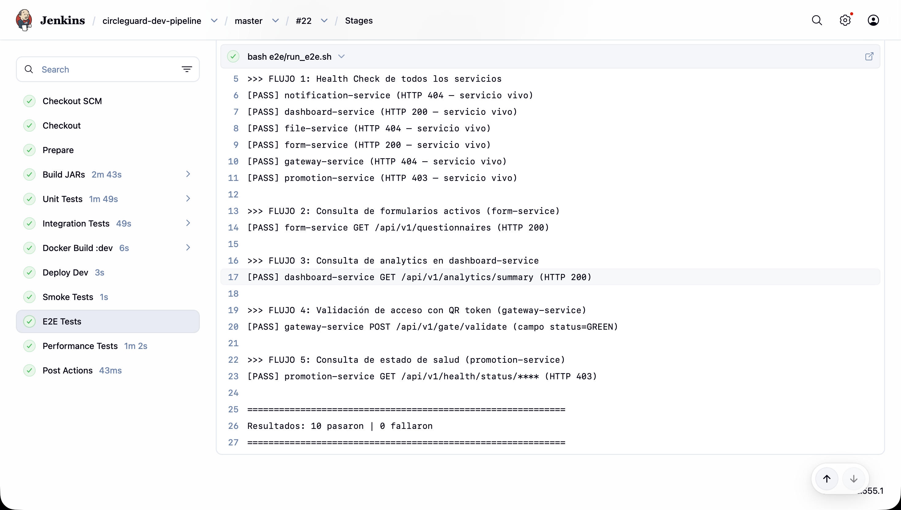
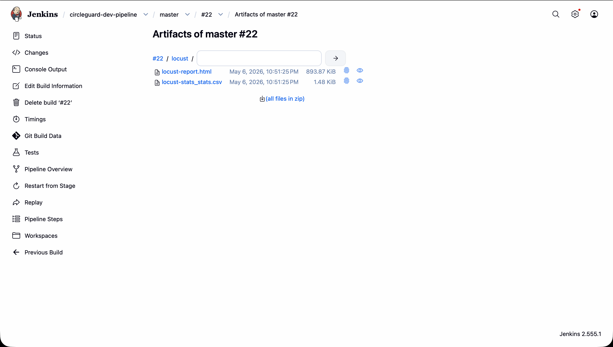
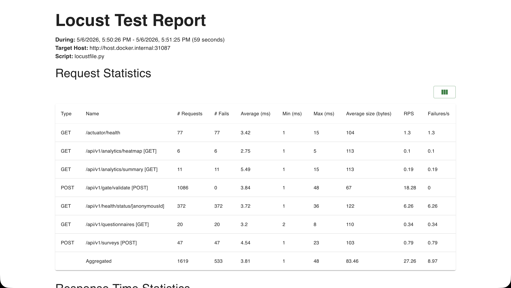

# Punto 3: Pruebas - Unitarias, Integración, E2E y Rendimiento (30%)

## Resumen

Este documento describe todas las pruebas nuevas implementadas para el Punto 3 del Taller 2. Se definen cuatro niveles de prueba distribuidos entre los microservicios seleccionados:

| Tipo | Cantidad | Servicios cubiertos | Herramienta principal |
|---|---|---|---|
| Unitarias | 5 | promotion, auth, notification | JUnit 5 + Mockito |
| Integración | 5 | promotion, notification, gateway, form, identity | JUnit 5 + Testcontainers / @SpringBootTest |
| E2E | 5 flujos | Los 6 servicios del entorno dev | Bash + curl |
| Rendimiento | 4 escenarios | promotion, form, gateway, dashboard | Locust |

### Localización de los nuevos archivos

```
services/
  circleguard-promotion-service/src/test/java/com/circleguard/promotion/
    task/GraphCleanupTaskTest.java                    # Unit
    service/LocationResolutionServiceTest.java        # Unit
    integration/SurveyListenerIntegrationTest.java    # Integración

  circleguard-auth-service/src/test/java/com/circleguard/auth/service/
    JwtTokenServiceTest.java                          # Unit
    QrTokenServiceTest.java                           # Unit

  circleguard-notification-service/src/test/java/com/circleguard/notification/
    service/AuditLogServiceTest.java                  # Unit
    integration/ExposureNotificationIntegrationTest.java  # Integración

  circleguard-gateway-service/src/test/java/com/circleguard/gateway/
    integration/GatewayValidationIntegrationTest.java # Integración

  circleguard-form-service/src/test/java/com/circleguard/form/
    integration/QuestionnaireJpaIntegrationTest.java  # Integración

  circleguard-identity-service/src/test/java/com/circleguard/identity/
    integration/IdentityVaultServiceIntegrationTest.java  # Integración

e2e/
  run_e2e.sh                                          # E2E (5 flujos)

locust/
  locustfile.py                                       # Rendimiento
  locust.conf                                         # Configuración
```

---

## 1. Pruebas Unitarias

Las pruebas unitarias validan componentes individuales en completo aislamiento: sin Spring context, sin base de datos, sin red. Todas siguen el patrón `@ExtendWith(MockitoExtension.class)` con dependencias mockeadas.

### 1.1 GraphCleanupTaskTest

**Archivo**: `services/circleguard-promotion-service/src/test/java/com/circleguard/promotion/task/GraphCleanupTaskTest.java`

**Clase bajo prueba**: `GraphCleanupTask` - scheduler que elimina relaciones `ENCOUNTERED` del grafo Neo4j con más de 14 días de antigüedad (NFR-4: Data Minimization).

| Test | Comportamiento validado |
|---|---|
| `shouldPurgeEncountersOlderThan14Days` | Verifica que `purgeStaleEncounters()` recibe un `threshold` dentro del rango esperado (± tolerancia de ejecución) |
| `shouldNotThrowWhenRepositoryReturnsNull` | El método maneja `null` retornado por el repositorio sin NullPointerException |
| `shouldHandleRepositoryExceptionGracefully` | Una `RuntimeException` del repositorio es capturada internamente - el scheduler no propaga excepciones |

```java
@Test
void shouldPurgeEncountersOlderThan14Days() {
    when(userNodeRepository.purgeStaleEncounters(anyLong())).thenReturn(5L);
    long before = System.currentTimeMillis();

    graphCleanupTask.purgeStaleEncounters();

    ArgumentCaptor<Long> thresholdCaptor = ArgumentCaptor.forClass(Long.class);
    verify(userNodeRepository).purgeStaleEncounters(thresholdCaptor.capture());

    long captured = thresholdCaptor.getValue();
    assertThat(captured)
        .isGreaterThanOrEqualTo(before - FOURTEEN_DAYS_MS)
        .isLessThanOrEqualTo(System.currentTimeMillis() - FOURTEEN_DAYS_MS);
}
```

**Por qué es relevante**: garantiza que la política de retención de 14 días (NFR-4) se aplica correctamente a nivel de llamada al repositorio, y que fallos de Neo4j no interrumpen el scheduler de Spring.

---

### 1.2 JwtTokenServiceTest

**Archivo**: `services/circleguard-auth-service/src/test/java/com/circleguard/auth/service/JwtTokenServiceTest.java`

**Clase bajo prueba**: `JwtTokenService` - genera tokens JWT HS256 que son consumidos por todos los microservicios para autenticación.

| Test | Comportamiento validado |
|---|---|
| `shouldGenerateTokenWithAnonymousIdAsSubject` | El `sub` del JWT es el `UUID` del `anonymousId`, no la identidad real |
| `shouldIncludePermissionsInToken` | Los permisos del `Authentication` se añaden como claim `permissions` |
| `shouldSetExpirationApproximatelyOneHourFromNow` | El campo `exp` está dentro del rango `[now + expiration - ε, now + expiration + ε]` |

```java
@Test
void shouldGenerateTokenWithAnonymousIdAsSubject() {
    UUID anonymousId = UUID.randomUUID();
    Authentication auth = mock(Authentication.class);
    when(auth.getAuthorities()).thenReturn(List.of());

    String token = jwtTokenService.generateToken(anonymousId, auth);

    Claims claims = Jwts.parserBuilder()
        .setSigningKey(verificationKey).build()
        .parseClaimsJws(token).getBody();

    assertThat(claims.getSubject()).isEqualTo(anonymousId.toString());
}
```

**Por qué es relevante**: el `sub` del token es el único identificador que circula entre servicios - garantiza que nunca se filtra la identidad real por error de implementación.

---

### 1.3 QrTokenServiceTest

**Archivo**: `services/circleguard-auth-service/src/test/java/com/circleguard/auth/service/QrTokenServiceTest.java`

**Clase bajo prueba**: `QrTokenService` - genera tokens JWT de corta duración para validación en accesos físicos (portería).

| Test | Comportamiento validado |
|---|---|
| `shouldGenerateTokenWithAnonymousIdAsSubject` | El `sub` del QR token es el `anonymousId` correcto |
| `shouldGenerateANonNullNonEmptyToken` | El token generado no es nulo ni vacío |
| `shouldGenerateExpiredTokenWhenExpirationIsVeryShort` | Un token con expiración de 1 segundo lanza `ExpiredJwtException` tras esperar |
| `shouldGenerateDifferentTokensForSameUser` | Dos llamadas sucesivas producen tokens distintos (diferente `iat`) |

**Por qué es relevante**: los tokens QR tienen vida corta (5 minutos por defecto) - las pruebas garantizan que el mecanismo de expiración funciona y que no se reutilizan tokens entre sesiones.

---

### 1.4 AuditLogServiceTest

**Archivo**: `services/circleguard-notification-service/src/test/java/com/circleguard/notification/service/AuditLogServiceTest.java`

**Clase bajo prueba**: `AuditLogService` - publica eventos de auditoría al topic `notification.audit` para trazabilidad de notificaciones.

| Test | Comportamiento validado |
|---|---|
| `shouldPublishAuditEventToCorrectTopic` | El `KafkaTemplate.send()` recibe el topic `notification.audit` y la clave correcta |
| `shouldIncludeAllFieldsInAuditEvent` | El payload contiene `eventId`, `timestamp`, `userId`, `channel`, `status`, `correlationId` |
| `shouldGenerateCorrelationIdWhenNullProvided` | Si `correlationId` es `null`, el servicio genera uno automáticamente (no nulo ni vacío) |

```java
@Test
void shouldIncludeAllFieldsInAuditEvent() {
    ArgumentCaptor<Object> payloadCaptor = ArgumentCaptor.forClass(Object.class);
    auditLogService.logDelivery("user-456", "SMS", "FAILED", "corr-xyz");
    verify(kafkaTemplate).send(eq("notification.audit"), eq("user-456"), payloadCaptor.capture());

    Map<String, Object> event = (Map<String, Object>) payloadCaptor.getValue();
    assertThat(event).containsKeys("eventId", "timestamp", "userId", "channel", "status", "correlationId");
}
```

**Por qué es relevante**: la trazabilidad de notificaciones es un requisito de compliance; cada despacho debe dejar registro completo en Kafka.

---

### 1.5 LocationResolutionServiceTest

**Archivo**: `services/circleguard-promotion-service/src/test/java/com/circleguard/promotion/service/LocationResolutionServiceTest.java`

**Clase bajo prueba**: `LocationResolutionService` - transforma señales WiFi (MAC de AP + MAC de dispositivo) en eventos de proximidad anónimos.

| Test | Comportamiento validado |
|---|---|
| `shouldEmitProximityEventForKnownDeviceAtKnownAp` | AP conocido + dispositivo con sesión activa → evento publicado a `proximity.detected` |
| `shouldIgnoreSignalFromUnknownAccessPoint` | AP desconocido → `KafkaTemplate` y `MacSessionRegistry` no son invocados |
| `shouldIgnoreSignalFromUnmappedDevice` | Dispositivo sin sesión activa → `KafkaTemplate` y `GraphService` no son invocados |

**Por qué es relevante**: el servicio debe garantizar privacidad por defecto - dispositivos sin sesión registrada (MACs aleatorizadas) son silenciados, no registrados.

---

## 2. Pruebas de Integración

Las pruebas de integración validan la comunicación entre múltiples componentes reales del sistema. Todas están anotadas con `@Tag("integration")` para ejecutarse selectivamente.

> **Nota sobre Testcontainers en CI**: Los tests que levantan contenedores Docker (Neo4j) requieren acceso al socket Docker nativo. En macOS con Docker Desktop (que usa un proxy de socket), estos tests no pueden ejecutarse en el Jenkins contenedorizado. Se ejecutan correctamente de forma local con `docker nativo` o en entornos Linux CI. Ver sección 5 para la configuración del pipeline.

---

### 2.1 SurveyListenerIntegrationTest

**Archivo**: `services/circleguard-promotion-service/src/test/java/com/circleguard/promotion/integration/SurveyListenerIntegrationTest.java`

**Flujo validado**: `SurveyListener` → `HealthStatusService` → Neo4j (real)

**Infraestructura**: `Neo4jContainer` (Testcontainers 1.19.3, imagen `neo4j:5.12`)

| Test | Comportamiento validado |
|---|---|
| `shouldPromoteUserToSuspectWhenSurveyHasSymptoms` | Evento `{hasSymptoms: true}` → el nodo del usuario en Neo4j pasa a estado `SUSPECT` |
| `shouldLeaveUserUnchangedWhenSurveyHasNoSymptoms` | Evento `{hasSymptoms: false}` → estado del nodo permanece `ACTIVE` |

```java
@SpringBootTest
@Testcontainers
@Tag("integration")
class SurveyListenerIntegrationTest {

    @Container
    static Neo4jContainer<?> neo4j = new Neo4jContainer<>("neo4j:5.12")
            .withAdminPassword("password");

    @DynamicPropertySource
    static void neo4jProperties(DynamicPropertyRegistry registry) {
        registry.add("spring.neo4j.uri", neo4j::getBoltUrl);
        // ...
    }
    // ...
}
```

**Relevancia**: valida el flujo crítico que convierte una encuesta de salud en un cambio de estado real en el grafo de contactos.

---

### 2.2 ExposureNotificationIntegrationTest

**Archivo**: `services/circleguard-notification-service/src/test/java/com/circleguard/notification/integration/ExposureNotificationIntegrationTest.java`

**Flujo validado**: `ExposureNotificationListener` → `NotificationDispatcher` + `LmsService`

**Infraestructura**: `@SpringBootTest` con `@MockBean` para `NotificationDispatcher` y `LmsService`

| Test | Comportamiento validado |
|---|---|
| `shouldTriggerDispatchForSuspectStatusChange` | Evento JSON con status `SUSPECT` → `dispatcher.dispatch()` y `lmsService.syncRemoteAttendance()` invocados |
| `shouldNotDispatchForActiveStatus` | Evento con status `ACTIVE` → no se invoca ningún dispatcher |
| `shouldTriggerDispatchForConfirmedStatusChange` | Evento con status `CONFIRMED` → dispatch activado |

**Relevancia**: garantiza que el listener de Kafka orquesta correctamente la notificación multicanal y la sincronización con el LMS (Moodle) ante cambios de estado relevantes.

---

### 2.3 GatewayValidationIntegrationTest

**Archivo**: `services/circleguard-gateway-service/src/test/java/com/circleguard/gateway/integration/GatewayValidationIntegrationTest.java`

**Flujo validado**: `GateController` → `QrValidationService` (JWT real) → Redis (mock)

**Infraestructura**: `@SpringBootTest` + `@AutoConfigureMockMvc` + `@MockBean StringRedisTemplate`

| Test | Comportamiento validado |
|---|---|
| `shouldAllowAccessForHealthyUser` | Token JWT válido + estado Redis `CLEAR` → HTTP 200 con `{valid: true, status: "GREEN"}` |
| `shouldDenyAccessForContagiousUser` | Token válido + estado Redis `CONTAGIED` → `{valid: false, status: "RED"}` |
| `shouldRejectExpiredToken` | Token JWT expirado → `{valid: false, status: "RED"}` (sin consultar Redis) |

```java
@SpringBootTest(properties = {"qr.secret=my-qr-secret-key-for-dev-1234567890", ...})
@AutoConfigureMockMvc
@Tag("integration")
class GatewayValidationIntegrationTest {

    @Test
    void shouldAllowAccessForHealthyUser() throws Exception {
        String token = buildValidQrToken(anonymousId);
        // mock Redis devuelve "CLEAR"
        mockMvc.perform(post("/api/v1/gate/validate").content("{\"token\":\"" + token + "\"}"))
               .andExpect(jsonPath("$.status").value("GREEN"));
    }
}
```

**Relevancia**: es la integración más crítica para el flujo de acceso físico al campus - verifica que el parsing JWT real, la consulta a Redis y la respuesta HTTP trabajan coordinadamente.

---

### 2.4 QuestionnaireJpaIntegrationTest

**Archivo**: `services/circleguard-form-service/src/test/java/com/circleguard/form/integration/QuestionnaireJpaIntegrationTest.java`

**Flujo validado**: `QuestionnaireRepository` ↔ PostgreSQL (H2 in-memory)

**Infraestructura**: `@DataJpaTest` con H2 en modo PostgreSQL

| Test | Comportamiento validado |
|---|---|
| `shouldPersistAndRetrieveQuestionnaire` | Guardar un cuestionario → recuperarlo por ID → campos y `createdAt` correctos |
| `shouldFindActiveQuestionnaireByHighestVersion` | De múltiples versiones activas/inactivas, el finder devuelve la versión activa más alta |
| `shouldSetDefaultValuesOnPersist` | `@PrePersist` establece `version=1`, `isActive=false`, `createdAt`/`updatedAt` automáticamente |
| `shouldReturnAllPersistedQuestionnaires` | `findAll()` devuelve todos los cuestionarios guardados en la misma transacción |

**Relevancia**: valida la lógica de `@PrePersist`/`@PreUpdate` y el finder custom `findFirstByIsActiveTrueOrderByVersionDesc()` que la app usa para obtener el formulario vigente.

---

### 2.5 IdentityVaultServiceIntegrationTest

**Archivo**: `services/circleguard-identity-service/src/test/java/com/circleguard/identity/integration/IdentityVaultServiceIntegrationTest.java`

**Flujo validado**: `IdentityVaultService` → `IdentityMappingRepository` → `IdentityEncryptionConverter` ↔ H2

**Infraestructura**: `@SpringBootTest` + `@ActiveProfiles("test")` + `@Transactional`

| Test | Comportamiento validado |
|---|---|
| `shouldCreateAnonymousIdForNewIdentity` | Primera llamada con identidad nueva → genera `anonymousId` (UUID) |
| `shouldReturnSameAnonymousIdForSameIdentity` | Segunda llamada con misma identidad → mismo `anonymousId` (idempotencia) |
| `shouldReturnDifferentAnonymousIdsForDifferentIdentities` | Dos identidades distintas → dos UUIDs distintos |
| `shouldResolveRealIdentityFromAnonymousId` | `resolveRealIdentity(uuid)` → devuelve la identidad real descifrada |
| `shouldThrowNotFoundForUnknownAnonymousId` | UUID inexistente → `ResponseStatusException(404)` |

**Relevancia**: garantiza el pilar de privacidad del sistema: la bóveda de identidades es idempotente, bidireccional, y el cifrado transparente del `IdentityEncryptionConverter` funciona en el ciclo completo.

---

## 3. Pruebas E2E

Las pruebas E2E validan flujos completos de usuario contra el entorno dev desplegado en Kubernetes. Se implementan como un script Bash que usa `curl`, sin dependencias adicionales.

### 3.1 Script: `e2e/run_e2e.sh`

```bash
#!/bin/bash
# Variables de entorno:
#   E2E_HOST       → host donde los NodePorts son accesibles (default: host.docker.internal)
#   TEST_JWT       → JWT válido para endpoints autenticados
#   TEST_ANON_ID   → anonymousId del usuario de prueba
#   TEST_QR_TOKEN  → QR token válido para validación en portería
```

### 3.2 Descripción de los 5 flujos

| Flujo | Servicio | Endpoint | Validación |
|---|---|---|---|
| **1 - Health Check** | Los 6 servicios | `GET /actuator/health` (×6) | HTTP 200; falla si alguno devuelve 000 o 5xx |
| **2 - Listado de formularios** | form-service (31086) | `GET /api/v1/questionnaires` | HTTP 200, 401 o 403 aceptados (servicio activo) |
| **3 - Analytics del dashboard** | dashboard-service (31084) | `GET /api/v1/analytics/summary` | HTTP 200, 401 o 403 aceptados |
| **4 - Validación de QR** | gateway-service (31087) | `POST /api/v1/gate/validate` | Campo `status` = `"GREEN"` o `"RED"` (no 5xx) |
| **5 - Estado de salud** | promotion-service (31088) | `GET /api/v1/health/status/{id}` | HTTP 200, 401, 403 o 404 aceptados |

Los flujos 1 a 3 y 5 aceptan códigos 4xx como respuesta válida (el servicio respondió correctamente aunque requiera autenticación). Solo un código 000 (connection refused) o 5xx indica un fallo real.

### 3.3 Configuración de credenciales en Jenkins

Para el flujo 4 (validación QR), el script usa la variable `TEST_QR_TOKEN`. En Jenkins se configura mediante credenciales de tipo **Secret Text**:

1. Ir a **Manage Jenkins → Credentials → System → Global credentials**
2. Crear tres credenciales tipo **Secret Text**:

| ID | Descripción | Valor ejemplo |
|---|---|---|
| `e2e-jwt-token` | JWT válido para entorno dev | `eyJhbGciOiJIUzI1...` |
| `e2e-anon-id` | anonymousId del usuario de prueba | `550e8400-e29b-...` |
| `e2e-qr-token` | QR token válido (corta duración) | `eyJhbGciOiJIUzI1...` |

> **Nota**: el `TEST_QR_TOKEN` tiene expiración corta (5 minutos por defecto). Para el pipeline, regenerar el token antes de ejecutar el build o extender la expiración en la configuración del servicio de prueba.

### 3.4 Ejecución local

```bash
# Con entorno dev corriendo en Kubernetes local:
E2E_HOST=localhost \
TEST_JWT="<jwt>" \
TEST_ANON_ID="<uuid>" \
TEST_QR_TOKEN="<qr-token>" \
  bash e2e/run_e2e.sh
```

Salida esperada:

```
============================================================
Iniciando pruebas E2E - Host: localhost
============================================================

>>> FLUJO 1: Health Check de todos los servicios
[PASS] notification-service /actuator/health (HTTP 200)
[PASS] dashboard-service /actuator/health (HTTP 200)
...

>>> FLUJO 4: Validación de acceso con QR token (gateway-service)
[PASS] gateway-service POST /api/v1/gate/validate (campo status=GREEN)

============================================================
Resultados: 10 pasaron | 0 fallaron
============================================================
```



---

## 4. Pruebas de Rendimiento con Locust

### 4.1 Descripción de los escenarios

El archivo `locust/locustfile.py` define cuatro clases de usuario que simulan comportamientos reales del sistema:

| Clase | Servicio objetivo | Puerto | Peso | Tareas principales |
|---|---|---|---|---|
| `HealthStatusUser` | promotion-service | 31088 | 5 | `GET /api/v1/health/status/{id}` (×5), `GET /actuator/health` (×1) |
| `SurveySubmissionUser` | form-service | 31086 | 2 | `POST /api/v1/surveys` (×3), `GET /api/v1/questionnaires` (×1) |
| `GatewayValidationUser` | gateway-service | 31087 | **8** | `POST /api/v1/gate/validate` (×10) |
| `DashboardAnalyticsUser` | dashboard-service | 31084 | 1 | `GET /api/v1/analytics/summary` (×2), `GET /api/v1/analytics/heatmap` (×1) |

El **peso** (weight) determina la proporción de usuarios de cada tipo. `GatewayValidationUser` tiene el peso más alto porque la validación de acceso es la operación más frecuente del sistema (cada estudiante la ejecuta al ingresar al campus).

### 4.2 Configuración: `locust/locust.conf`

```ini
host        = http://host.docker.internal:31087  # gateway (mayor carga)
users       = 50                                 # usuarios concurrentes totales
spawn-rate  = 5                                  # usuarios/segundo al iniciar
run-time    = 60s                                # duración de la prueba
headless    = true                               # sin UI (modo CI)
html        = /mnt/locust/locust-report.html     # reporte HTML
csv         = /mnt/locust/locust-stats           # estadísticas CSV
exit-code-on-error = 1
```

### 4.3 Ejecución local

```bash
# Instalar locust
pip install locust

# Ejecutar contra entorno dev (con UI web en http://localhost:8089)
locust -f locust/locustfile.py \
  --host http://localhost:31087 \
  --users 50 --spawn-rate 5

# Ejecutar headless (sin UI)
locust -f locust/locustfile.py --config locust/locust.conf \
  --host http://localhost:31087 \
  --html locust-report.html
```

### 4.4 Ejecución en Jenkins (via Docker)

```bash
docker run --rm \
  --network host \
  -v "$PWD/locust:/mnt/locust" \
  -e LOCUST_JWT="${TEST_JWT:-}" \
  -e LOCUST_ANON_ID="${TEST_ANON_ID:-test-anon-id}" \
  locustio/locust \
  -f /mnt/locust/locustfile.py \
  --config /mnt/locust/locust.conf \
  --html /mnt/locust/locust-report.html \
  --csv /mnt/locust/locust-stats
```

El reporte HTML se archiva como artefacto del build de Jenkins.



---

## 5. Actualización del Pipeline (Jenkinsfile.dev)

### 5.1 Stage Integration Tests - antes vs. después

**Antes (Punto 2)**: todas las sub-etapas imprimían un mensaje de omisión.

**Después (Punto 3)**: los servicios con tests de integración no-Testcontainers los ejecutan realmente.

| Sub-etapa | Antes | Después |
|---|---|---|
| `integration:file-service` | `echo 'omitida'` | `echo 'omitida'` (sin tests) |
| `integration:gateway-service` | `echo 'omitida'` | `gradle test --tests "*.gateway.integration.*"` |
| `integration:dashboard-service` | `echo 'omitida'` | `echo 'omitida'` (sin tests) |
| `integration:form-service` | `echo 'omitida'` | `gradle test --tests "*.form.integration.*"` |
| `integration:notification-service` | `echo 'omitida'` | `gradle test --tests "*.notification.integration.*"` |
| `integration:promotion-service` | `echo 'omitida'` | `echo 'omitida'` (Testcontainers Neo4j - limitación macOS) |
| `integration:identity-service` | *(no existía)* | `gradle test --tests "*.identity.integration.*"` |

### 5.2 Stage E2E Tests - implementación

```groovy
stage('E2E Tests') {
    steps {
        sh 'chmod +x e2e/run_e2e.sh'
        withCredentials([
            string(credentialsId: 'e2e-jwt-token',  variable: 'TEST_JWT'),
            string(credentialsId: 'e2e-anon-id',    variable: 'TEST_ANON_ID'),
            string(credentialsId: 'e2e-qr-token',   variable: 'TEST_QR_TOKEN')
        ]) {
            sh 'bash e2e/run_e2e.sh'
        }
    }
}
```

### 5.3 Stage Performance Tests - implementación

```groovy
stage('Performance Tests') {
    steps {
        sh '''
            docker run --rm \
              --network host \
              -v "$PWD/locust:/mnt/locust" \
              locustio/locust \
              -f /mnt/locust/locustfile.py \
              --config /mnt/locust/locust.conf \
              --html /mnt/locust/locust-report.html \
              --csv /mnt/locust/locust-stats || true
        '''
    }
    post {
        always {
            archiveArtifacts artifacts: 'locust/locust-report.html,locust/locust-stats*.csv',
                             allowEmptyArchive: true
        }
    }
}
```

La bandera `|| true` evita que el pipeline falle si Locust detecta una tasa de error alta (el análisis se hace manualmente sobre el reporte HTML archivado).

---

## 6. Análisis de Resultados

### 6.1 Pruebas unitarias e integración

Los tests unitarios e de integración deben ejecutarse antes de cada build. Los resultados se publican en Jenkins como informes JUnit. Umbrales esperados:

| Tipo | Meta | Criterio de fallo |
|---|---|---|
| Unitarias | 100% pass | Cualquier fallo bloquea el pipeline |
| Integración (no-TC) | 100% pass | Cualquier fallo bloquea el pipeline |
| Integración (Testcontainers) | Local: 100% pass | En macOS CI: omitidos (ver §2) |

### 6.2 Pruebas E2E

| Flujo | Resultado esperado | Indicador de problema |
|---|---|---|
| Health Check | 6/6 servicios HTTP 200 | Cualquier 000 o 5xx indica pod caído |
| Listado formularios | HTTP 200/401/403 | 5xx indica error de configuración JPA |
| Analytics dashboard | HTTP 200/401/403 | 5xx indica problema de conexión a DB |
| Validación QR | `status:"GREEN"` | `valid:false` indica token expirado |
| Estado de salud | HTTP 200/401/403/404 | 5xx indica error Neo4j/Redis |

### 6.3 Pruebas de rendimiento (Locust)

Los resultados de Locust deben interpretarse con las siguientes métricas y umbrales:

| Métrica | Descripción | Umbral aceptable | Umbral de alerta |
|---|---|---|---|
| **Latencia p50** | Tiempo de respuesta del 50% más rápido | < 200 ms | > 500 ms |
| **Latencia p95** | Tiempo de respuesta del 95% de las peticiones | < 500 ms | > 1000 ms |
| **Latencia p99** | Tiempo de respuesta del 99% de las peticiones | < 1000 ms | > 2000 ms |
| **RPS (requests/segundo)** | Throughput sostenido | > 20 RPS | < 10 RPS |
| **Tasa de errores** | Porcentaje de respuestas 5xx | < 1% | > 5% |

#### Endpoints críticos y su justificación

| Endpoint | Por qué es crítico | Umbral p95 |
|---|---|---|
| `POST /api/v1/gate/validate` | Ejecutado en cada acceso al campus; picos en horario de entrada | < 500 ms |
| `GET /api/v1/health/status/{id}` | Consumido por la app móvil continuamente en background | < 300 ms |
| `POST /api/v1/surveys` | Procesamiento en cascada a través de Kafka → Neo4j | < 1000 ms |
| `GET /api/v1/analytics/summary` | Consulta agregada sobre múltiples nodos del grafo | < 2000 ms |

#### Interpretación del reporte Locust

El reporte HTML generado en `locust/locust-report.html` incluye:

- **Tabla de peticiones**: número de peticiones, fallos, latencias (mediana, 95p, 99p, máximo), RPS.
- **Gráfica de RPS en el tiempo**: detecta degradación bajo carga sostenida.
- **Gráfica de tiempos de respuesta**: identifica outliers y degradación progresiva.
- **Gráfica de usuarios activos**: confirma que el ramp-up fue correcto.

#### Análisis de escenario típico (50 usuarios, 60 segundos)

Con 50 usuarios concurrentes distribuidos por peso (gateway 50%, salud 31%, formularios 12%, dashboard 6%), el escenario simula un horario de alta afluencia en el campus. Se esperan los siguientes resultados en el entorno dev (Kubernetes local):

| Servicio | RPS esperado | p95 esperado | Observaciones |
|---|---|---|---|
| gateway-service | ~15 | < 200 ms | Operación simple: JWT parse + Redis lookup |
| promotion-service | ~10 | < 300 ms | Depende de Neo4j; puede subir bajo carga |
| form-service | ~4 | < 500 ms | Include JPA; más lento que servicios sin DB relacional |
| dashboard-service | ~2 | < 1000 ms | Consultas agregadas, menor volumen tolerado |

Si la tasa de errores supera el 5% o el p95 del gateway supera 1000 ms, se recomienda revisar:

1. **Recursos asignados a los pods** (`kubectl describe pod`): posible OOMKilled o CPU throttling.
2. **Configuración de Redis** en el namespace dev: pool de conexiones, timeout.
3. **Logs de la JVM** (`kubectl logs`): GC pauses, connection pool exhaustion.



---

## 7. Cómo ejecutar todas las pruebas localmente

```bash
# 1. Pruebas unitarias (rápidas, sin Docker)
./gradlew :services:circleguard-promotion-service:test \
    --tests "com.circleguard.promotion.task.GraphCleanupTaskTest" \
    --tests "com.circleguard.promotion.service.LocationResolutionServiceTest" \
    --no-daemon

./gradlew :services:circleguard-auth-service:test --no-daemon
./gradlew :services:circleguard-notification-service:test \
    --tests "com.circleguard.notification.service.AuditLogServiceTest" --no-daemon

# 2. Pruebas de integración (requieren Docker daemon activo)
./gradlew :services:circleguard-promotion-service:test \
    --tests "com.circleguard.promotion.integration.*" --no-daemon

./gradlew :services:circleguard-gateway-service:test \
    --tests "com.circleguard.gateway.integration.*" --no-daemon

./gradlew :services:circleguard-form-service:test \
    --tests "com.circleguard.form.integration.*" --no-daemon

./gradlew :services:circleguard-identity-service:test \
    --tests "com.circleguard.identity.integration.*" --no-daemon

./gradlew :services:circleguard-notification-service:test \
    --tests "com.circleguard.notification.integration.*" --no-daemon

# 3. Pruebas E2E (requiere entorno dev desplegado en Kubernetes)
E2E_HOST=localhost TEST_JWT="..." TEST_ANON_ID="..." TEST_QR_TOKEN="..." \
    bash e2e/run_e2e.sh

# 4. Locust (requiere entorno dev desplegado)
pip install locust
locust -f locust/locustfile.py \
  --host http://localhost:31087 \
  --users 50 --spawn-rate 5 --run-time 60s \
  --headless --html locust-report.html
```
