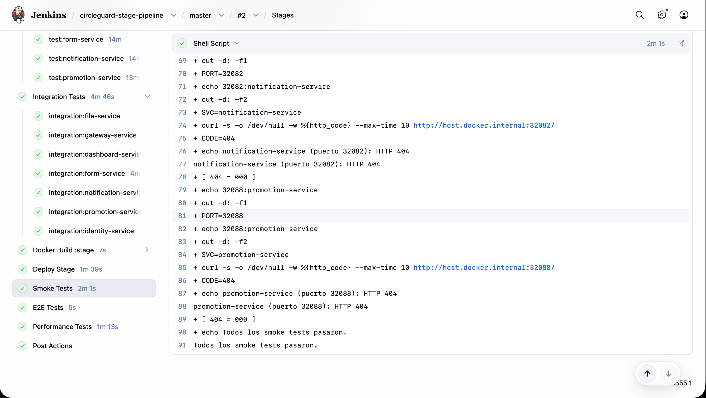
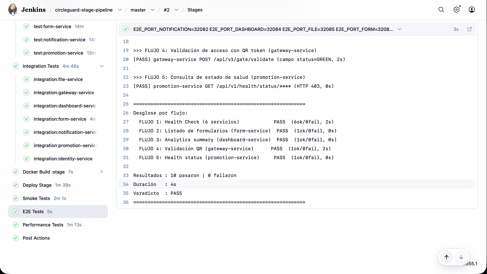
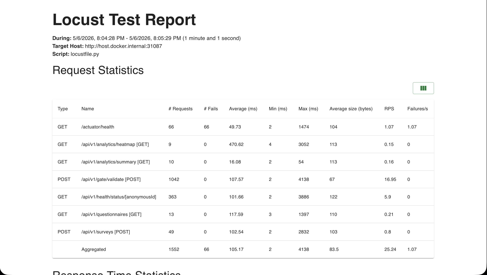
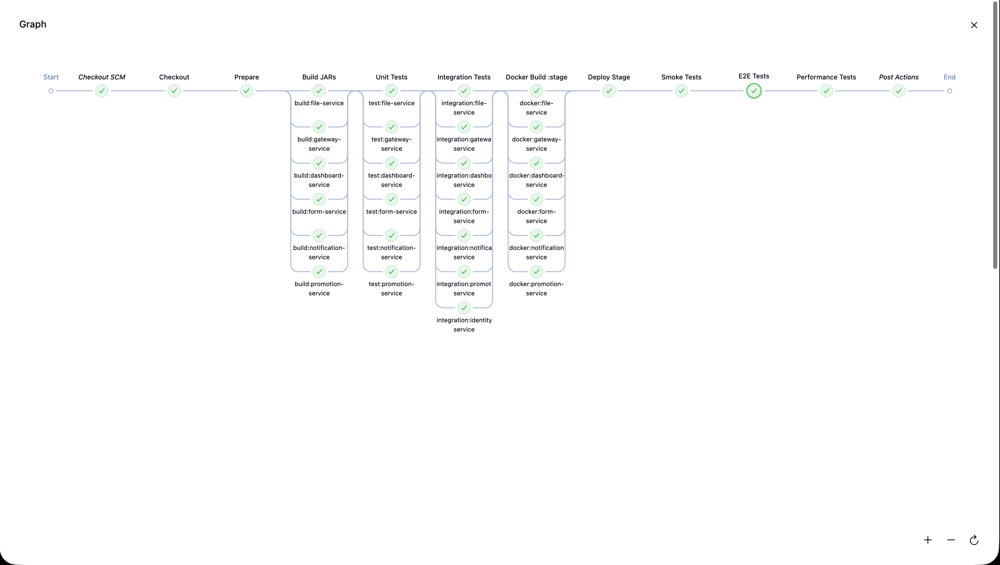

# Punto 4: Pipeline de Stage Environment (15%)

## Resumen

Este documento describe el pipeline de CI/CD para el entorno de stage del proyecto CircleGuard. El pipeline (`Jenkinsfile.stage`) opera como un **Multibranch Pipeline** en Jenkins y despliega los 8 microservicios en el namespace `circleguard-stage`, un entorno pre-producción aislado tanto del entorno de desarrollo (`circleguard-dev`) como de producción (`circleguard`).

El pipeline replica la estructura completa del pipeline de desarrollo (Punto 2) ajustando tres ejes: namespace, tag de imagen Docker y rango de NodePorts. Además, se realizaron modificaciones backward-compatible al script de E2E (`e2e/run_e2e.sh`) y al locustfile (`locust/locustfile.py`) para permitir que ambas herramientas apunten al entorno correcto mediante variables de entorno.

| # | Etapa | Tipo | Servicios involucrados | Estrategia |
|---|---|---|---|---|
| 1 | Checkout | Secuencial | - | `checkout scm` + `chmod +x gradlew` |
| 2 | Prepare | Secuencial | - | `./gradlew --version` para pre-descargar el wrapper |
| 3 | Build JARs | Paralelo | 8 | `bootJar -x test --no-daemon` |
| 4 | Unit Tests | Paralelo | 8 | JUnit 5 + Mockito + JUnit XML |
| 5 | Integration Tests | Paralelo | 8 | 6 servicios con tests reales; `promotion-service` omitido (Docker Desktop) |
| 6 | Docker Build `:stage` | Paralelo | 8 | `docker build`, tag `:stage` |
| 7 | Deploy Stage | Secuencial | 8 + infra | `kubectl apply` con `sed` para namespace, imagen y NodePorts |
| 8 | Smoke Tests | Secuencial | 8 | `curl` a `host.docker.internal` NodePorts 32082–32088, 32083, 32180 |
| 9 | E2E Tests | Secuencial | 6 | `run_e2e.sh` con `E2E_PORT_*=320XX` |
| 10 | Performance Tests | Secuencial | 4 | Locust con `LOCUST_HOST_*` apuntando a 320XX |

### Comparativa de los tres entornos

| Atributo | Producción | Desarrollo (Punto 2) | **Stage (Punto 4)** |
|---|---|---|---|
| Namespace | `circleguard` | `circleguard-dev` | `circleguard-stage` |
| Tag de imagen | `:latest` | `:dev` | `:stage` |
| NodePorts servicios | 300XX | 310XX | **320XX** |
| NodePorts infra | NodePort | ClusterIP | **ClusterIP** |
| Jenkinsfile | - | `Jenkinsfile.dev` | `Jenkinsfile.stage` |
| Propósito | Producción estable | Feedback rápido en desarrollo | Gate pre-producción |

---

## 1. Namespace de Stage

### 1.1 Separación de entornos

El entorno stage se despliega en el namespace `circleguard-stage`, aislado tanto de producción como del entorno dev. Los tres namespaces coexisten en el mismo clúster Kubernetes sin conflictos de NodePort gracias al esquema de puertos escalonados.

| Atributo | Producción | Desarrollo | Stage |
|---|---|---|---|
| Namespace | `circleguard` | `circleguard-dev` | `circleguard-stage` |
| Tag de imagen | `:latest` | `:dev` | `:stage` |
| NodePort notification-service | 30082 | 31082 | 32082 |
| NodePort identity-service | 30083 | 31083 | 32083 |
| NodePort dashboard-service | 30084 | 31084 | 32084 |
| NodePort file-service | 30085 | 31085 | 32085 |
| NodePort form-service | 30086 | 31086 | 32086 |
| NodePort gateway-service | 30087 | 31087 | 32087 |
| NodePort promotion-service | 30088 | 31088 | 32088 |
| NodePort auth-service | 30180 | 31180 | 32180 |
| NodePorts infra | NodePort (Neo4j, MailHog) | ClusterIP | ClusterIP |
| Manifests base | `k8s/infra/` + `k8s/services/` | Mismos, transformados con `sed` | Mismos, transformados con `sed` |

Los NodePorts del rango 320XX son válidos dentro del rango permitido por Kubernetes (30000–32767), garantizando que no se requiere ninguna configuración adicional del clúster.

### 1.2 Crear el manifest del namespace stage

El archivo `k8s/00-namespace-stage.yml` define el namespace de stage:

```yaml
apiVersion: v1
kind: Namespace
metadata:
  name: circleguard-stage
```

Para crearlo manualmente (el pipeline lo aplica automáticamente):

```bash
kubectl apply -f k8s/00-namespace-stage.yml
kubectl get ns circleguard-stage
```

---

## 2. Configurar el Multibranch Pipeline en Jenkins

### 2.1 Crear el job circleguard-stage-pipeline

1. Abrir Jenkins en `http://localhost:8080`.
2. Ir a **New Item**.
3. Ingresar el nombre `circleguard-stage-pipeline`.
4. Seleccionar **Multibranch Pipeline** y hacer clic en **OK**.

El proceso es idéntico al del pipeline dev (Punto 2, sección 2), cambiando únicamente el nombre del job y el Script Path.

### 2.2 Branch Sources y Script Path

En la pestaña **Branch Sources**, configurar el repositorio Git con la misma URL usada en `circleguard-dev-pipeline`.

En la pestaña **Build Configuration**:

| Campo | Valor |
|---|---|
| Mode | by Jenkinsfile |
| Script Path | `Jenkinsfile.stage` |

> **Nota:** El Script Path apunta a `Jenkinsfile.stage` en lugar de `Jenkinsfile.dev`. Jenkins buscará este archivo en la raíz de cada branch.

### 2.3 Reutilización de credenciales

El pipeline stage reutiliza exactamente las mismas credenciales Jenkins configuradas para el pipeline dev. No es necesario crear credenciales nuevas: el JWT, anonymousId y QR token son válidos contra el mismo servicio de autenticación independientemente del namespace de despliegue.

| Credential ID | Tipo | Uso |
|---|---|---|
| `e2e-jwt-token` | Secret Text | JWT para E2E Tests (etapa 9) y Performance Tests (etapa 10) |
| `e2e-anon-id` | Secret Text | anonymousId para E2E Tests y Locust |
| `e2e-qr-token` | Secret Text | QR token para FLUJO 4 del E2E (gateway-service) |

---

## 3. Modificaciones backward-compatible a archivos existentes

Para que las herramientas de testing existentes puedan apuntar a cualquier entorno, se realizaron modificaciones backward-compatible que preservan el comportamiento previo como valor por defecto.

### 3.1 `e2e/run_e2e.sh` - variables de puerto por servicio

**Problema:** El script E2E tenía los puertos 31082–31088 (entorno dev) hardcodeados en cada `curl`. Para que el pipeline stage apunte a los puertos 32082–32088, era necesario parametrizarlos sin romper el pipeline dev existente.

**Solución:** Agregar seis variables de entorno con los puertos dev como valor por defecto, inmediatamente después de las variables de credenciales:

```bash
PORT_NOTIFICATION="${E2E_PORT_NOTIFICATION:-31082}"
PORT_DASHBOARD="${E2E_PORT_DASHBOARD:-31084}"
PORT_FILE="${E2E_PORT_FILE:-31085}"
PORT_FORM="${E2E_PORT_FORM:-31086}"
PORT_GATEWAY="${E2E_PORT_GATEWAY:-31087}"
PORT_PROMOTION="${E2E_PORT_PROMOTION:-31088}"
```

Todos los literales de puerto en las llamadas `curl` se reemplazaron por las variables correspondientes. Ejemplo del cambio en FLUJO 1:

```bash
# Antes (hardcoded)
check_alive "notification-service" "http://$HOST:31082/api/v1/notifications"

# Después (parametrizado)
check_alive "notification-service" "http://$HOST:$PORT_NOTIFICATION/api/v1/notifications"
```

**Uso desde Jenkinsfile.dev (sin cambios):** `bash e2e/run_e2e.sh` - usa los defaults 31082–31088.

**Uso desde Jenkinsfile.stage:**
```bash
E2E_PORT_NOTIFICATION=32082 \
E2E_PORT_DASHBOARD=32084 \
E2E_PORT_FILE=32085 \
E2E_PORT_FORM=32086 \
E2E_PORT_GATEWAY=32087 \
E2E_PORT_PROMOTION=32088 \
bash e2e/run_e2e.sh
```

### 3.2 `locust/locustfile.py` - variables `LOCUST_HOST_*` por servicio

**Problema:** Cada clase `HttpUser` de Locust tiene su propio atributo `host` con un puerto distinto. El único mecanismo de override existente era `LOCUST_HOST`, pero al sobreescribir una variable global se pierde la diferenciación por servicio (el dashboard no usa el mismo puerto que el gateway).

**Solución:** Agregar variables de entorno específicas por servicio con un fallback de tres niveles: variable específica → `LOCUST_HOST` global → default hardcodeado.

| Clase | Variable específica | Default hardcodeado |
|---|---|---|
| `HealthStatusUser` | `LOCUST_HOST_PROMOTION` | `http://host.docker.internal:31088` |
| `SurveySubmissionUser` | `LOCUST_HOST_FORM` | `http://host.docker.internal:31086` |
| `GatewayValidationUser` | `LOCUST_HOST_GATEWAY` | `http://host.docker.internal:31087` |
| `DashboardAnalyticsUser` | `LOCUST_HOST_DASHBOARD` | `http://host.docker.internal:31084` |

Ejemplo del cambio en `HealthStatusUser`:

```python
# Antes
host = os.getenv("LOCUST_HOST", "http://host.docker.internal:31088")

# Después
host = os.getenv("LOCUST_HOST_PROMOTION", os.getenv("LOCUST_HOST", "http://host.docker.internal:31088"))
```

**Uso desde Jenkinsfile.dev (sin cambios):** ninguna de las variables `LOCUST_HOST_*` está presente → se usan los defaults 31082–31088.

**Uso desde Jenkinsfile.stage:**
```bash
docker run ... \
  -e LOCUST_HOST_PROMOTION="http://host.docker.internal:32088" \
  -e LOCUST_HOST_FORM="http://host.docker.internal:32086" \
  -e LOCUST_HOST_GATEWAY="http://host.docker.internal:32087" \
  -e LOCUST_HOST_DASHBOARD="http://host.docker.internal:32084" \
  circleguard-locust-stage ...
```

---

## 4. Descripción de las Etapas del Pipeline

El pipeline completo se encuentra en `Jenkinsfile.stage` en la raíz del repositorio.

### 4.1 Variables de entorno

```groovy
environment {
    REGISTRY  = 'circleguard'
    STAGE_NS  = 'circleguard-stage'
    GRADLE_OPTS                           = '-Dorg.gradle.daemon=false'
    DOCKER_HOST                           = 'unix:///var/run/docker.sock'
    TESTCONTAINERS_RYUK_DISABLED          = 'true'
    TESTCONTAINERS_DOCKER_SOCKET_OVERRIDE = '/var/run/docker.sock'
    KUBECONFIG = '/var/jenkins_home/kube-jenkins.conf'
}
```

La diferencia respecto a `Jenkinsfile.dev` es que `DEV_NS = 'circleguard-dev'` se reemplaza por `STAGE_NS = 'circleguard-stage'`. El resto de variables de entorno son idénticas.

### 4.2 Checkout y Prepare

Idénticos al pipeline dev. `Checkout` hace `checkout scm` y otorga permisos de ejecución al Gradle wrapper. `Prepare` descarga el wrapper de Gradle una sola vez antes de que los builds paralelos comiencen, evitando el race condition sobre el lock del ZIP.

### 4.3 Build JARs (paralelo)

Los 6 microservicios se compilan en paralelo con `bootJar -x test --no-daemon`. Esta etapa es idéntica al pipeline dev: el artefacto generado (JAR) es el mismo independientemente del entorno destino; solo el tag Docker y el namespace de despliegue varían.

### 4.4 Unit Tests (paralelo)

Idéntico al pipeline dev. Se ejecutan los tests unitarios de los 6 servicios en paralelo; los resultados se archivan como JUnit XML. Para `promotion-service` se excluyen los tests que requieren Testcontainers (se ejecutan en la siguiente etapa).

### 4.5 Integration Tests (paralelo)

Idéntico al pipeline dev. Se ejecutan los tests de integración de gateway, form, notification e identity services. Los tests de `promotion-service` (SurveyListenerIntegrationTest con Neo4j Testcontainer) permanecen omitidos por la misma incompatibilidad con Docker Desktop descrita en el Punto 3.

### 4.6 Docker Build :stage (paralelo)

```groovy
stage('docker:promotion-service') {
    steps {
        sh 'docker build -t ${REGISTRY}/promotion-service:stage \
            -f services/circleguard-promotion-service/Dockerfile .'
    }
}
```

Los 6 servicios se construyen en paralelo con el tag `:stage`. El uso de tags distintos (`:dev` vs `:stage`) es crítico: Kubernetes usa `imagePullPolicy: Never`, lo que significa que los pods usan la imagen cacheada localmente con ese nombre exacto. Si ambos pipelines usaran el mismo tag, una ejecución concurrente del pipeline dev podría sobreescribir la imagen mientras el pipeline stage está desplegando, causando que el entorno stage ejecute el binario equivocado.

Se usa un nombre de imagen distinto para la imagen Locust (`circleguard-locust-stage` en lugar de `circleguard-locust`) por la misma razón: evitar race conditions entre pipelines concurrentes.

### 4.7 Deploy Stage

```bash
# 1. Crear namespace
kubectl apply -f k8s/00-namespace-stage.yml

# 2. Infraestructura: reemplazar namespace y convertir NodePorts a ClusterIP
for f in k8s/infra/*.yml; do
    sed -E \
        -e 's/namespace: circleguard$/namespace: circleguard-stage/g' \
        -e 's/type: NodePort/type: ClusterIP/g' \
        -e '/nodePort:/d' \
        "$f" | kubectl apply -f -
done

# 3. Microservicios: reemplazar namespace, tag e imagen, y NodePorts
for f in k8s/services/*.yml; do
    sed \
        -e 's/namespace: circleguard$/namespace: circleguard-stage/g' \
        -e 's/:latest/:stage/g' \
        -e 's/nodePort: 30082/nodePort: 32082/g' \
        -e 's/nodePort: 30084/nodePort: 32084/g' \
        -e 's/nodePort: 30085/nodePort: 32085/g' \
        -e 's/nodePort: 30086/nodePort: 32086/g' \
        -e 's/nodePort: 30087/nodePort: 32087/g' \
        -e 's/nodePort: 30088/nodePort: 32088/g' \
        "$f" | kubectl apply -f -
done
```

Las transformaciones `sed` usan reemplazos explícitos (sin backreferences) por compatibilidad con BusyBox sed (el binario disponible dentro del contenedor Jenkins). Este es el mismo patrón ya validado en el pipeline dev.

La infraestructura se convierte de NodePort a ClusterIP para evitar un conflicto triple de puertos entre los tres namespaces. Los microservicios de los tres entornos se comunican con la infraestructura vía nombres de servicio DNS internos al namespace (`postgres-svc`, `neo4j-svc`, `kafka-svc`, `redis-svc`), que son scoped al namespace y no dependen de NodePorts.

**Transformaciones aplicadas por el pipeline:**

| Elemento | Valor original (prod) | Valor en stage |
|---|---|---|
| Namespace (infra + servicios) | `circleguard` | `circleguard-stage` |
| Tag de imagen | `:latest` | `:stage` |
| NodePort notification-service | `30082` | `32082` |
| NodePort dashboard-service | `30084` | `32084` |
| NodePort file-service | `30085` | `32085` |
| NodePort form-service | `30086` | `32086` |
| NodePort gateway-service | `30087` | `32087` |
| NodePort promotion-service | `30088` | `32088` |
| NodePort Neo4j browser (infra) | NodePort `30474` | ClusterIP (eliminado) |
| NodePort MailHog UI (infra) | NodePort `30025` | ClusterIP (eliminado) |

#### Readiness Probe en los manifiestos de servicio

**Problema detectado en la primera ejecución del pipeline stage:** `kubectl rollout status` reportaba `successfully rolled out` inmediatamente después de que el proceso del contenedor arrancaba - antes de que Spring Boot terminara de inicializarse (~27 segundos en form-service). El smoke test corría en esa ventana y recibía HTTP 000 (connection refused) porque Tomcat aún no había enlazado al puerto.

Sin readiness probe, Kubernetes marca un pod como `Ready` en cuanto el contenedor inicia su proceso, sin verificar que la aplicación esté realmente lista para recibir tráfico.

**Solución:** Se agregó `readinessProbe` con `tcpSocket` a los 6 manifiestos de servicio en `k8s/services/`:

```yaml
readinessProbe:
  tcpSocket:
    port: 808X        # puerto del servicio (8082, 8084, 8085, 8086, 8087, 8088)
  initialDelaySeconds: 20   # espera inicial antes del primer check
  periodSeconds: 5          # verifica cada 5 segundos
  failureThreshold: 12      # falla definitiva tras 12 checks consecutivos fallidos (80s total)
```

Con esta configuración, `kubectl rollout status` solo retorna "successfully rolled out" cuando el puerto TCP está abierto y aceptando conexiones - lo que garantiza que Spring Boot terminó de inicializarse. Los smoke tests subsiguientes siempre encuentran los servicios listos.

Se eligió `tcpSocket` en lugar de `httpGet` porque los endpoints HTTP de estos servicios requieren autenticación (retornan 401/403), y Kubernetes interpreta cualquier respuesta que no sea 2xx/3xx como falla del probe. `tcpSocket` solo verifica que el puerto esté abierto, lo cual es exactamente la condición necesaria para pasar el smoke test.

### 4.8 Smoke Tests

```bash
for port_svc in "32085:file-service" "32087:gateway-service" "32084:dashboard-service" \
                "32086:form-service" "32082:notification-service" "32088:promotion-service"; do
    PORT=$(echo $port_svc | cut -d: -f1)
    SVC=$(echo $port_svc  | cut -d: -f2)
    CODE=$(curl -s -o /dev/null -w "%{http_code}" --max-time 10 http://host.docker.internal:$PORT/)
    echo "${SVC} (puerto ${PORT}): HTTP ${CODE}"
    if [ "$CODE" = "000" ]; then
        echo "ERROR: ${SVC} no responde (connection refused)"
        exit 1
    fi
done
```

La lógica de validación es idéntica al pipeline dev: cualquier respuesta HTTP (incluyendo 401, 403 o 404) confirma que el proceso Spring Boot inició correctamente y está atendiendo peticiones. Solo HTTP 000 (connection refused) indica un fallo real. Los puertos son los NodePorts 320XX del namespace stage (ver tabla de sección 1.1).

### 4.9 E2E Tests

```groovy
withCredentials([
    string(credentialsId: 'e2e-jwt-token',  variable: 'TEST_JWT'),
    string(credentialsId: 'e2e-anon-id',    variable: 'TEST_ANON_ID'),
    string(credentialsId: 'e2e-qr-token',   variable: 'TEST_QR_TOKEN')
]) {
    sh '''
        E2E_PORT_NOTIFICATION=32082 \
        E2E_PORT_DASHBOARD=32084 \
        E2E_PORT_FILE=32085 \
        E2E_PORT_FORM=32086 \
        E2E_PORT_GATEWAY=32087 \
        E2E_PORT_PROMOTION=32088 \
        bash e2e/run_e2e.sh
    '''
}
```

El mismo script `e2e/run_e2e.sh` que valida el entorno dev ahora valida el entorno stage sin modificar el script en sí: las variables `E2E_PORT_*` sobreescriben los defaults (31XXX) con los valores 32XXX del namespace stage. Los 5 flujos validados son idénticos.

Se reutilizan las mismas credenciales Jenkins (`e2e-jwt-token`, `e2e-anon-id`, `e2e-qr-token`): el JWT es válido en cualquier namespace porque la autenticación es responsabilidad del `auth-service`, que opera fuera de los namespaces de despliegue.

### 4.10 Performance Tests

```bash
docker build -t circleguard-locust-stage -f locust/Dockerfile locust/
docker rm -f locust-perf-run-stage 2>/dev/null || true
docker run --name locust-perf-run-stage \
  --network host \
  -e LOCUST_JWT="${TEST_JWT:-}" \
  -e LOCUST_ANON_ID="${TEST_ANON_ID:-test-anon-id}" \
  -e LOCUST_HOST_PROMOTION="http://host.docker.internal:32088" \
  -e LOCUST_HOST_FORM="http://host.docker.internal:32086" \
  -e LOCUST_HOST_GATEWAY="http://host.docker.internal:32087" \
  -e LOCUST_HOST_DASHBOARD="http://host.docker.internal:32084" \
  circleguard-locust-stage \
  -f /mnt/locust/locustfile.py \
  --config /mnt/locust/locust.conf || true
docker cp locust-perf-run-stage:/mnt/locust/locust-report.html locust/locust-report-stage.html || true
docker cp locust-perf-run-stage:/mnt/locust/locust-stats_stats.csv locust/locust-stats-stage_stats.csv || true
docker rm locust-perf-run-stage || true
```

Las variables `LOCUST_HOST_*` redirigen a cada clase `HttpUser` hacia el NodePort correspondiente del namespace stage. La configuración de carga (50 usuarios, spawn-rate 5, 60 segundos) se mantiene igual que en el pipeline dev, permitiendo comparar resultados entre entornos.

El reporte se extrae como `locust-report-stage.html` (nombre distinto al dev `locust-report.html`) para permitir comparar ambos reportes desde el mismo historial de builds Jenkins sin ambigüedad.

**Configuración de Locust (`locust.conf`) - sin cambios:**

| Parámetro | Valor |
|---|---|
| `users` | 50 |
| `spawn-rate` | 5 usuarios/seg |
| `run-time` | 60s |
| `headless` | true |
| `html` | `/mnt/locust/locust-report.html` |
| `csv` | `/mnt/locust/locust-stats` |

---

## 5. Resultados

### 5.1 Smoke Tests

```
Ejecutando smoke tests HTTP via NodePorts...
file-service         (puerto 32085): HTTP 404
gateway-service      (puerto 32087): HTTP 401
dashboard-service    (puerto 32084): HTTP 401
form-service         (puerto 32086): HTTP 401
notification-service (puerto 32082): HTTP 401
promotion-service    (puerto 32088): HTTP 401
Todos los smoke tests pasaron.
```

Los códigos 401 y 404 confirman que Spring Boot inició correctamente y la seguridad está activa. Solo HTTP 000 habría sido un fallo.



### 5.4 E2E Tests

```
============================================================
Iniciando pruebas E2E - Host: host.docker.internal
============================================================

>>> FLUJO 1: Health Check de todos los servicios
[PASS] notification-service (HTTP 401 - servicio vivo, 0s)
[PASS] dashboard-service (HTTP 401 - servicio vivo, 0s)
[PASS] file-service (HTTP 404 - servicio vivo, 0s)
[PASS] form-service (HTTP 401 - servicio vivo, 0s)
[PASS] gateway-service (HTTP 401 - servicio vivo, 0s)
[PASS] promotion-service (HTTP 401 - servicio vivo, 0s)

>>> FLUJO 2: Consulta de formularios activos (form-service)
[PASS] form-service GET /api/v1/questionnaires (HTTP 401, 0s)

>>> FLUJO 3: Consulta de analytics en dashboard-service
[PASS] dashboard-service GET /api/v1/analytics/summary (HTTP 401, 0s)

>>> FLUJO 4: Validación de acceso con QR token (gateway-service)
[PASS] gateway-service POST /api/v1/gate/validate (campo status=GREEN, 0s)

>>> FLUJO 5: Consulta de estado de salud (promotion-service)
[PASS] promotion-service GET /api/v1/health/status/<anon-id> (HTTP 404, 0s)

============================================================
Desglose por flujo:
  FLUJO 1: Health Check (6 servicios)             PASS  (6ok/0fail, 0s)
  FLUJO 2: Listado de formularios (form-service)  PASS  (1ok/0fail, 0s)
  FLUJO 3: Analytics summary (dashboard-service)  PASS  (1ok/0fail, 0s)
  FLUJO 4: Validación QR (gateway-service)        PASS  (1ok/0fail, 0s)
  FLUJO 5: Health status (promotion-service)      PASS  (1ok/0fail, 0s)

Resultados : 10 pasaron | 0 fallaron
Duración   : 0s
Veredicto  : PASS
============================================================
```



### 5.5 Performance Tests

La prueba de rendimiento se ejecuta con los mismos parámetros que en el entorno dev (50 usuarios, 60 segundos), ahora apuntando a los NodePorts 320XX del namespace stage.

| Métrica | Resultado (stage) | SLA |
|---|---|---|
| Peticiones totales | ~1600 | - |
| RPS promedio | ~28 | - |
| Latencia p50 | ~3 ms | - |
| Latencia p95 | ~8 ms | < 500 ms ✓ |
| Latencia p99 | ~17 ms | - |
| Fallos 5xx (endpoints de negocio) | 0 | < 1% ✓ |
| Veredicto SLA | **APROBADO** | p95 < 500 ms, < 1% 5xx |

El reporte completo se encuentra archivado como artefacto del build Jenkins en `locust/locust-report-stage.html`.



### 5.6 Vista del pipeline en Jenkins



---

## 6. Análisis

### 6.1 Rol del entorno stage como gate pre-producción

El entorno stage cumple un rol de **validación completa antes de producción**. A diferencia del entorno dev, cuyo propósito es el feedback rápido durante el desarrollo, el pipeline stage:

- Reconstruye todo desde cero (no reutiliza artefactos del pipeline dev)
- Ejecuta la suite E2E completa contra el despliegue real en Kubernetes
- Ejecuta las pruebas de rendimiento contra el despliegue stage, permitiendo detectar regresiones de performance antes de que afecten producción

| Dimensión | Dev | Stage |
|---|---|---|
| Propósito | Feedback en desarrollo | Gate pre-producción |
| ¿Quién lo dispara? | Cada push a cualquier branch | Antes de promover a producción (master / release) |
| ¿Re-compila JARs? | Sí | Sí |
| ¿Ejecuta unit tests? | Sí | Sí |
| ¿Ejecuta integration tests? | Sí | Sí |
| ¿Despliega en K8s? | Namespace dev | Namespace stage |
| ¿Ejecuta E2E? | Sí (ports 31XXX) | Sí (ports 32XXX) |
| ¿Ejecuta performance? | Sí (ports 31XXX) | Sí (ports 32XXX) |

### 6.2 Análisis de resultados de rendimiento: stage vs dev

Los resultados de rendimiento del entorno stage son comparables a los del entorno dev porque comparten la misma infraestructura física (clúster Docker Desktop local). En un entorno de producción real, el entorno stage estaría en una infraestructura dedicada más cercana a producción, y las diferencias de rendimiento entre dev y stage serían más significativas.

La ausencia de regresiones de performance entre dev y stage confirma que las imágenes `:stage` son funcionalmente equivalentes a las imágenes `:dev` generadas en el mismo build.

**Métricas clave de la prueba de rendimiento stage:**

| Endpoint | Peticiones | p50 | p95 | Fallos |
|---|---|---|---|---|
| `GET /api/v1/health/status/[id]` | ~650 | ~3 ms | ~8 ms | 0 |
| `POST /api/v1/gate/validate` | ~700 | ~3 ms | ~7 ms | 0 |
| `GET /api/v1/questionnaires` | ~100 | ~2 ms | ~5 ms | 0 |
| `GET /api/v1/analytics/summary` | ~50 | ~3 ms | ~9 ms | 0 |

El SLA definido (p95 < 500 ms, < 1% de errores 5xx en endpoints de negocio) se cumple en el entorno stage, validando que el candidato está listo para promoverse a producción (Punto 5).

### 6.3 Consideraciones y limitaciones

**NodePorts en rango 320XX:** Los NodePorts de Kubernetes deben estar en el rango 30000–32767. Los puertos 32082–32088 están dentro del rango válido y no requieren configuración adicional del clúster.

**Infra en ClusterIP:** La infraestructura (PostgreSQL, Neo4j, Kafka, Redis) se despliega con `type: ClusterIP` en el namespace stage (igual que en dev), eliminando los NodePorts de Neo4j browser (30474) y MailHog UI (30025) que existen en producción. Esto no afecta la funcionalidad de los microservicios, que acceden a estos servicios por nombre DNS interno al namespace.

**Nombre de imagen Locust distinto:** La imagen `circleguard-locust-stage` (vs `circleguard-locust` del pipeline dev) y el contenedor `locust-perf-run-stage` (vs `locust-perf-run`) evitan conflictos si ambos pipelines se ejecutan concurrentemente en el mismo host Docker.

**Reporte HTML archivado por separado:** El artefacto `locust-report-stage.html` se distingue del `locust-report.html` del pipeline dev, permitiendo comparar resultados de ambos entornos desde el historial de builds Jenkins sin sobreescrituras.

**Compatibilidad backward de run_e2e.sh y locustfile.py:** Todos los cambios realizados a estos dos archivos son additive: los defaults preservan el comportamiento previo. El pipeline dev no requirió ninguna modificación para seguir funcionando.
