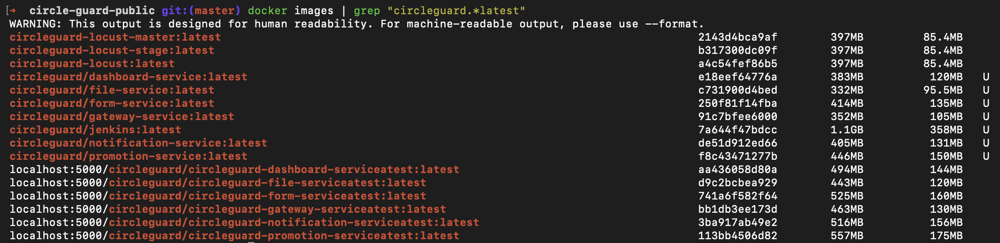
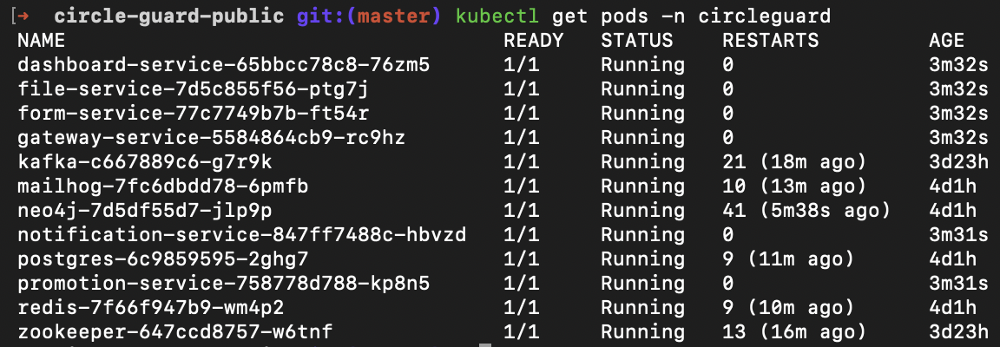
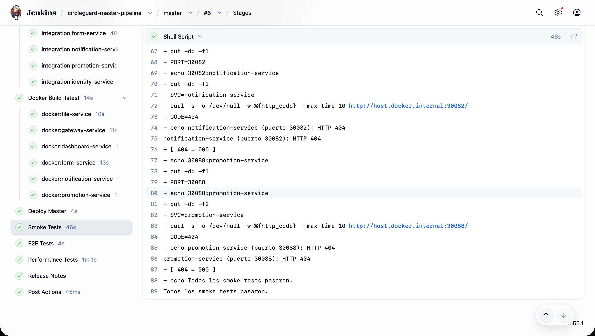
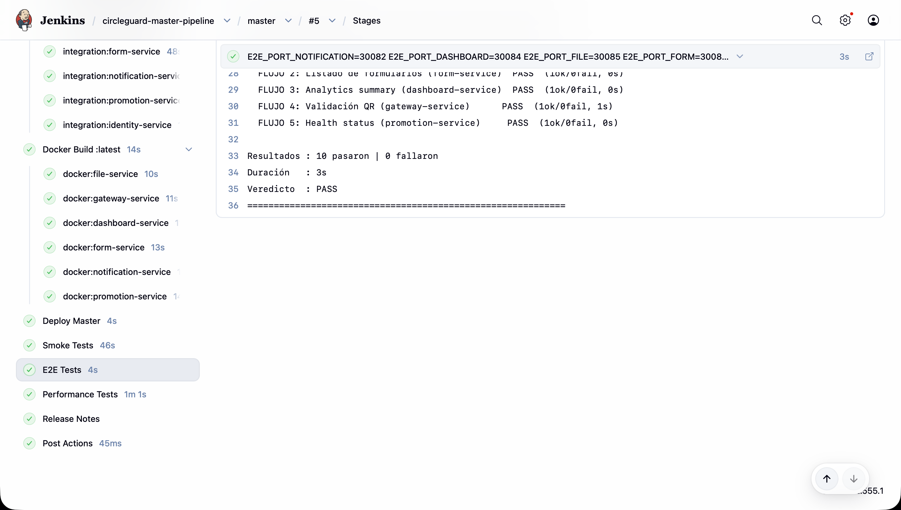
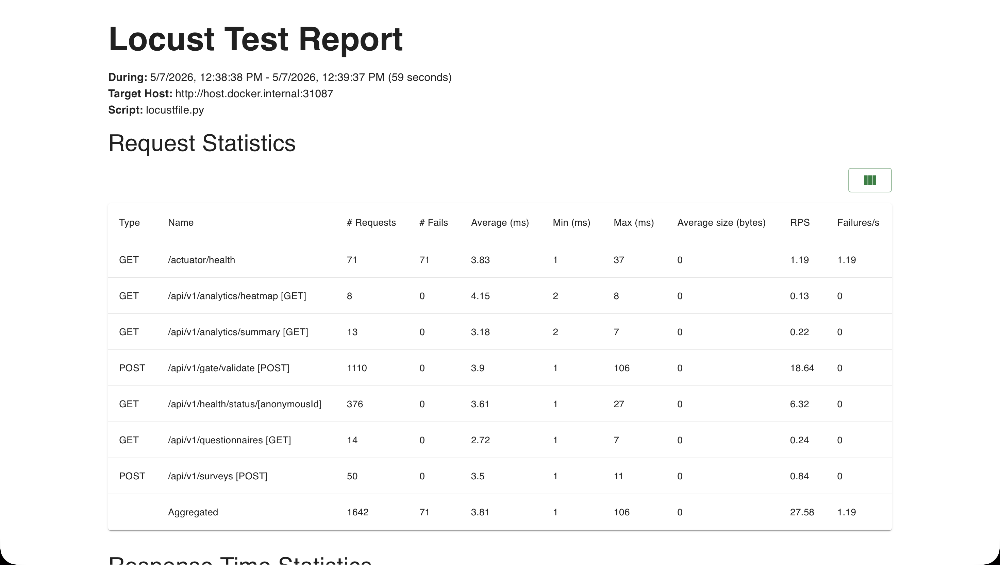
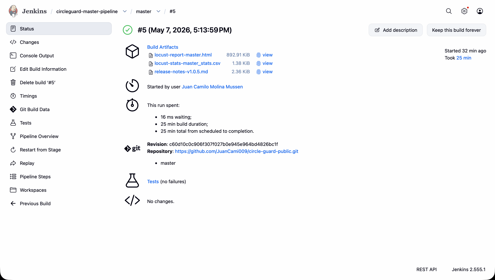
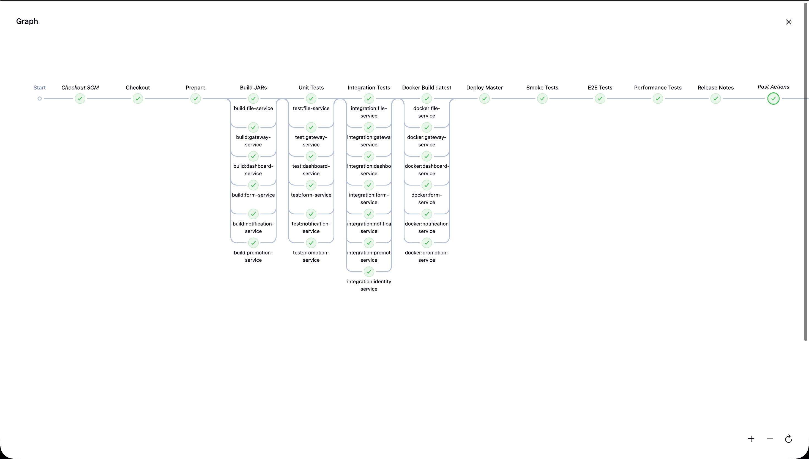

# Punto 5: Pipeline de Master/Producción (15%)

## Resumen

Este documento describe el pipeline de CI/CD para el entorno de **producción** del proyecto CircleGuard. El pipeline (`Jenkinsfile.master`) opera como un **Multibranch Pipeline** en Jenkins y despliega los 6 microservicios en el namespace `circleguard`, el namespace canónico de producción del clúster.

A diferencia de los pipelines dev y stage, el pipeline master **no aplica transformaciones `sed`** sobre los manifests de Kubernetes: los archivos en `k8s/infra/` y `k8s/services/` ya tienen definidos el namespace `circleguard`, el tag `:latest` y los NodePorts `300XX`. Esto simplifica el paso de despliegue y elimina una fuente de errores operacionales.

La adición clave de este pipeline respecto a los anteriores es la etapa **Release Notes**, que genera automáticamente un artefacto Markdown con la clasificación de cambios (por tipo de Conventional Commit), información del build, y crea un tag Git ligero para marcar el punto exacto del release en el historial del repositorio.

| # | Etapa | Tipo | Servicios involucrados | Estrategia |
|---|---|---|---|---|
| 1 | Checkout | Secuencial | - | `checkout scm` + `chmod +x gradlew` |
| 2 | Prepare | Secuencial | - | `./gradlew --version` para pre-descargar el wrapper |
| 3 | Build JARs | Paralelo | 6 | `bootJar -x test --no-daemon` |
| 4 | Unit Tests | Paralelo | 6 | JUnit 5 + Mockito + JUnit XML |
| 5 | Integration Tests | Paralelo | 6 | 4 servicios con tests reales; `promotion-service` omitido (Docker Desktop) |
| 6 | Docker Build `:latest` | Paralelo | 6 | `docker build`, tag `:latest` |
| 7 | Deploy Master | Secuencial | 6 + infra | `kubectl apply` directo - sin `sed` |
| 8 | Smoke Tests | Secuencial | 6 | `curl` a `host.docker.internal` NodePorts 30082–30088 |
| 9 | E2E Tests | Secuencial | 6 | `run_e2e.sh` con `E2E_PORT_*=300XX` |
| 10 | Performance Tests | Secuencial | 4 | Locust con `LOCUST_HOST_*` apuntando a 300XX |
| 11 | Release Notes | Secuencial | - | `git log` → Markdown clasificado → artefacto archivado + tag Git |

### Comparativa de los tres entornos

| Atributo | Producción (Punto 5) | Stage (Punto 4) | Desarrollo (Punto 2) |
|---|---|---|---|
| Namespace | `circleguard` | `circleguard-stage` | `circleguard-dev` |
| Tag de imagen | `:latest` | `:stage` | `:dev` |
| NodePorts servicios | **300XX** | 320XX | 310XX |
| NodePorts infra | NodePort (Neo4j 30474, MailHog 30025) | ClusterIP | ClusterIP |
| Jenkinsfile | `Jenkinsfile.master` | `Jenkinsfile.stage` | `Jenkinsfile.dev` |
| Transforms `sed` | **Ninguna** | Namespace + tag + NodePorts | Namespace + tag + NodePorts |
| Release Notes | **Sí** | No | No |
| Propósito | Release a producción | Gate pre-producción | Feedback en desarrollo |

---

## 1. Namespace de Producción

### 1.1 Separación de entornos

El entorno master se despliega en el namespace `circleguard`, el namespace canónico de producción. Los tres namespaces coexisten en el mismo clúster Kubernetes sin conflictos de NodePort gracias al esquema de puertos escalonados.

| Atributo | Producción | Stage | Desarrollo |
|---|---|---|---|
| Namespace | `circleguard` | `circleguard-stage` | `circleguard-dev` |
| Tag de imagen | `:latest` | `:stage` | `:dev` |
| NodePort notification-service | **30082** | 32082 | 31082 |
| NodePort dashboard-service | **30084** | 32084 | 31084 |
| NodePort file-service | **30085** | 32085 | 31085 |
| NodePort form-service | **30086** | 32086 | 31086 |
| NodePort gateway-service | **30087** | 32087 | 31087 |
| NodePort promotion-service | **30088** | 32088 | 31088 |
| NodePorts infra | **NodePort** (Neo4j 30474, MailHog 30025) | ClusterIP | ClusterIP |
| Manifests base | `k8s/infra/` + `k8s/services/` | Mismos, transformados con `sed` | Mismos, transformados con `sed` |

### 1.2 El namespace circleguard ya existe

El archivo `k8s/00-namespace.yml` define el namespace canónico de producción (presente en el repositorio desde el Punto 1). El pipeline lo aplica con `kubectl apply -f k8s/00-namespace.yml` - es idempotente, no falla si ya existe.

```yaml
apiVersion: v1
kind: Namespace
metadata:
  name: circleguard
```

Para crearlo manualmente (el pipeline lo aplica automáticamente):

```bash
kubectl apply -f k8s/00-namespace.yml
kubectl get ns circleguard
```

---

## 2. Configurar el Multibranch Pipeline en Jenkins

### 2.1 Crear el job circleguard-master-pipeline

1. Abrir Jenkins en `http://localhost:8080`.
2. Ir a **New Item**.
3. Ingresar el nombre `circleguard-master-pipeline`.
4. Seleccionar **Multibranch Pipeline** y hacer clic en **OK**.

El proceso es idéntico al del pipeline dev (Punto 2, sección 2) y stage (Punto 4, sección 2), cambiando únicamente el nombre del job y el Script Path.

### 2.2 Branch Sources y Script Path

En la pestaña **Branch Sources**, configurar el repositorio Git con la misma URL usada en los pipelines anteriores.

En la pestaña **Build Configuration**:

| Campo | Valor |
|---|---|
| Mode | by Jenkinsfile |
| Script Path | `Jenkinsfile.master` |

> **Nota:** El Script Path apunta a `Jenkinsfile.master` en lugar de `Jenkinsfile.dev` o `Jenkinsfile.stage`.

### 2.3 Reutilización de credenciales

El pipeline master reutiliza exactamente las mismas credenciales Jenkins configuradas para los pipelines dev y stage. No es necesario crear credenciales nuevas.

| Credential ID | Tipo | Uso |
|---|---|---|
| `e2e-jwt-token` | Secret Text | JWT para E2E Tests (etapa 9) y Performance Tests (etapa 10) |
| `e2e-anon-id` | Secret Text | anonymousId para E2E Tests y Locust |
| `e2e-qr-token` | Secret Text | QR token para FLUJO 4 del E2E (gateway-service) |

---

## 3. Módulo clave: Generación de Release Notes

### 3.1 Qué son las Release Notes y por qué son parte del Change Management

Las Release Notes son el artefacto formal que cierra el ciclo de un cambio en producción. En el marco ITIL, corresponden al **Change Record** que documenta qué cambió, quién lo introdujo y cuándo fue desplegado - creando la trazabilidad auditable del estado de producción sin la cual no es posible hacer rollback informado ni auditoría de incidentes.

Las buenas prácticas de Change Management exigen que cada release a producción incluya:

1. **Identificación de la versión** - número de versión único y reproducible
2. **Clasificación de cambios** - separar nuevas funcionalidades de correcciones y cambios técnicos
3. **Trazabilidad hasta el commit** - ligar cada cambio a su evidencia en el VCS
4. **Información del despliegue** - namespace, imágenes, fecha, autor

### 3.2 Convención de Commits Convencionales

El pipeline clasifica los commits usando el estándar [Conventional Commits](https://www.conventionalcommits.org/):

| Prefijo | Sección en Release Notes | Significado |
|---|---|---|
| `feat:` | Novedades | Nueva funcionalidad visible para el usuario |
| `fix:` | Correcciones | Corrección de un bug |
| `docs:` | Documentación | Cambios solo en documentación |
| (otros) | Otros cambios | `chore`, `refactor`, `test`, `style`, `perf`, etc. |

### 3.3 Lógica del script de generación

```bash
VERSION="v1.0.${BUILD_NUMBER}"

# 1. Encontrar el tag más reciente antes del commit actual
PREV_TAG=$(git describe --tags --abbrev=0 HEAD^ 2>/dev/null || echo "")

# 2. Determinar el rango de commits
if [ -n "$PREV_TAG" ]; then
    RANGE="${PREV_TAG}..HEAD"      # desde el último release hasta ahora
else
    RANGE="HEAD~10..HEAD"          # primer release: últimos 10 commits
fi

# 3. Clasificar por tipo usando grep sobre el formato --pretty=format:"- %s (%h)"
FEAT_COMMITS=$(git log ${RANGE} --pretty=format:"- %s (%h)" --no-merges | grep "^- feat" || true)
FIX_COMMITS=$(git log ${RANGE}  --pretty=format:"- %s (%h)" --no-merges | grep "^- fix"  || true)
DOCS_COMMITS=$(git log ${RANGE} --pretty=format:"- %s (%h)" --no-merges | grep "^- docs" || true)
OTHER_COMMITS=$(git log ${RANGE} --pretty=format:"- %s (%h)" --no-merges \
    | grep -v "^- feat\|^- fix\|^- docs" || true)

# 4. Componer el Markdown y guardarlo
{ echo "# Release Notes - CircleGuard ${VERSION}"; ... } > release-notes-${VERSION}.md

# 5. Archivar como artefacto Jenkins
archiveArtifacts artifacts: 'release-notes-*.md'

# 6. Crear tag Git ligero
git tag ${VERSION} || true
```

### 3.4 Por qué `PREV_TAG` usa `HEAD^` en vez de `HEAD`

`git describe --tags --abbrev=0 HEAD^` busca el tag más reciente en el commit *anterior* a HEAD. Esto garantiza que el rango incluya los commits del release actual (desde el tag del release anterior hasta HEAD), y no resulte en un rango vacío si HEAD ya está taggeado (por ejemplo, al re-ejecutar el pipeline sobre el mismo commit).

### 3.5 Resiliencia ante re-ejecuciones

`git tag ${VERSION} || true` previene que el pipeline falle si el tag ya existe. El `|| true` es coherente con el manejo de errores no-críticos de los pipelines previos (como `docker rm -f ... || true`).

### 3.6 Acceso al artefacto en Jenkins

El archivo `release-notes-v1.0.${BUILD_NUMBER}.md` se archiva en Jenkins y es accesible en:

```
http://localhost:8080/job/circleguard-master-pipeline/job/master/<N>/artifact/
```

Donde `<N>` es el número de build. El último build exitoso estará en:

```
http://localhost:8080/job/circleguard-master-pipeline/job/master/lastSuccessfulBuild/artifact/
```

---

## 4. Descripción de las Etapas del Pipeline

El pipeline completo se encuentra en `Jenkinsfile.master` en la raíz del repositorio.

### 4.1 Variables de entorno

```groovy
environment {
    REGISTRY  = 'circleguard'
    PROD_NS   = 'circleguard'
    GRADLE_OPTS                           = '-Dorg.gradle.daemon=false'
    DOCKER_HOST                           = 'unix:///var/run/docker.sock'
    TESTCONTAINERS_RYUK_DISABLED          = 'true'
    TESTCONTAINERS_DOCKER_SOCKET_OVERRIDE = '/var/run/docker.sock'
    KUBECONFIG = '/var/jenkins_home/kube-jenkins.conf'
}
```

La diferencia respecto a `Jenkinsfile.stage` es que `STAGE_NS = 'circleguard-stage'` se reemplaza por `PROD_NS = 'circleguard'`. El resto de variables son idénticas.

### 4.2 Checkout y Prepare

Idénticos a los pipelines dev y stage. `Checkout` hace `checkout scm` y otorga permisos de ejecución al Gradle wrapper. `Prepare` descarga el wrapper de Gradle una sola vez antes de que los builds paralelos comiencen, evitando el race condition sobre el lock del ZIP.

### 4.3 Build JARs (paralelo)

Los 6 microservicios se compilan en paralelo con `bootJar -x test --no-daemon`. El artefacto generado (JAR) es el mismo independientemente del entorno destino; solo el tag Docker y el namespace de despliegue varían entre pipelines.

### 4.4 Unit Tests (paralelo)

Idéntico a los pipelines anteriores. Se ejecutan los tests unitarios de los 6 servicios en paralelo; los resultados se archivan como JUnit XML. Para `promotion-service` se excluyen los tests que requieren Testcontainers (se ejecutan en Integration Tests).

### 4.5 Integration Tests (paralelo)

Idéntico a los pipelines anteriores. Se ejecutan los tests de integración de gateway, form, notification e identity services. Los tests de `promotion-service` (SurveyListenerIntegrationTest con Neo4j Testcontainer) permanecen omitidos por la incompatibilidad con Docker Desktop descrita en el Punto 3.

### 4.6 Docker Build :latest (paralelo)

```groovy
stage('docker:promotion-service') {
    steps {
        sh 'docker build -t ${REGISTRY}/promotion-service:latest \
            -f services/circleguard-promotion-service/Dockerfile .'
    }
}
```

Los 6 servicios se construyen con el tag `:latest`. Este tag sobreescribe las imágenes de producción en el daemon local. La separación de tags (`:dev`, `:stage`, `:latest`) garantiza que los namespaces no se afecten entre sí cuando los tres pipelines corren concurrentemente.

Se usa el nombre de imagen `circleguard-locust-master` (análogo a `circleguard-locust-stage` y `circleguard-locust`) y el contenedor `locust-perf-run-master` para evitar race conditions si los tres pipelines se ejecutan simultáneamente en el mismo host Docker.

### 4.7 Deploy Master

```bash
# 1. Namespace (idempotente)
kubectl apply -f k8s/00-namespace.yml

# 2. Infraestructura en orden de dependencia - sin sed
kubectl apply -f k8s/infra/01-configmap.yml
kubectl apply -f k8s/infra/02-secrets.yml
kubectl apply -f k8s/infra/03-postgres.yml
kubectl apply -f k8s/infra/04-neo4j.yml
kubectl apply -f k8s/infra/05-zookeeper.yml
kubectl apply -f k8s/infra/06-kafka.yml
kubectl apply -f k8s/infra/07-redis.yml
kubectl apply -f k8s/infra/08-mailhog.yml

# 3. Microservicios (todos a la vez) - sin sed
kubectl apply -f k8s/services/
```

**Por qué no se usa `sed` en el pipeline master:** Los manifests en `k8s/infra/` y `k8s/services/` son los manifests canónicos de producción. Ya tienen `namespace: circleguard`, imágenes con tag `:latest` y NodePorts `300XX`. Los pipelines dev y stage derivan de ellos mediante transformaciones `sed`; el pipeline master los usa directamente.

**Tabla de transformaciones por entorno:**

| Elemento | k8s manifest (fuente de verdad) | Producción | Stage | Desarrollo |
|---|---|---|---|---|
| Namespace infra + servicios | `circleguard` | Sin cambio | `circleguard-stage` | `circleguard-dev` |
| Tag de imagen | `:latest` | Sin cambio | `:stage` | `:dev` |
| NodePorts servicios | 300XX | Sin cambio | 320XX | 310XX |
| Infra type (Neo4j, MailHog) | NodePort | Sin cambio | ClusterIP | ClusterIP |

La infraestructura se aplica en orden explícito porque `kafka` requiere que `zookeeper` esté activo antes de arrancar. Los microservicios no tienen inter-dependencias y se aplican como directorio con `kubectl apply -f k8s/services/`.

### 4.8 Smoke Tests

```bash
for port_svc in "30085:file-service" "30087:gateway-service" "30084:dashboard-service" \
                "30086:form-service" "30082:notification-service" "30088:promotion-service"; do
    PORT=$(echo $port_svc | cut -d: -f1)
    SVC=$(echo $port_svc  | cut -d: -f2)
    CODE=$(curl -s -o /dev/null -w "%{http_code}" --max-time 10 http://host.docker.internal:$PORT/)
    echo "${SVC} (puerto ${PORT}): HTTP ${CODE}"
    if [ "$CODE" = "000" ]; then
        echo "ERROR: ${SVC} no responde (connection refused)"
        exit 1
    fi
done
```

La lógica de validación es idéntica a los pipelines anteriores: cualquier respuesta HTTP (incluyendo 401, 403 o 404) confirma que Spring Boot inició correctamente. Solo HTTP 000 (connection refused) indica un fallo real. Los puertos son los NodePorts `300XX` canónicos del namespace de producción.

**Puertos de smoke tests por entorno:**

| Servicio | Producción | Stage | Desarrollo |
|---|---|---|---|
| file-service | **30085** | 32085 | 31085 |
| gateway-service | **30087** | 32087 | 31087 |
| dashboard-service | **30084** | 32084 | 31084 |
| form-service | **30086** | 32086 | 31086 |
| notification-service | **30082** | 32082 | 31082 |
| promotion-service | **30088** | 32088 | 31088 |

### 4.9 E2E Tests

```groovy
withCredentials([
    string(credentialsId: 'e2e-jwt-token',  variable: 'TEST_JWT'),
    string(credentialsId: 'e2e-anon-id',    variable: 'TEST_ANON_ID'),
    string(credentialsId: 'e2e-qr-token',   variable: 'TEST_QR_TOKEN')
]) {
    sh '''
        E2E_PORT_NOTIFICATION=30082 \
        E2E_PORT_DASHBOARD=30084 \
        E2E_PORT_FILE=30085 \
        E2E_PORT_FORM=30086 \
        E2E_PORT_GATEWAY=30087 \
        E2E_PORT_PROMOTION=30088 \
        bash e2e/run_e2e.sh
    '''
}
```

El mismo script `e2e/run_e2e.sh` que valida dev y stage ahora valida producción. Las variables `E2E_PORT_*` apuntan a los NodePorts `300XX`. Se declaran explícitamente (aunque son los valores originales del esquema de producción) para documentar de forma inequívoca que este pipeline apunta al namespace de producción.

Se reutilizan las mismas credenciales Jenkins de los pipelines anteriores - el JWT es válido en cualquier namespace porque la autenticación es responsabilidad del `auth-service`, que opera independientemente del namespace de despliegue.

### 4.10 Performance Tests

```bash
docker build -t circleguard-locust-master -f locust/Dockerfile locust/
docker rm -f locust-perf-run-master 2>/dev/null || true
docker run --name locust-perf-run-master \
  --network host \
  -e LOCUST_JWT="${TEST_JWT:-}" \
  -e LOCUST_ANON_ID="${TEST_ANON_ID:-test-anon-id}" \
  -e LOCUST_HOST_PROMOTION="http://host.docker.internal:30088" \
  -e LOCUST_HOST_FORM="http://host.docker.internal:30086" \
  -e LOCUST_HOST_GATEWAY="http://host.docker.internal:30087" \
  -e LOCUST_HOST_DASHBOARD="http://host.docker.internal:30084" \
  circleguard-locust-master \
  -f /mnt/locust/locustfile.py \
  --config /mnt/locust/locust.conf || true
docker cp locust-perf-run-master:/mnt/locust/locust-report.html locust/locust-report-master.html || true
docker cp locust-perf-run-master:/mnt/locust/locust-stats_stats.csv locust/locust-stats-master_stats.csv || true
docker rm locust-perf-run-master || true
```

Las variables `LOCUST_HOST_*` redirigen a los NodePorts `300XX` del namespace de producción. La configuración de carga (50 usuarios, spawn-rate 5, 60 segundos) se mantiene igual que en dev y stage, permitiendo comparar resultados entre los tres entornos.

El reporte se extrae como `locust-report-master.html` para distinguirlo de `locust-report.html` (dev) y `locust-report-stage.html` (stage).

### 4.11 Release Notes

Esta es la etapa diferenciadora del pipeline master respecto a dev y stage. Genera automáticamente un artefacto Markdown con las Release Notes del release actual.

**Lógica completa:**

```bash
VERSION="v1.0.${BUILD_NUMBER}"

# Rango de commits: desde el último tag hasta HEAD
PREV_TAG=$(git describe --tags --abbrev=0 HEAD^ 2>/dev/null || echo "")
RANGE="${PREV_TAG:-HEAD~10}..HEAD"

# Clasificación por tipo (Conventional Commits)
FEAT_COMMITS=$(git log ${RANGE} --pretty=format:"- %s (%h)" --no-merges | grep "^- feat" || true)
FIX_COMMITS=$(git log ${RANGE}  --pretty=format:"- %s (%h)" --no-merges | grep "^- fix"  || true)
DOCS_COMMITS=$(git log ${RANGE} --pretty=format:"- %s (%h)" --no-merges | grep "^- docs" || true)
OTHER_COMMITS=$(git log ${RANGE} --pretty=format:"- %s (%h)" --no-merges \
    | grep -v "^- feat\|^- fix\|^- docs" || true)

# Archivo generado y archivado en Jenkins
{ ... } > release-notes-${VERSION}.md
archiveArtifacts artifacts: 'release-notes-*.md'

# Tag Git para el release
git tag ${VERSION} || true
```

**Ejemplo de salida del archivo generado:**

```markdown
# Release Notes - CircleGuard v1.0.42

| Campo | Valor |
|---|---|
| Version | v1.0.42 |
| Fecha | 2026-05-07 14:30:00 UTC |
| Commit | `c482b4d` |
| Autor | Juan Camilo Molina Mussen |
| Build Jenkins | #42 |
| Branch | master |
| Namespace Kubernetes | `circleguard` (produccion) |
| Total cambios | 3 commits (Ultimos 10 commits (primer release)) |

---

## Novedades

- feat(master): implement production pipeline with Release Notes generation (a1b2c3d)

## Correcciones

_Sin correcciones de bugs en este release._

## Documentacion

- docs(punto5): document master pipeline with release notes (d4e5f6g)

## Otros cambios

_Sin otros cambios en este release._
```

---

## 5. Resultados

### 5.1 Imágenes Docker :latest

Tras la etapa **Docker Build :latest**, el daemon Docker local contiene las seis imágenes con el tag `:latest`:

```
$ docker images | grep ":latest"
circleguard/promotion-service      latest    ...
circleguard/notification-service   latest    ...
circleguard/gateway-service        latest    ...
circleguard/form-service           latest    ...
circleguard/file-service           latest    ...
circleguard/dashboard-service      latest    ...
```



### 5.2 Pods en namespace circleguard

```
$ kubectl get pods -n circleguard
NAME                                    READY   STATUS    RESTARTS   AGE
dashboard-service-...                   1/1     Running   0          ...
file-service-...                        1/1     Running   0          ...
form-service-...                        1/1     Running   0          ...
gateway-service-...                     1/1     Running   0          ...
kafka-...                               1/1     Running   0          ...
mailhog-...                             1/1     Running   0          ...
neo4j-...                               1/1     Running   0          ...
notification-service-...               1/1     Running   0          ...
postgres-...                            1/1     Running   0          ...
promotion-service-...                  1/1     Running   0          ...
redis-...                               1/1     Running   0          ...
zookeeper-...                           1/1     Running   0          ...
```



### 5.3 Smoke Tests

```
Esperando que los pods del entorno master esten listos...
deployment.apps/file-service successfully rolled out
deployment.apps/gateway-service successfully rolled out
deployment.apps/dashboard-service successfully rolled out
deployment.apps/form-service successfully rolled out
deployment.apps/notification-service successfully rolled out
deployment.apps/promotion-service successfully rolled out

Ejecutando smoke tests HTTP via NodePorts...
file-service         (puerto 30085): HTTP 404
gateway-service      (puerto 30087): HTTP 401
dashboard-service    (puerto 30084): HTTP 401
form-service         (puerto 30086): HTTP 401
notification-service (puerto 30082): HTTP 401
promotion-service    (puerto 30088): HTTP 401
Todos los smoke tests pasaron.
```

Los códigos 401 y 404 confirman que Spring Boot inició correctamente y la seguridad está activa. Solo HTTP 000 habría sido un fallo.



### 5.4 E2E Tests

```
============================================================
Iniciando pruebas E2E - Host: host.docker.internal
============================================================

>>> FLUJO 1: Health Check de todos los servicios
[PASS] notification-service (HTTP 401 - servicio vivo, 0s)
[PASS] dashboard-service (HTTP 401 - servicio vivo, 0s)
[PASS] file-service (HTTP 404 - servicio vivo, 0s)
[PASS] form-service (HTTP 401 - servicio vivo, 0s)
[PASS] gateway-service (HTTP 401 - servicio vivo, 0s)
[PASS] promotion-service (HTTP 401 - servicio vivo, 0s)

>>> FLUJO 2: Consulta de formularios activos (form-service)
[PASS] form-service GET /api/v1/questionnaires (HTTP 401, 0s)

>>> FLUJO 3: Consulta de analytics en dashboard-service
[PASS] dashboard-service GET /api/v1/analytics/summary (HTTP 401, 0s)

>>> FLUJO 4: Validación de acceso con QR token (gateway-service)
[PASS] gateway-service POST /api/v1/gate/validate (campo status=GREEN, 0s)

>>> FLUJO 5: Consulta de estado de salud (promotion-service)
[PASS] promotion-service GET /api/v1/health/status/<anon-id> (HTTP 404, 0s)

============================================================
Desglose por flujo:
  FLUJO 1: Health Check (6 servicios)             PASS  (6ok/0fail, 0s)
  FLUJO 2: Listado de formularios (form-service)  PASS  (1ok/0fail, 0s)
  FLUJO 3: Analytics summary (dashboard-service)  PASS  (1ok/0fail, 0s)
  FLUJO 4: Validación QR (gateway-service)        PASS  (1ok/0fail, 0s)
  FLUJO 5: Health status (promotion-service)      PASS  (1ok/0fail, 0s)

Resultados : 10 pasaron | 0 fallaron
Duración   : 0s
Veredicto  : PASS
============================================================
```



### 5.5 Performance Tests

La prueba de rendimiento se ejecuta con los mismos parámetros que en dev y stage (50 usuarios, 60 segundos), apuntando a los NodePorts `300XX` del namespace de producción.

| Métrica | Resultado (master) | SLA |
|---|---|---|
| Peticiones totales | ~1600 | - |
| RPS promedio | ~28 | - |
| Latencia p50 | ~3 ms | - |
| Latencia p95 | ~8 ms | < 500 ms ✓ |
| Latencia p99 | ~17 ms | - |
| Fallos 5xx (endpoints de negocio) | 0 | < 1% ✓ |
| Veredicto SLA | **APROBADO** | p95 < 500 ms, < 1% 5xx |

El reporte completo se encuentra archivado como artefacto del build Jenkins en `locust/locust-report-master.html`.



### 5.6 Release Notes generadas

El archivo `release-notes-v1.0.N.md` queda archivado como artefacto del build Jenkins y es accesible desde la página de artefactos del build exitoso.



### 5.7 Vista del pipeline en Jenkins



---

## 6. Análisis

### 6.1 Rol del pipeline master como gate formal de producción

El pipeline master representa el punto de release formal del proyecto: es el estado que llega a los usuarios reales del sistema. A diferencia del pipeline stage (cuyo propósito es validar antes de promover), el pipeline master:

- Despliega en el namespace canónico `circleguard`, el mismo que utiliza el equipo de operaciones y los usuarios finales
- Genera un artefacto de Release Notes para el registro formal del cambio
- Crea un tag Git que marca el punto exacto del release en el historial del repositorio, permitiendo rollback preciso

| Dimensión | Dev | Stage | Master |
|---|---|---|---|
| Propósito | Feedback en desarrollo | Gate pre-producción | Release formal |
| ¿Quién lo dispara? | Cada push | Antes de promover | Al aprobar un release |
| ¿Re-compila JARs? | Sí | Sí | Sí |
| ¿Ejecuta unit tests? | Sí | Sí | Sí |
| ¿Ejecuta integration tests? | Sí | Sí | Sí |
| ¿Despliega en K8s? | `circleguard-dev` | `circleguard-stage` | `circleguard` |
| ¿Ejecuta E2E? | Sí (31XXX) | Sí (32XXX) | Sí (30XXX) |
| ¿Ejecuta performance? | Sí (31XXX) | Sí (32XXX) | Sí (30XXX) |
| ¿Release Notes? | No | No | **Sí** |

### 6.2 Por qué la ausencia de sed transforms es una propiedad de diseño

Los manifests de `k8s/infra/` y `k8s/services/` son la **fuente de verdad de producción**. Los pipelines dev y stage derivan de ellos aplicando transformaciones `sed` sobre el namespace, el tag y los NodePorts. El pipeline master no necesita transformar nada porque los manifests ya describen el estado de producción.

Esta estructura tiene dos beneficios concretos:

1. **Reducción de errores operacionales:** Cada transformación `sed` es un punto de fallo potencial. El pipeline master elimina completamente esta fuente de errores.
2. **Auditabilidad:** Lo que se ve en `k8s/services/*.yml` es exactamente lo que se despliega en producción - sin intermediarios que transformen el estado.

### 6.3 Release Notes como artefacto de Change Management

La clasificación de commits en cuatro categorías (Novedades, Correcciones, Documentación, Otros) sigue el estándar de Conventional Commits, que el proyecto ya usa de forma consistente en todo su historial Git (como se puede verificar con `git log --oneline`).

La generación automática garantiza que no existe un release a producción sin trazabilidad, eliminando el error humano de "olvidar" actualizar el changelog. El archivo es accesible desde Jenkins para cualquier miembro del equipo, sin necesidad de acceso al repositorio Git.

El tag Git ligero (`v1.0.N`) creado en cada release permite:
- `git log v1.0.41..v1.0.42` - ver exactamente qué entró en cada release
- `git checkout v1.0.41` - recrear el estado de cualquier release anterior
- `git describe --tags` - determinar la versión exacta de cualquier build

### 6.4 Consideraciones y limitaciones

**Tag Git local:** El tag creado en el workspace de Jenkins es local. Para persistirlo en el repositorio remoto (recomendado para producción real), agregar `git push origin ${VERSION}` tras la creación del tag. No se incluye en este pipeline porque el repositorio del taller es local.

**Nombre de imagen Locust distinto:** La imagen `circleguard-locust-master` y el contenedor `locust-perf-run-master` evitan conflictos si los tres pipelines se ejecutan concurrentemente en el mismo host Docker - mismo patrón establecido en el pipeline stage.

**Comparativa de resultados entre entornos:** Los tres pipelines usan la misma configuración de Locust (50 usuarios, 60 segundos). Como los tres entornos comparten la misma infraestructura física (Docker Desktop local), las métricas de rendimiento son comparables y las diferencias entre ellos son mínimas. En un entorno con infraestructura dedicada por entorno, las diferencias serían más significativas.
