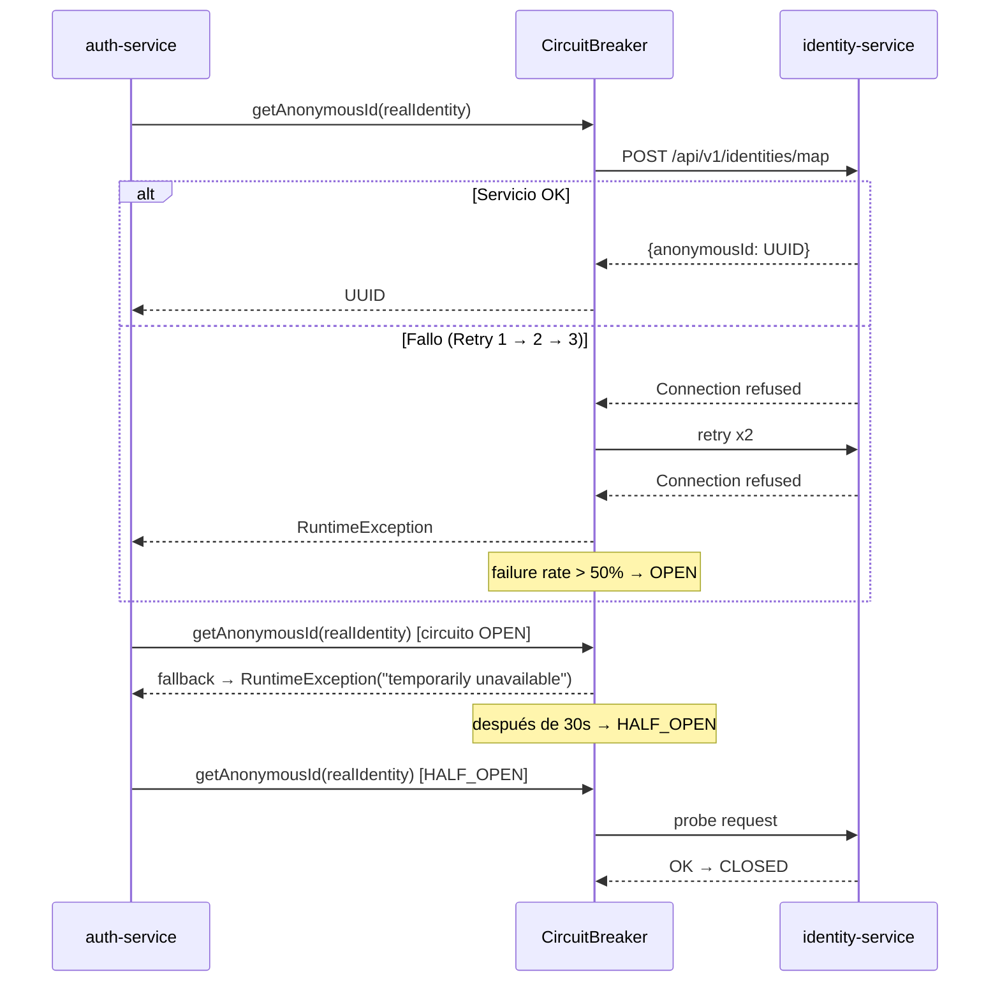
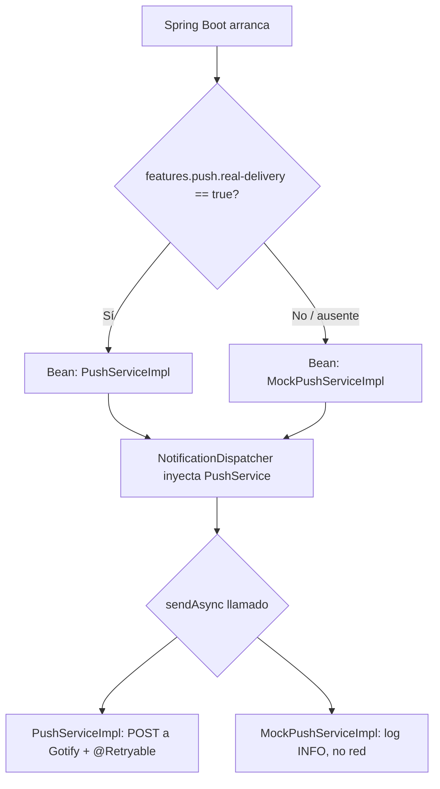
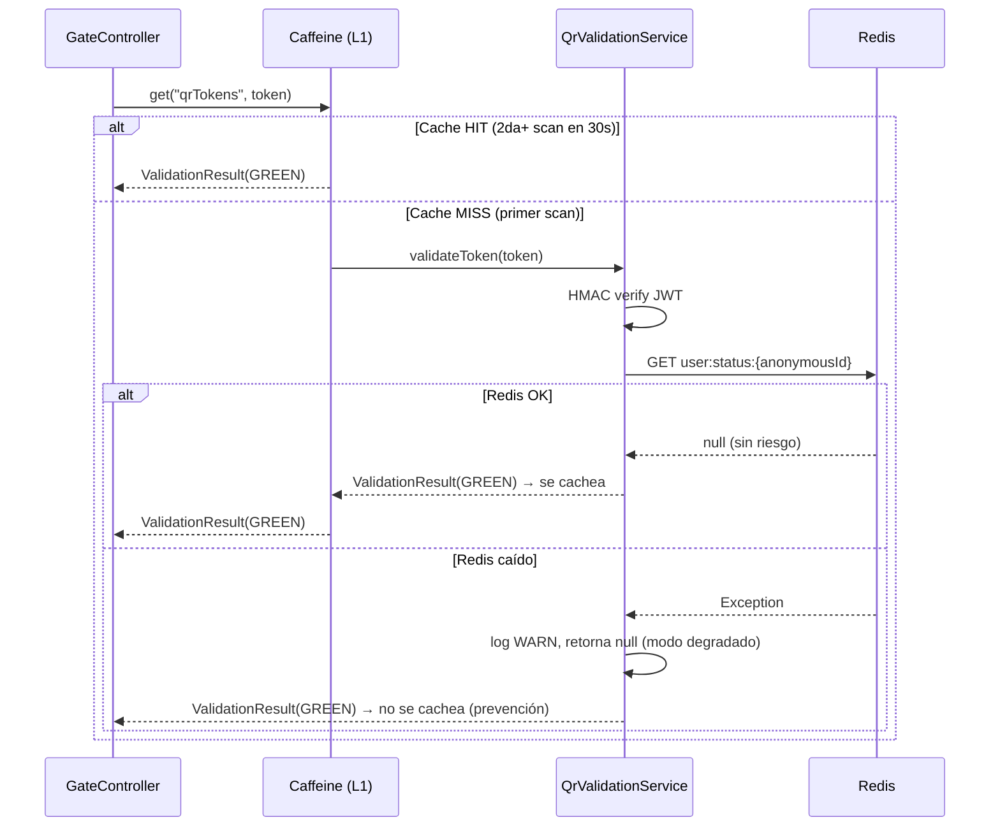

# Punto 3: Patrones de Diseño (10%)

## 1. Patrones Existentes en la Arquitectura

Los siguientes patrones fueron identificados en el código fuente. No requieren cambios adicionales.

| Patrón | Categoría | Evidencia (archivo:línea) |
|---|---|---|
| **Builder** (Lombok `@Builder`) | Creacional | `identity-service/.../model/IdentityMapping.java:13`; `.../event/IdentityAccessEvent.java:9,19,27`; `promotion-service/.../service/HealthStatusService.java:48-53` |
| **Factory** (Spring `@Bean`) | Creacional | `auth-service/.../config/SecurityConfig.java:23,37,49,57,67,75,82`; `promotion-service/.../config/CacheConfig.java:17` |
| **Adapter** (clientes HTTP) | Estructural | `auth-service/.../client/IdentityClient.java`; `dashboard-service/.../client/PromotionClient.java`; `notification-service/.../service/PushServiceImpl.java:18-32` |
| **Facade** | Estructural | `notification-service/.../service/NotificationDispatcher.java:13-41` - oculta Email/SMS/Push detrás de `dispatch()` |
| **Chain of Responsibility** | Comportamiento | `auth-service/.../security/DualChainAuthenticationProvider.java:13-27` - LDAP → Local DB |
| **Strategy** | Comportamiento | `notification-service/.../service/TemplateService.java:45-58`; interfaces `EmailService`/`SmsService`/`PushService` + `*Impl` |
| **Observer / Pub-Sub** (Kafka) | Comportamiento | Producers: `HealthStatusService.java:119,135,150`, `StatusLifecycleService.java:76`. Listeners: `SurveyListener.java:16,33`, `ExposureNotificationListener.java:22`, `CircleFencedListener`, `PriorityAlertListener` |
| **State** (máquina de estados) | Comportamiento | `promotion-service/.../service/HealthStatusService.java:34-138` - transiciones `ACTIVE→SUSPECT→PROBABLE→CONFIRMED→RECOVERED` |
| **Template Method** | Comportamiento | Interfaces Spring Data `*Repository.java` - define el esqueleto de consulta, implementación por el framework |
| **Repository** | Arquitectural | `IdentityMappingRepository`; `LocalUserRepository`; `promotion-service/.../repository/{graph,jpa}/*` (Neo4j + JPA) |
| **DTO** | Arquitectural | `promotion-service/.../dto/{Building,AccessPoint,Floor}DTO.java` |
| **Dependency Injection** | Arquitectural | Pervasivo vía `@RequiredArgsConstructor` - `HealthStatusService.java:17-25`, `NotificationDispatcher.java:14-18` |
| **Retry** (Spring Retry) | Resiliencia | `notification-service/build.gradle.kts:18`; `PushServiceImpl.java:42-46,86-91` |
| **External Configuration** (parcial) | Configuración | `@Value` en `PushServiceImpl.java:20,23`, `TemplateService.java:21-28`, `QrValidationService.java:18` |
| **Scheduled Tasks** | Operacional | `StatusLifecycleService.java:33` - `@Scheduled` para transiciones automáticas de estado |
| **Cache-Aside** (parcial) | Performance | `promotion-service/.../config/CacheConfig.java:13-29` - Caffeine + `@Cacheable/@CacheEvict` en `HealthStatusService.java:39,168,173` |

---

## 2. Patrones Nuevos Implementados

### 2.1 Circuit Breaker + Retry - Resiliencia

**Objetivo:** Proteger `auth-service` y `dashboard-service` de fallos en cascada cuando `identity-service` o `promotion-service` no están disponibles.

**Propósito:** Detectar fallos repetidos en llamadas HTTP entre servicios, abrir el circuito temporalmente para evitar saturar el servicio caído, y activar un fallback determinista en lugar de propagar excepciones no manejadas.

**Beneficios:**
- Evita tiempos de espera indefinidos (sin CB, cada request esperaría el timeout TCP del SO ~2min)
- El fallback controlado previene 500s en cascada
- Estado HALF_OPEN permite recuperación automática sin intervención manual
- Ventana deslizante de 10 llamadas detecta degradación parcial

**Archivos modificados:**

| Archivo | Cambio |
|---|---|
| `auth-service/build.gradle.kts` | `resilience4j-spring-boot3:2.2.0` + `spring-boot-starter-aop` |
| `dashboard-service/build.gradle.kts` | Idem |
| `auth-service/.../client/IdentityClient.java` | `@CircuitBreaker` + `@Retry` + fallback + URL externalizada a `${IDENTITY_SERVICE_URL}` |
| `dashboard-service/.../client/PromotionClient.java` | `@CircuitBreaker` por método, reemplaza try/catch manual |
| `auth-service/application.yml` | Config instancia "identity": sliding window 10, threshold 50%, open 30s, retry 3 intentos |
| `dashboard-service/application.yml` | Config instancia "promotion" |

**Configuración (auth-service/application.yml):**
```yaml
resilience4j:
  circuitbreaker:
    instances:
      identity:
        slidingWindowSize: 10
        failureRateThreshold: 50
        waitDurationInOpenState: 30s
        permittedNumberOfCallsInHalfOpenState: 3
  retry:
    instances:
      identity:
        maxAttempts: 3
        waitDuration: 500ms
```

**Diagrama de secuencia:**



**Test:**
```bash
./gradlew :services:circleguard-auth-service:test --tests "*IdentityClientResilienceTest*"
```

#### ADR-0001: Circuit Breaker con Resilience4j

**Estado:** Aceptado | **Fecha:** 2025-05-28

**Contexto:** `IdentityClient` usaba `new RestTemplate()` sin timeout ni fallback. `PromotionClient` tenía try/catch manual sin estado compartido de fallos - sin umbral de apertura de circuito, el servicio degradado seguía recibiendo carga.

**Decisión:** Resilience4j con `@CircuitBreaker` + `@Retry` sobre métodos públicos de ambos clientes.

**Alternativas descartadas:**

| Alternativa | Razón |
|---|---|
| Spring Retry solo | No tiene estado de CB: no abre circuito aunque el servicio esté completamente caído |
| Istio / service mesh | Correcto a escala; excesivo para proyecto académico. Oculta lógica fuera del código Java |
| Feign + Resilience4j | Feign requiere Spring Cloud; complejidad no justificada |
| Hystrix | Deprecated desde 2018; Resilience4j es el sucesor estándar |

**Consecuencias positivas:**
- Cortes no bloquean thread pools de servicios llamadores
- Recovery automático via HALF_OPEN
- Métricas en `/actuator/circuitbreakers`

**Consecuencias negativas:**
- `@Retry` stacked con `@CircuitBreaker` multiplica llamadas al servicio destino antes de abrir (2 retries × N requests)
- Tests de CB requieren `@SpringBootTest` → más lentos que unit tests puros

---

### 2.2 External Configuration + Feature Toggle - Configuración

**Objetivo:** Centralizar secretos vía variables de entorno y reemplazar el toggle ad-hoc `gotifyToken.equals("MOCK_TOKEN")` por un mecanismo formal de Spring.

**Propósito:**

- **External Configuration:** Los secretos JWT/QR y URLs de servicios ya no están hardcoded. En producción se inyectan vía `JWT_SECRET`, `QR_SECRET`, etc. En desarrollo, los defaults permiten arrancar sin configuración adicional.
- **Feature Toggle:** `MockPushServiceImpl` y `PushServiceImpl` son beans mutuamente excluyentes controlados por `features.push.real-delivery`. Spring selecciona el bean correcto en el arranque vía `@ConditionalOnProperty`.

**Beneficios:**
- Elimina duplicación de secretos entre 4+ `application.yml`
- Permite despliegues multi-entorno sin cambios de código
- El toggle es explícito, auditable y testeable (no un string mágico)
- `FeatureFlags` como `@ConfigurationProperties` centraliza todos los toggles del servicio

**Archivos modificados:**

| Archivo | Cambio |
|---|---|
| `auth-service/application.yml` | `jwt.secret`, `qr.secret` → `${JWT_SECRET:dev-default}`, `${QR_SECRET:dev-default}` |
| `gateway-service/application.yml` | Idem |
| `promotion-service/application.yml` | `jwt.secret` → `${JWT_SECRET:dev-default}` |
| `notification-service/application.yml` | Idem + `push.gotify.*` + `features.push.real-delivery` |
| `PushServiceImpl.java` | `@ConditionalOnProperty(havingValue="true")`, eliminado bloque `if MOCK_TOKEN` |

**Archivos creados:**

| Archivo | Descripción |
|---|---|
| `notification-service/.../service/MockPushServiceImpl.java` | Bean activo por defecto (`matchIfMissing=true`), solo loguea |
| `notification-service/.../config/FeatureFlags.java` | `@ConfigurationProperties(prefix="features")` |

**Variables de entorno requeridas en producción:**

| Variable | Servicio(s) | Descripción |
|---|---|---|
| `JWT_SECRET` | auth, gateway, promotion, notification | Clave HMAC-HS256 (≥32 chars) |
| `QR_SECRET` | auth, gateway, notification | Clave HMAC para tokens QR |
| `IDENTITY_SERVICE_URL` | auth | URL de identity-service |
| `PROMOTION_SERVICE_URL` | dashboard | URL de promotion-service |
| `GOTIFY_URL` | notification | URL del servidor Gotify |
| `GOTIFY_TOKEN` | notification | Token de API de Gotify |
| `PUSH_REAL_DELIVERY` | notification | `true` para push real, `false` para mock |

**Diagrama de Feature Toggle:**



**Test:**
```bash
./gradlew :services:circleguard-notification-service:test --tests "*PushServiceToggleTest*"
```

#### ADR-0002: External Configuration y Feature Toggle

**Estado:** Aceptado | **Fecha:** 2025-05-28

**Contexto:** El secreto JWT estaba hardcoded y duplicado en 4 `application.yml`. `PushServiceImpl` usaba `if (gotifyToken.equals("MOCK_TOKEN"))` como toggle ad-hoc: no testeable con DI, viola SRP, depende de un string mágico.

**Decisión:** Placeholders `${ENV:default}` en YAMLs. Dos beans condicionales con `@ConditionalOnProperty`. `FeatureFlags` como `@ConfigurationProperties`.

**Alternativas descartadas:**

| Alternativa | Razón |
|---|---|
| Spring Cloud Config Server | Requiere infra adicional (config-server + Git/Redis backend); sobre-ingeniería para 8 servicios académicos |
| HashiCorp Vault | Solución enterprise; fuera del alcance del proyecto |
| Togglz | UI admin + BD persistence; `@ConditionalOnProperty` cubre el caso con cero dependencias adicionales |
| Mantener `MOCK_TOKEN` | Frágil ante refactors, no testeable, viola principio de menor sorpresa |

**Consecuencias positivas:**
- Secretos nunca hardcoded en código (defaults inocuos para dev)
- Toggle testeable con `@TestPropertySource`
- Compatible con Kubernetes `envFrom: secretRef`

**Consecuencias negativas:**
- Defaults de dev aparecen en el repo - producción debe garantizar inyección de `JWT_SECRET`
- Cambio de toggle requiere restart (no hot-reload)
- Dos clases push puede confundir sin leer esta documentación

---

### 2.3 Cache-Aside en gateway-service - Performance

**Objetivo:** Reducir latencia en el hot path de validación QR y aislar el gate de caídas momentáneas de Redis.

**Propósito:** Cada scan de QR ejecuta (1) verificación HMAC del JWT y (2) consulta a Redis. Con Caffeine L1 local, validaciones repetidas del mismo token dentro de 30s se sirven en microsegundos sin red. Si Redis cae, el gate no retorna "Invalid Token" (falso negativo de seguridad) sino que opera en modo degradado.

**Beneficios:**
- Latencia P50: ~5ms → < 1ms para tokens cacheados
- Solo tokens GREEN se cachean (`unless = "!#result.valid"`); tokens RED siempre consultan Redis
- Fallback ante Redis caído: gate sigue operando sin bloquear acceso al campus
- `recordStats()` en Caffeine expone hit rate para observabilidad

**Archivos modificados:**

| Archivo | Cambio |
|---|---|
| `gateway-service/build.gradle.kts` | `spring-boot-starter-cache` + `caffeine:3.1.8` |
| `gateway-service/.../service/QrValidationService.java` | `@Cacheable(value="qrTokens", unless="!#result.valid")` + `getStatusFromRedis()` aislado con try/catch + `@Slf4j` |

**Archivos creados:**

| Archivo | Descripción |
|---|---|
| `gateway-service/.../config/CacheConfig.java` | `@EnableCaching`, Caffeine 30s TTL, maxSize=10k |

**Diagrama de secuencia:**



**Test:**
```bash
./gradlew :services:circleguard-gateway-service:test --tests "*QrValidationCacheTest*"
```

#### ADR-0003: Cache-Aside en gateway-service

**Estado:** Aceptado | **Fecha:** 2025-05-28

**Contexto:** `QrValidationService.validateToken` es hot path de acceso al campus. Sin cache, cada scan ejecuta verificación HMAC + consulta Redis. Para 500 personas en 5min = ~3,000 operaciones de red. Si Redis cae, el servicio retornaba "Invalid or Expired Token" - mensaje que confunde fallo de infra con fallo de seguridad. `promotion-service` ya usa Cache-Aside con Caffeine, patrón conocido por el equipo.

**Decisión:** Caffeine como L1 cache local, TTL 30s, máximo 10k entradas. Solo resultados válidos (GREEN) se cachean. Redis separado en método privado con manejo de fallos independiente.

**Alternativas descartadas:**

| Alternativa | Razón |
|---|---|
| Redis como L1 cache | Dependencia circular: Redis ya es el store de estado. Si cae, perdemos store y cache simultáneamente |
| Spring Session + Redis | gateway-service es stateless; sesión la gestiona auth-service. Complejidad innecesaria |
| Cache sin TTL | Token puede invalidarse si estado cambia. 30s balances performance vs. consistencia eventual |
| Solo resolver fallo Redis (sin cache) | Resuelve NFR de disponibilidad pero no de performance; Caffeine resuelve ambos |

**Consecuencias positivas:**
- Latencia P50 de validación baja drásticamente para tokens repetidos
- Gate opera en modo degradado ante caída de Redis
- Mensaje de error diferencia infraestructura de seguridad
- Hit rate observable para métricas operacionales

**Consecuencias negativas:**
- Ventana de inconsistencia de 30s (mitigado: RED/POTENTIAL nunca se cachean)
- Cache no compartido entre instancias en despliegue horizontal (migrar a Redis TTL si se escala)
- Consumo heap estimado ~10MB para 10k tokens