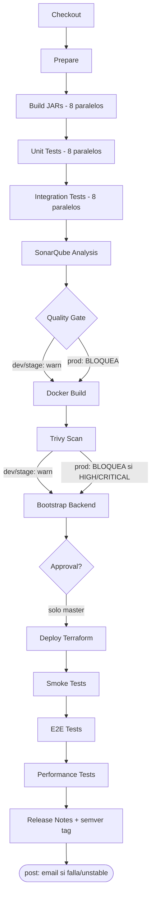
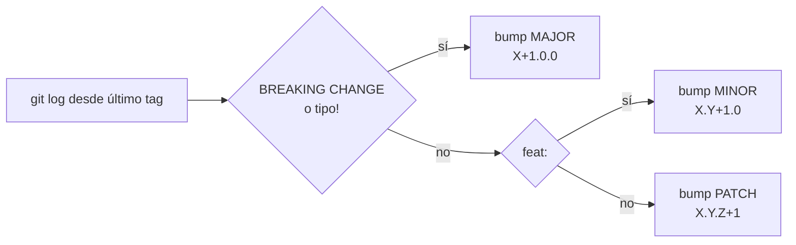

# Punto 4: CI/CD Avanzado (15%)

## Resumen

Este documento describe las capacidades de CI/CD avanzado implementadas en CircleGuard para el Proyecto Final. La base de los pipelines existía desde el Taller 2 (`Jenkinsfile.dev`, `Jenkinsfile.stage`, `Jenkinsfile.master`). Este punto agrega las cuatro capacidades faltantes exigidas por el Proyecto Final:

| Capacidad | Descripción | Bloquea en dev/stage | Bloquea en prod |
|---|---|---|---|
| **SonarQube** | Análisis estático de código + cobertura JaCoCo | No (reporta) | **Sí** (Quality Gate) |
| **Trivy** | Escaneo de vulnerabilidades en imágenes Docker | No (reporta) | **Sí** (HIGH/CRITICAL) |
| **Versionado semántico** | Bump automático MAJOR/MINOR/PATCH desde Conventional Commits | - | Reemplaza `v1.0.N` manual |
| **Notificaciones de fallo** | Email vía MailHog en `post.failure` y `post.unstable` | Sí (todos los envs) | Sí |

### Flujo de pipeline actualizado



### Comparativa de comportamiento por entorno

| Etapa | dev | stage | prod/master |
|---|---|---|---|
| SonarQube Analysis | Ejecuta | Ejecuta | Ejecuta |
| Quality Gate | Reporta (no bloquea) | Reporta (no bloquea) | Bloquea release |
| Docker Build tag | `:dev` | `:stage` | `:latest` |
| Trivy Scan exit code | `0` (no bloquea) | `0` (no bloquea) | `1` (bloquea ante HIGH/CRITICAL) |
| .trivyignore aplicado | No | No | Si |
| Versionado semántico | No aplica | No aplica | `scripts/semver.sh` |
| Email fallo/inestable | `devops@circleguard.local` | `devops@circleguard.local` | Con prefijo `PRODUCCION` |

---

## 1. Análisis Estático con SonarQube

### 1.1 Arquitectura del servidor

SonarQube se levanta con un Compose dedicado (separado del `docker-compose.yml` de infraestructura de aplicación) para no mezclar responsabilidades:

```bash
# Levantar SonarQube (solo para CI - no es parte del stack de aplicación)
docker compose -f sonarqube/docker-compose.sonarqube.yml up -d

# Verificar disponibilidad
curl -s http://localhost:9000/api/system/status | jq .status
# → "UP"
```

| Servicio | Puerto | Credenciales iniciales |
|---|---|---|
| SonarQube UI | `http://localhost:9000` | admin / admin |
| sonar-db (Postgres 16) | interno | sonar / sonar |

> **Nota de seguridad:** cambiar la contraseña de `admin` en el primer acceso. Crear un token de proyecto en `My Account > Security > Generate Tokens`.

### 1.2 Configuración del proyecto en SonarQube

El proyecto raíz de Gradle tiene el plugin `org.sonarqube` configurado en `build.gradle.kts`:

```kotlin
plugins {
    id("org.sonarqube") version "5.1.0.4882"
    // ...
}

sonar {
    properties {
        property("sonar.projectKey", "circleguard")
        property("sonar.projectName", "CircleGuard")
        property("sonar.sourceEncoding", "UTF-8")
        property("sonar.java.source", "21")
    }
}
```

Cada subproyecto tiene el plugin `jacoco` aplicado y la tarea `jacocoTestReport` configurada para generar XML:

```kotlin
subprojects {
    apply(plugin = "jacoco")

    tasks.withType<Test> {
        finalizedBy("jacocoTestReport")  // ejecuta JaCoCo al terminar los tests
    }

    tasks.withType<org.gradle.testing.jacoco.tasks.JacocoReport> {
        reports {
            xml.required.set(true)  // SonarQube lee el XML
            html.required.set(true)
        }
    }
}
```

SonarQube lee automáticamente el reporte XML de cobertura de cada subproyecto en:
```
services/<servicio>/build/reports/jacoco/test/jacocoTestReport.xml
```

### 1.3 Etapa SonarQube Analysis en Jenkins

La etapa corre después de Integration Tests para tener cobertura completa:

```groovy
stage('SonarQube Analysis') {
    steps {
        withSonarQubeEnv('sonarqube') {
            withCredentials([string(credentialsId: 'sonar-token', variable: 'SONAR_TOKEN')]) {
                sh './gradlew sonar --no-daemon -Dsonar.token=${SONAR_TOKEN} -Dsonar.host.url=${SONAR_HOST_URL}'
            }
        }
    }
}
```

**Configuración requerida en Jenkins:**

1. Instalar plugin **SonarQube Scanner** (`Manage Jenkins > Plugins`).
2. Ir a `Manage Jenkins > Configure System > SonarQube Servers`.
3. Agregar servidor con nombre `sonarqube` y URL `http://host.docker.internal:9000`.
4. Crear credencial Secret Text con ID `sonar-token` con el token generado en SonarQube.

### 1.4 Quality Gate

La etapa `Quality Gate` espera el veredicto del análisis via webhook:

```groovy
stage('Quality Gate') {
    steps {
        timeout(time: 5, unit: 'MINUTES') {
            waitForQualityGate abortPipeline: true   // true solo en master
        }
    }
}
```

**Configurar webhook en SonarQube:**
1. `Administration > Configuration > Webhooks > Create`.
2. URL: `http://host.docker.internal:8080/sonarqube-webhook/`
3. Sin secreto en entorno local.

| Entorno | `abortPipeline` | Resultado si Quality Gate falla |
|---|---|---|
| dev | `false` | Pipeline continúa, build marcado Unstable |
| stage | `false` | Pipeline continúa, build marcado Unstable |
| master | **`true`** | Pipeline se **aborta** - no llega a Docker ni al deploy |

### 1.5 Resultado esperado en SonarQube

Tras la primera ejecución del pipeline, el proyecto `circleguard` aparece en `http://localhost:9000` con:
- Bugs, Code Smells, Vulnerabilidades por servicio
- Cobertura de tests por módulo (lectura de JaCoCo XML)
- Duplicación de código


---

## 2. Escaneo de Vulnerabilidades con Trivy

### 2.1 Estrategia de escaneo

Trivy se ejecuta vía imagen Docker oficial sin instalación binaria, montando el socket del daemon Docker (ya disponible en el agente Jenkins por los stages `Docker Build`):

```bash
docker run --rm \
    -v /var/run/docker.sock:/var/run/docker.sock \
    -v "$PWD/trivy-reports":/out \
    aquasec/trivy:latest image \
    --severity HIGH,CRITICAL \
    --exit-code ${TRIVY_EXIT_CODE} \
    --format template --template "@contrib/html.tpl" \
    -o /out/trivy-${svc}.html \
    circleguard/${svc}-service:${IMAGE_TAG}
```

Los 8 servicios se escanean en bucle. Los reportes HTML se archivan en Jenkins como artefactos del build.

### 2.2 Gate por entorno

| Variable | dev | stage | prod |
|---|---|---|---|
| `TRIVY_EXIT_CODE` | `0` | `0` | `1` |
| `IMAGE_TAG` | `dev` | `stage` | `latest` |
| Bloquea pipeline | No | No | **Sí** ante HIGH/CRITICAL |

```groovy
environment {
    // En Jenkinsfile.master:
    TRIVY_EXIT_CODE = '1'  // bloquea ante HIGH/CRITICAL
    IMAGE_TAG       = 'latest'
}
```

### 2.3 Gestión de CVEs aceptados

El archivo `.trivyignore` en la raíz del repositorio lista CVEs aceptados conscientemente con justificación documentada:

```
# .trivyignore
# CVE-2023-XXXXX  # JDK 21 base image - sin fix disponible; mitigado por network policy
```

En el pipeline master, `.trivyignore` se monta en el contenedor Trivy:
```bash
-v "$PWD/.trivyignore":/.trivyignore \
--ignorefile /.trivyignore
```

> **Política**: ningún CVE entra a `.trivyignore` sin comentario de justificación. Revisar y actualizar en cada release.

### 2.4 Acceso a los reportes

Los reportes HTML se archivan en Jenkins:
```
http://localhost:8080/job/circleguard-master-pipeline/job/master/<N>/artifact/trivy-reports/
```


---

## 3. Versionado Semántico Automático

### 3.1 Problema del versionado manual

El pipeline original usaba `VERSION="v1.0.${BUILD_NUMBER}"` - un número de build monótonamente creciente sin semántica. No comunica si el release introduce una nueva funcionalidad (`feat:`), una corrección (`fix:`) o un cambio incompatible (`BREAKING CHANGE`).

### 3.2 Reglas de bump (Conventional Commits)

El script `scripts/semver.sh` lee los commits desde el último tag `vX.Y.Z` y aplica las reglas del estándar [Conventional Commits](https://www.conventionalcommits.org/):

| Tipo de commit | Bump | Ejemplo |
|---|---|---|
| `BREAKING CHANGE` en cuerpo/pie | **MAJOR** | `feat!: migrar API a v2` |
| `feat!:` o `fix!:` (con `!`) | **MAJOR** | `fix!(auth): cambiar firma de token` |
| `feat:` | **MINOR** | `feat(gateway): validación QR multifactor` |
| `fix:` / `chore:` / `docs:` / cualquier otro | **PATCH** | `fix(promotion): corregir cascade null` |



### 3.3 Uso en el pipeline

En `Jenkinsfile.master`, la etapa `Release Notes` ahora llama al script:

```groovy
stage('Release Notes') {
    steps {
        sh '''
            chmod +x scripts/semver.sh
            VERSION=$(bash scripts/semver.sh)
            echo "Generando Release Notes para ${VERSION}..."
            # ... generación de markdown ...
            git tag ${VERSION} || true
        '''
    }
}
```

### 3.4 Verificación local

```bash
# Probar el script con los commits actuales
bash scripts/semver.sh
# → v0.1.0  (si hay commits feat: desde v0.0.0)

# Simular un commit de fix después
git commit --allow-empty -m "fix(auth): token refresh null pointer"
bash scripts/semver.sh
# → v0.1.1

# Simular feat: → bump minor
git commit --allow-empty -m "feat(dashboard): nuevo endpoint de analytics por zona"
bash scripts/semver.sh
# → v0.2.0

# Simular breaking change → bump major
git commit --allow-empty -m "feat!: migrar auth API a /api/v2"
bash scripts/semver.sh
# → v1.0.0
```

---

## 4. Notificaciones Automáticas de Fallo

### 4.1 Canal: MailHog

MailHog está en el `docker-compose.yml` de infraestructura (`mailhog/mailhog:latest`, SMTP 1025, UI 8025). No requiere credenciales ni TLS - perfecto para entorno de desarrollo y CI local.

### 4.2 Configuración en Jenkins

1. Instalar plugin **Email Extension** (`Manage Jenkins > Plugins`).
2. Ir a `Manage Jenkins > Configure System > Extended E-mail Notification`.
3. Configurar:

| Campo | Valor |
|---|---|
| SMTP server | `host.docker.internal` |
| SMTP port | `1025` |
| Use SSL | No |
| Default user email suffix | `@circleguard.local` |

### 4.3 Implementación en pipelines

Los tres Jenkinsfiles tienen el bloque `post` extendido:

```groovy
post {
    failure {
        emailext(
            subject: "❌ FALLÓ ${env.JOB_NAME} #${env.BUILD_NUMBER} (${env.GIT_BRANCH})",
            body: """Pipeline fallido.
Job     : ${env.JOB_NAME}
Build   : #${env.BUILD_NUMBER}
Branch  : ${env.GIT_BRANCH}
Commit  : ${env.GIT_COMMIT}
Consola : ${env.BUILD_URL}console
""",
            to: 'devops@circleguard.local'
        )
    }
    unstable {
        emailext(
            subject: "⚠️ INESTABLE ${env.JOB_NAME} #${env.BUILD_NUMBER} (${env.GIT_BRANCH})",
            // ...
            to: 'devops@circleguard.local'
        )
    }
}
```

El pipeline master usa el prefijo `PRODUCCION` en el asunto para diferenciarlo de dev/stage.

**Casos que disparan notificación:**

| Evento | Destinatario | Asunto |
|---|---|---|
| Fallo de cualquier etapa (dev) | devops@circleguard.local | FALLO [job] #[N] |
| Build inestable - Quality Gate degradado (dev/stage) | devops@circleguard.local | INESTABLE [job] #[N] |
| Fallo de producción (master) | devops@circleguard.local | FALLO PRODUCCION [job] #[N] |


---

## 5. Configuración Requerida en Jenkins (checklist)

| # | Paso | Dónde | Detalle |
|---|---|---|---|
| 1 | Instalar plugin SonarQube Scanner | Manage Jenkins > Plugins | Buscar "SonarQube Scanner" |
| 2 | Instalar plugin Email Extension | Manage Jenkins > Plugins | Buscar "Email Extension" |
| 3 | Configurar servidor SonarQube | Configure System > SonarQube Servers | Nombre: `sonarqube`, URL: `http://host.docker.internal:9000` |
| 4 | Crear credencial `sonar-token` | Manage Jenkins > Credentials | Secret Text con token de SonarQube |
| 5 | Configurar SMTP en Jenkins | Configure System > Extended E-mail | Server: `host.docker.internal`, Puerto: `1025` |
| 6 | Configurar webhook en SonarQube | SonarQube > Administration > Webhooks | URL: `http://host.docker.internal:8080/sonarqube-webhook/` |

---

## 6. Análisis

### 6.1 Por qué el gate es asimétrico (dev/stage reporta, prod bloquea)

El propósito de dev y stage es dar feedback rápido al desarrollador. Bloquear el pipeline dev en cada advertencia de SonarQube ralentizaría el ciclo de desarrollo sin beneficio proporcional. El gate bloqueante en prod garantiza que ningún código con vulnerabilidades críticas o deuda técnica insostenible llega a usuarios reales.

### 6.2 Trivy con exit-code 0 en dev/stage

El escaneo en dev/stage genera evidencia auditable (reportes HTML archivados) sin interrumpir el flujo de desarrollo. El equipo puede revisar las vulnerabilidades y decidir si son aceptables antes de que el código llegue al pipeline master, donde sí son bloqueantes.

### 6.3 Semver sobre BUILD_NUMBER

`v1.0.42` no comunica nada sobre la naturaleza del cambio. `v1.2.0` indica que se agregó funcionalidad; `v2.0.0` indica un cambio incompatible. El versionado semántico desde Conventional Commits cierra el ciclo: los mensajes de commit estandarizados que ya usa el proyecto (verificable con `git log --oneline`) se convierten automáticamente en versiones significativas.

### 6.4 MailHog como canal de notificaciones

MailHog es la solución pragmática para un entorno de CI local: sin cuenta externa, sin TLS, sin API keys. En un entorno productivo real, `emailext` apuntaría al relay SMTP corporativo o se complementaría con `slackSend` al canal `#alerts-cicd`.

---

## 7. Archivos Modificados / Creados

| Archivo | Tipo | Cambio |
|---|---|---|
| `build.gradle.kts` | Modificado | Plugin `sonarqube`, JaCoCo en subprojectos, bloque `sonar {}` |
| `Jenkinsfile.dev` | Modificado | Env: `SONAR_HOST_URL`, `IMAGE_TAG=dev`, `TRIVY_EXIT_CODE=0`; etapas `SonarQube Analysis`, `Quality Gate`, `Trivy Scan`; `post` con `emailext` |
| `Jenkinsfile.stage` | Modificado | Ídem dev con `IMAGE_TAG=stage` |
| `Jenkinsfile.master` | Modificado | Ídem con `TRIVY_EXIT_CODE=1`, Quality Gate bloqueante, semver en Release Notes, `post` con prefijo `PRODUCCIÓN` |
| `scripts/semver.sh` | Nuevo | Calcula bump MAJOR/MINOR/PATCH desde Conventional Commits |
| `sonarqube/docker-compose.sonarqube.yml` | Nuevo | SonarQube LTS-Community + Postgres 16 dedicado en puerto 9000 |
| `.trivyignore` | Nuevo | Lista de CVEs aceptados conscientemente con documentación requerida |
