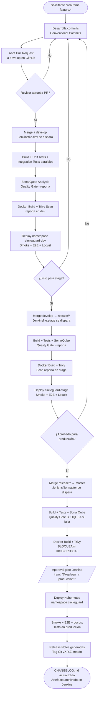

# Punto 6: Change Management y Release Notes (5%)

## Resumen

Este documento describe las capacidades de Change Management implementadas en CircleGuard para el Proyecto Final. Las cuatro capacidades exigidas se cubren así:

| Capacidad | Estado | Artefacto / Ubicación |
|---|---|---|
| **Generación automática de Release Notes** | Existente | Stage `Release Notes` en `Jenkinsfile.master:622` |
| **Sistema de etiquetado de releases (semver)** | Existente | `scripts/semver.sh` + `git tag ${VERSION}` en el pipeline |
| **Proceso formal de Change Management** | Nuevo | Este documento (sección 3) |
| **Planes de rollback** | Nuevo | Este documento (sección 4) + `scripts/rollback.sh` |

---

## 1. Generación Automática de Release Notes

### Funcionamiento

Cada ejecución exitosa del pipeline de producción (`Jenkinsfile.master`) genera un artefacto Markdown con las Release Notes de esa versión. El stage `Release Notes` (línea 622 de `Jenkinsfile.master`) ejecuta los siguientes pasos:

1. Calcula la versión (`VERSION`) llamando a `scripts/semver.sh`.
2. Determina el rango de commits desde el tag anterior (`PREV_TAG..HEAD`) o los últimos 10 si no hay tag previo.
3. Clasifica los commits por tipo (Conventional Commits) en cuatro categorías.
4. Genera el archivo `release-notes-${VERSION}.md` con metadata del build, lista de cambios y tabla de entorno.
5. Crea un tag Git ligero `${VERSION}` en el commit actual.
6. Archiva el Markdown como artefacto Jenkins (`archiveArtifacts`).

### Formato del artefacto

```
release-notes-v0.1.0.md
├── Tabla de metadata (versión, fecha, commit, autor, build Jenkins, branch)
├── ## Novedades       ← commits con prefijo feat:
├── ## Correcciones    ← commits con prefijo fix:
├── ## Documentación   ← commits con prefijo docs:
├── ## Otros cambios   ← resto de commits
├── ## Entorno de despliegue
├── ## Servicios desplegados (8 servicios con NodePorts)
└── ## Validaciones ejecutadas (checklist de 11 etapas)
```

### Clasificación de commits (Conventional Commits)

| Prefijo | Sección en Release Notes | Impacto semver |
|---|---|---|
| `feat:` / `feat(scope):` | Novedades | MINOR bump |
| `fix:` / `fix(scope):` | Correcciones | PATCH bump |
| `docs:` / `docs(scope):` | Documentación | PATCH bump |
| `feat!:` / `BREAKING CHANGE` | Novedades | MAJOR bump |
| Cualquier otro (`chore`, `ci`, `test`, etc.) | Otros cambios | PATCH bump |

### Evidencia en Jenkins

El artefacto se puede ver en la vista de build de Jenkins bajo **Build Artifacts**. La captura de pantalla de referencia está en [`screenshots/jenkins-master-release-notes.png`](../screenshots/jenkins-master-release-notes.png).

---

## 2. Sistema de Etiquetado de Releases

### Script `scripts/semver.sh`

El script `scripts/semver.sh` implementa versionado semántico automático basado en Conventional Commits. Sigue las reglas:

```
BREAKING CHANGE | feat! | fix!  →  MAJOR bump  (p.ej. v1.0.0 → v2.0.0)
feat:                           →  MINOR bump  (p.ej. v0.1.0 → v0.2.0)
fix: | cualquier otro           →  PATCH bump  (p.ej. v0.1.0 → v0.1.1)
Sin tag previo                  →  v0.1.0 (arranque)
```

**Flujo de uso en el pipeline:**

```bash
VERSION=$(bash scripts/semver.sh)   # Calcula nueva versión
# ... genera release-notes-${VERSION}.md ...
git tag ${VERSION} || true          # Crea tag ligero en HEAD
```

### Relación tag ↔ release notes ↔ CHANGELOG

```
git tag v0.1.0  ──►  release-notes-v0.1.0.md (artefacto Jenkins)
                └──►  Entrada en CHANGELOG.md (mantenida manualmente / por pipeline)
```

Los tags creados en el pipeline son **locales** al workspace de Jenkins. Para publicarlos en el repositorio remoto se puede agregar `git push origin ${VERSION}` al stage (no implementado para evitar permisos adicionales en el pipeline).

Para listar todos los tags del repositorio:

```bash
git tag --sort=-version:refname
```

Para ver los commits de un release específico:

```bash
git log v0.1.0..v0.2.0 --oneline --no-merges
```

---

## 3. Proceso Formal de Change Management

### Marco de referencia

CircleGuard implementa un proceso de Change Management basado en **ITIL v4 (Gestión de Cambios ligera)** adaptado a una organización de tamaño pequeño con GitFlow y CI/CD automatizado. El pipeline actúa como el motor de aplicación de controles: ningún cambio llega a producción sin pasar por las etapas de calidad y la aprobación explícita.

### Tipos de cambio

| Tipo | Descripción | Ruta GitFlow | Aprobación requerida |
|---|---|---|---|
| **Standard** | Cambio pre-aprobado, bajo riesgo. Sigue el proceso normal sin revisión adicional. | `feature/* → develop → Jenkinsfile.dev` | No (automático en dev) |
| **Normal** | Cambio planificado con impacto en stage o producción. Requiere revisión de PR y aprobación en el pipeline. | `develop → release/* → master → Jenkinsfile.stage/master` | Sí (PR review + `Approval (Prod)` gate) |
| **Emergency** | Hotfix urgente que no puede esperar el ciclo de release normal. | `hotfix/* → master → develop` | Sí (pipeline + verbal) |

### Roles

| Rol | Responsabilidad | Herramienta |
|---|---|---|
| **Solicitante / Desarrollador** | Crea la rama `feature/*` o `hotfix/*`, escribe los commits en Conventional Commits y abre el PR. | GitHub Pull Request |
| **Revisor / Aprobador técnico** | Revisa el código del PR, verifica que los tests pasen y la calidad no se degrade. | GitHub PR review |
| **Ejecutor de producción** | Aprueba el despliegue en el gate `Approval (Prod)` de Jenkins. En proyectos pequeños, puede ser el mismo que el revisor. | Jenkins `input` stage |
| **Responsable de operaciones** | Monitorea el despliegue, ejecuta smoke/E2E post-deploy y valida el estado del clúster. | Jenkins pipeline + kubectl |

### Flujo de un cambio (de feature a producción)



### Criterios de aceptación de un cambio (Definition of Done)

Un cambio está listo para producción cuando cumple **todos** los siguientes criterios:

- [ ] Todos los builds Java compilan sin errores (8 servicios).
- [ ] Tests unitarios pasan al 100% (0 fallos).
- [ ] Tests de integración pasan al 100% (0 fallos).
- [ ] Mobile tests pasan (`npm test -- --watchAll=false`).
- [ ] SonarQube Quality Gate en estado `OK` (o `WARN` aceptado por el aprobador).
- [ ] Trivy no reporta vulnerabilidades `HIGH` ni `CRITICAL` sin mitigación documentada en `.trivyignore`.
- [ ] PR revisado y aprobado por al menos un revisor en GitHub.
- [ ] Aprobación explícita en el gate `Approval (Prod)` del pipeline de Jenkins.
- [ ] Smoke Tests pasan en el namespace `circleguard` (todos los endpoints responden).
- [ ] E2E Tests pasan (7 flujos sin errores en `run_e2e.sh`).

---

## 4. Planes de Rollback

### Restricción de despliegue local

Las imágenes Docker en el clúster local usan el tag `:latest` con `imagePullPolicy: Never`. Esto significa que Kubernetes **nunca descarga imágenes del registry remoto**; usa las que están cargadas localmente en el nodo. Por tanto el rollback de imágenes no es un simple swap de tag: requiere reconstruir la imagen de la versión anterior y recargarla en el nodo.

Adicionalmente, el pipeline de master escala todos los deployments a **0 réplicas** en el bloque `post.always` para conservar recursos del clúster local. Al restaurar desde rollback es necesario volver a escalar a 1 réplica.

### Tabla de escenarios de rollback

| Escenario | Señal de alerta | Acción | Tiempo estimado |
|---|---|---|---|
| **Deploy fallido** (pods en CrashLoopBackOff / Error) | Jenkins pipeline falla, pods no llegan a `Running` | Rollout undo K8s al revision anterior | 2-5 min |
| **Regresión funcional post-deploy** (E2E/Smoke fallan tras deploy exitoso) | Tests de humo fallan, alertas de monitoreo | Rollout undo K8s + verificación de smoke | 5-10 min |
| **Vulnerabilidad crítica post-deploy** (CVE reportada tras el release) | Reporte de seguridad, Trivy en re-scan | Rollback por versión git: checkout `vX.Y.Z` anterior → rebuild → redeploy | 15-30 min |
| **Fallo de base de datos / migración** (servicio arranca pero falla en runtime) | Logs de error en pods, health check degradado | Rollout undo + restore de backup de base de datos | Variable |

### Plan A - Rollback rápido (revisión K8s anterior)

Usa `kubectl rollout undo` para revertir el Deployment a la revisión inmediatamente anterior. Válido cuando la imagen anterior aún existe en el nodo local y el problema es de configuración o startup.

**Script automatizado: `scripts/rollback.sh`**

```bash
# Rollback de un servicio
bash scripts/rollback.sh auth-service

# Rollback de todos los servicios
bash scripts/rollback.sh all

# Rollback a una revisión específica
bash scripts/rollback.sh gateway-service --to-revision 2
```

**Pasos manuales equivalentes:**

```bash
# 1. Ver el estado actual
kubectl get pods -n circleguard

# 2. Ver el historial de revisiones del deployment
kubectl rollout history deployment/auth-service -n circleguard

# 3. Revertir a la revisión anterior
kubectl rollout undo deployment/auth-service -n circleguard

# 4. O revertir a una revisión específica
kubectl rollout undo deployment/auth-service -n circleguard --to-revision=2

# 5. Verificar que los pods lleguen a Running
kubectl rollout status deployment/auth-service -n circleguard

# 6. Re-escalar si el post.always los dejó en 0 réplicas
kubectl scale deployment --all -n circleguard --replicas=1
```

### Plan B - Rollback por versión (tag Git anterior)

Para revertir a una versión específica del código (p.ej. cuando el Plan A no es suficiente porque la imagen anterior fue sobreescrita o la regresión es de código).

**Requisito previo:** el pipeline debe haber creado el tag `vX.Y.Z` en la versión a la que se quiere volver.

```bash
# 1. Identificar la versión objetivo
git tag --sort=-version:refname
# → v0.3.0, v0.2.1, v0.2.0, v0.1.0, ...

# 2. Crear rama de rollback desde el tag objetivo
git checkout -b rollback/v0.2.1 v0.2.1

# 3. Reconstruir las imágenes Docker con ese código
# (requiere ejecutar el pipeline en esa rama, o manualmente:)
docker build -t circleguard/auth-service:latest services/auth-service/
docker build -t circleguard/gateway-service:latest services/gateway-service/
# ... repetir para los 8 servicios o ejecutar el pipeline

# 4. Cargar las imágenes en el nodo del clúster local (si usa kind)
kind load docker-image circleguard/auth-service:latest --name <nombre-cluster>

# 5. Forzar re-deploy con rollout restart
kubectl rollout restart deployment --all -n circleguard

# 6. Verificar
kubectl get pods -n circleguard
```

### Plan C - Verificación post-rollback

Después de cualquier rollback ejecutar la verificación mínima:

```bash
# 1. Estado de los pods (todos deben estar en Running)
kubectl get pods -n circleguard

# 2. Re-escalar si necesario
kubectl scale deployment --all -n circleguard --replicas=1

# 3. Smoke tests manuales (equivalente al stage de Jenkins)
curl -s -o /dev/null -w "%{http_code}" http://localhost:30087/health  # gateway
curl -s -o /dev/null -w "%{http_code}" http://localhost:30082/actuator/health  # notification
curl -s -o /dev/null -w "%{http_code}" http://localhost:30084/actuator/health  # dashboard
curl -s -o /dev/null -w "%{http_code}" http://localhost:30085/actuator/health  # file
curl -s -o /dev/null -w "%{http_code}" http://localhost:30086/actuator/health  # form
curl -s -o /dev/null -w "%{http_code}" http://localhost:30088/actuator/health  # promotion
curl -s -o /dev/null -w "%{http_code}" http://localhost:30180/actuator/health  # auth
curl -s -o /dev/null -w "%{http_code}" http://localhost:30083/actuator/health  # identity

# 4. Registrar el incidente y el rollback en el CHANGELOG
# Agregar entrada bajo ## [Unreleased] con categoría Fixed o Changed
```

### Script `scripts/rollback.sh`

Ver el archivo [`scripts/rollback.sh`](../scripts/rollback.sh) para el script ejecutable. Uso:

```
scripts/rollback.sh <servicio|all> [--to-revision N]

  servicio     Nombre del deployment: auth-service, gateway-service, etc.
  all          Aplica rollout undo a los 8 microservicios en secuencia.
  --to-revision N  (Opcional) Revertir a la revisión N específica.
```

---

## 5. CHANGELOG

El archivo [`CHANGELOG.md`](../CHANGELOG.md) en la raíz del repositorio mantiene un historial consolidado de releases siguiendo el formato **Keep a Changelog** (<https://keepachangelog.com>) con **SemVer** (<https://semver.org>).

Diferencia con las Release Notes automáticas:

| Artefacto | Generado por | Contenido | Audiencia |
|---|---|---|---|
| `release-notes-vX.Y.Z.md` | Pipeline Jenkins (automático) | Commits clasificados + metadata de build | Equipo técnico / auditoría |
| `CHANGELOG.md` | Actualización manual (o script) | Resumen legible de cada versión | Stakeholders / equipo |

---

## 6. Integración con el pipeline

```
Jenkinsfile.master
  └── stage('Release Notes')
        ├── scripts/semver.sh          → calcula versión
        ├── git log --pretty            → extrae commits
        ├── genera release-notes-vX.Y.Z.md
        ├── git tag ${VERSION}          → etiqueta el commit
        └── archiveArtifacts            → artefacto permanente en Jenkins
```

El CHANGELOG y el script de rollback son complementos externos al pipeline; no modifican `Jenkinsfile.master` ni interrumpen el flujo de CI/CD existente.
