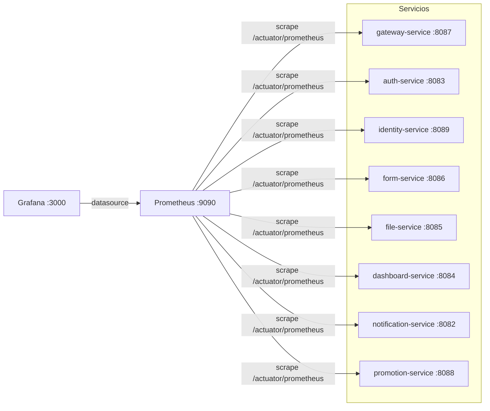
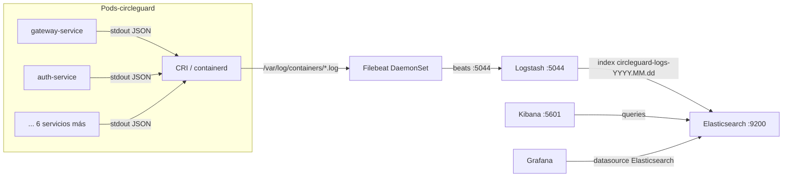
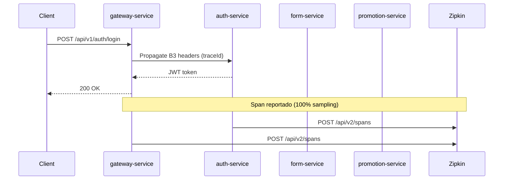

# Punto 7: Observabilidad y Monitoreo (10%)

## Resumen

Este documento describe las capacidades de Observabilidad y Monitoreo implementadas en CircleGuard para el Proyecto Final. Las siete capacidades exigidas se cubren así:

| Capacidad | Estado | Artefacto / Ubicación |
|---|---|---|
| **Dashboards relevantes por servicio** | ✅ Implementado | Grafana — dashboard técnico (variable `$service`) + dashboard de negocio |
| **Stack de monitoreo Prometheus + Grafana** | ✅ Implementado | `terraform/modules/k8s-prometheus/` · `terraform/modules/k8s-grafana/` · `k8s/infra/10-prometheus.yml` · `k8s/infra/17-grafana.yml` |
| **ELK Stack (Elasticsearch + Logstash + Kibana)** | ✅ Implementado | `terraform/modules/k8s-{elasticsearch,logstash,kibana,filebeat}/` · `k8s/infra/12-15-*.yml` |
| **Alertas para situaciones críticas** | ✅ Implementado | Prometheus `alert.rules.yml` + Alertmanager → MailHog SMTP (`k8s/infra/11-alertmanager.yml`) |
| **Tracing distribuido** | ✅ Implementado | Zipkin (`terraform/modules/k8s-zipkin/` · `k8s/infra/16-zipkin.yml`) + `micrometer-tracing-bridge-brave` |
| **Health checks + readiness/liveness probes** | ✅ Implementado | Spring Actuator HTTP probes en `terraform/modules/k8s-microservice/main.tf` + `k8s/services/09-16-*.yml` |
| **Métricas de negocio y técnicas** | ✅ Implementado | Micrometer custom Counters en 4 servicios + métricas JVM/HTTP automáticas |

---

## 1. Prometheus + Grafana (Stack de Monitoreo)

### Arquitectura



### Configuración de Prometheus

Prometheus recoge métricas de los 8 servicios vía scrape estático a `/actuator/prometheus`. La configuración se provisiona como ConfigMap en `terraform/modules/k8s-prometheus/main.tf` y su mirror en `k8s/infra/10-prometheus.yml`:

```yaml
scrape_configs:
  - job_name: 'gateway-service'
    static_configs:
      - targets: ['gateway-svc:8087']
    metrics_path: /actuator/prometheus
  # ... repite para los 8 servicios
```

### Activación de endpoints de métricas

La configuración de Actuator se inyecta vía ConfigMap (Spring relaxed binding) en `k8s/infra/01-configmap.yml` y en los `config_map_data` de cada env terraform:

```yaml
MANAGEMENT_ENDPOINTS_WEB_EXPOSURE_INCLUDE: "health,info,prometheus,metrics"
MANAGEMENT_ENDPOINT_HEALTH_PROBES_ENABLED: "true"
MANAGEMENT_ENDPOINT_HEALTH_SHOW_DETAILS:   "always"
MANAGEMENT_METRICS_TAGS_APPLICATION:       "circleguard"
MANAGEMENT_TRACING_SAMPLING_PROBABILITY:   "1.0"
MANAGEMENT_ZIPKIN_TRACING_ENDPOINT:        "http://zipkin-svc:9411/api/v2/spans"
```

### Dashboards en Grafana

Grafana se provisiona con dos dashboards JSON vía ConfigMap:

**Dashboard técnico por servicio** (`circleguard-services.json`):
- Variable `$service` → dropdown que cubre los 8 servicios
- Paneles: HTTP request rate, HTTP error rate (5xx %), latencia p50/p95/p99, JVM heap used/max, threads activos, GC time, estado UP/DOWN

**Dashboard de métricas de negocio** (`circleguard-business.json`):
- `circleguard_logins_total{result=success|failure}` (auth-service)
- `circleguard_surveys_submitted_total` (form-service)
- `circleguard_health_status_updates_total{status}` (promotion-service)
- `circleguard_notifications_sent_total{channel,result}` (notification-service)

> 📸 Captura de referencia: [`../screenshots/grafana-dashboard.png`](../screenshots/grafana-dashboard.png)

---

## 2. ELK Stack (Logs Centralizados)

### Arquitectura



### Logs JSON con LogstashEncoder

Cada servicio emite logs en formato JSON a stdout gracias a `logback-spring.xml` (archivo idéntico en los 8 servicios en `src/main/resources/`):

```xml
<configuration>
  <appender name="JSON" class="ch.qos.logback.core.ConsoleAppender">
    <encoder class="net.logstash.logback.encoder.LogstashEncoder">
      <includeMdcKeyName>traceId</includeMdcKeyName>
      <includeMdcKeyName>spanId</includeMdcKeyName>
      <includeMdcKeyName>parentId</includeMdcKeyName>
      <includeMdcKeyName>X-B3-TraceId</includeMdcKeyName>
      <includeMdcKeyName>X-B3-SpanId</includeMdcKeyName>
    </encoder>
  </appender>
  <root level="INFO">
    <appender-ref ref="JSON"/>
  </root>
</configuration>
```

Ejemplo de log emitido:

```json
{
  "@timestamp": "2024-06-08T14:23:11.234Z",
  "level": "INFO",
  "logger_name": "com.circleguard.auth.controller.LoginController",
  "message": "Login attempt for user: jdoe",
  "traceId": "c4fb6a2e3b1d4f8a",
  "spanId":  "a1b2c3d4e5f6a7b8",
  "service": "circleguard-auth-service"
}
```

### Filebeat → Logstash → Elasticsearch

Filebeat corre como DaemonSet con autodiscover kubernetes y RBAC (ServiceAccount + ClusterRole). Decodifica el JSON del campo `message` y reenvía a Logstash (`logstash-svc:5044`).

Logstash parsea con `json { source => "message" }` e indexa en Elasticsearch bajo el patrón `circleguard-logs-YYYY.MM.dd`.

### Kibana

Kibana expone UI en `:5601`. Patrón de índice sugerido: `circleguard-logs-*`. El campo de tiempo es `@timestamp`.

> 📸 Captura de referencia: [`../screenshots/kibana-logs.png`](../screenshots/kibana-logs.png)

---

## 3. Tracing Distribuido (Zipkin)

### Dependencias añadidas

En `build.gradle.kts` (raíz, bloque `subprojects { dependencies {} }`), añadidas para los 8 servicios:

```kotlin
"implementation"("io.micrometer:micrometer-tracing-bridge-brave")
"implementation"("io.zipkin.reporter2:zipkin-reporter-brave")
```

### Flujo de trazas



Configuración por env var (ConfigMap):
```
MANAGEMENT_TRACING_SAMPLING_PROBABILITY = "1.0"
MANAGEMENT_ZIPKIN_TRACING_ENDPOINT      = "http://zipkin-svc:9411/api/v2/spans"
```

> 📸 Captura de referencia: [`../screenshots/zipkin-trace.png`](../screenshots/zipkin-trace.png)

---

## 4. Alertas para Situaciones Críticas

### Reglas de Prometheus

Definidas en `alert.rules.yml` (ConfigMap de Prometheus):

| Alerta | Condición | Severidad | Ventana |
|---|---|---|---|
| `ServiceDown` | `up == 0` | critical | 1 m |
| `HighErrorRate` | ratio HTTP 5xx > 5 % | warning | 5 m |
| `HighLatencyP99` | p99 > 1 s | warning | 5 m |
| `HighJvmHeapUsage` | `jvm_memory_used / jvm_memory_max > 0.9` | warning | 5 m |
| `NoHealthStatusUpdates` | `rate(circleguard_health_status_updates_total[15m]) == 0` | warning | 15 m |

### Alertmanager → MailHog

Alertmanager (`alertmanager-svc:9093`) enruta todas las alertas al receiver SMTP conectado a MailHog (`mailhog-svc:1025`). Los correos de alerta son visibles en la UI de MailHog ya existente.

```yaml
# alertmanager.yml (extracto)
route:
  receiver: mailhog
  group_wait: 10s
  group_interval: 1m
  repeat_interval: 1h
receivers:
  - name: mailhog
    email_configs:
      - to: alerts@circleguard.local
        from: alertmanager@circleguard.local
        smarthost: mailhog-svc:1025
        require_tls: false
```

**Para probar una alerta:**

```bash
# Escalar a 0 replicas el form-service → dispara ServiceDown en ~1 min
kubectl scale deploy/form-service -n circleguard --replicas=0
# Ver alerta en MailHog: http://localhost:30025 (o 31025 en dev)
```

> 📸 Capturas de referencia:
> - [`../screenshots/prometheus-targets.png`](../screenshots/prometheus-targets.png) — Prometheus Targets (8 UP)
> - [`../screenshots/mailhog-alert.png`](../screenshots/mailhog-alert.png) — Email de alerta en MailHog

---

## 5. Health Checks y Probes

### Spring Actuator

Con `spring-boot-starter-actuator` y las variables de entorno de la sección 1, los endpoints disponibles son:

| Endpoint | URL | Propósito |
|---|---|---|
| `/actuator/health` | `http://<svc>:<port>/actuator/health` | Health general |
| `/actuator/health/liveness` | — | Probe de liveness |
| `/actuator/health/readiness` | — | Probe de readiness |
| `/actuator/prometheus` | — | Métricas para Prometheus |
| `/actuator/info` | — | Info del servicio |

### Kubernetes Probes

Todos los manifests de servicios (`k8s/services/09-*.yml` … `16-*.yml`) y el módulo terraform genérico (`terraform/modules/k8s-microservice/main.tf`) usan probes HTTP en lugar de `tcpSocket`:

```yaml
startupProbe:
  httpGet:
    path: /actuator/health/liveness
    port: 8087   # puerto del servicio
  initialDelaySeconds: 20
  periodSeconds: 5
  failureThreshold: 30   # 2.5 min máximo para arrancar

livenessProbe:
  httpGet:
    path: /actuator/health/liveness
    port: 8087
  periodSeconds: 10
  failureThreshold: 3
  timeoutSeconds: 5

readinessProbe:
  httpGet:
    path: /actuator/health/readiness
    port: 8087
  periodSeconds: 5
  failureThreshold: 6
  timeoutSeconds: 3
```

---

## 6. Métricas de Negocio y Técnicas

### Métricas técnicas (automáticas)

Con `micrometer-registry-prometheus` activo, Spring Boot registra automáticamente:

| Métrica | Descripción |
|---|---|
| `http_server_requests_seconds{uri,method,status}` | Latencia y tasa de peticiones HTTP |
| `jvm_memory_used_bytes{area,id}` | Memoria JVM usada |
| `jvm_memory_max_bytes{area,id}` | Memoria JVM máxima |
| `jvm_threads_live_threads` | Hilos JVM activos |
| `jvm_gc_pause_seconds` | Pausas de GC |
| `process_cpu_usage` | CPU del proceso |
| `up` | Estado del scrape target (1=UP, 0=DOWN) |

### Métricas de negocio (custom)

Implementadas con `Counter.builder(...).register(meterRegistry)` en 4 servicios:

| Métrica | Servicio | Archivo | Descripción |
|---|---|---|---|
| `circleguard_logins_total{result=success\|failure}` | auth-service | `LoginController.java` | Intentos de login por resultado |
| `circleguard_surveys_submitted_total` | form-service | `HealthSurveyService.java` | Encuestas de salud enviadas |
| `circleguard_health_status_updates_total{status}` | promotion-service | `HealthStatusService.java` | Cambios de estado de salud por tipo |
| `circleguard_notifications_sent_total{channel,result}` | notification-service | `ExposureNotificationListener.java` | Notificaciones despachadas |

**Ejemplo de consulta PromQL para el dashboard de negocio:**

```promql
# Tasa de logins exitosos por minuto
rate(circleguard_logins_total{result="success"}[5m])

# Encuestas enviadas en la última hora
increase(circleguard_surveys_submitted_total[1h])

# Distribución de estados de salud actualizados hoy
sum by (status) (increase(circleguard_health_status_updates_total[24h]))
```

---

## 7. Puertos de Acceso

### Producción (namespace `circleguard`, NodePorts `300XX`)

| Servicio | NodePort | URL |
|---|---|---|
| Prometheus | 30090 | `http://localhost:30090` |
| Grafana | 30091 | `http://localhost:30091` (admin / circleguard) |
| Kibana | 30092 | `http://localhost:30092` |
| Zipkin | 30093 | `http://localhost:30093` |
| Alertmanager | 30094 | `http://localhost:30094` |

### Dev (namespace `circleguard-dev`, NodePorts `310XX`)

| Servicio | NodePort | URL |
|---|---|---|
| Prometheus | 31090 | `http://localhost:31090` |
| Grafana | 31091 | `http://localhost:31091` |
| Kibana | 31092 | `http://localhost:31092` |
| Zipkin | 31093 | `http://localhost:31093` |
| Alertmanager | 31094 | `http://localhost:31094` |

### Stage (namespace `circleguard-stage`, NodePorts `320XX`)

| Servicio | NodePort | URL |
|---|---|---|
| Prometheus | 32090 | `http://localhost:32090` |
| Grafana | 32091 | `http://localhost:32091` |
| Kibana | 32092 | `http://localhost:32092` |
| Zipkin | 32093 | `http://localhost:32093` |
| Alertmanager | 32094 | `http://localhost:32094` |

---

## 8. Despliegue

### Opción A — Terraform (recomendado para CI/CD)

```bash
cd terraform/envs/dev
terraform init
terraform apply -auto-approve
```

Los 8 módulos de observabilidad se crean en el orden declarado con `depends_on` correcto:
`elasticsearch → logstash → kibana → filebeat → zipkin → alertmanager → prometheus → grafana`

### Opción B — Manifests estáticos (kubectl directo)

```bash
# namespace circleguard debe existir
kubectl apply -f k8s/infra/10-prometheus.yml
kubectl apply -f k8s/infra/11-alertmanager.yml
kubectl apply -f k8s/infra/12-elasticsearch.yml
kubectl apply -f k8s/infra/13-logstash.yml
kubectl apply -f k8s/infra/14-kibana.yml
kubectl apply -f k8s/infra/15-filebeat.yml
kubectl apply -f k8s/infra/16-zipkin.yml
kubectl apply -f k8s/infra/17-grafana.yml
```

### Verificación end-to-end

```bash
# 1. Todos los pods Running
kubectl get pods -n circleguard

# 2. Prometheus targets (8 services UP)
curl http://localhost:30090/api/v1/targets | jq '.data.activeTargets[].health'

# 3. Métricas de un servicio
curl http://localhost:30087/actuator/prometheus | grep circleguard_logins

# 4. Health probes
curl http://localhost:30087/actuator/health/readiness
# {"status":"UP"}

# 5. Traza en Zipkin
curl http://localhost:30093/api/v2/services
```

---

## 9. Archivos Modificados / Creados

### Modificados

| Archivo | Cambio |
|---|---|
| `build.gradle.kts` | 5 deps observabilidad en `subprojects` |
| `k8s/infra/01-configmap.yml` | 6 vars `MANAGEMENT_*` para actuator/tracing |
| `terraform/modules/k8s-microservice/main.tf` | Probes HTTP (startup + liveness + readiness) |
| `terraform/envs/{dev,stage,prod}/main.tf` | Port mappings + módulos observabilidad |
| `terraform/envs/{dev,stage,prod}/outputs.tf` | URLs prometheus/grafana/kibana/zipkin/alertmanager |
| `k8s/services/09-file-service.yml` | HTTP probes + envFrom |
| `k8s/services/10-form-service.yml` | HTTP probes |
| `k8s/services/11-dashboard-service.yml` | HTTP probes |
| `k8s/services/12-notification-service.yml` | HTTP probes |
| `k8s/services/13-gateway-service.yml` | HTTP probes |
| `k8s/services/14-promotion-service.yml` | HTTP probes |
| `k8s/services/15-auth-service.yml` | HTTP probes |
| `k8s/services/16-identity-service.yml` | HTTP probes |
| `services/circleguard-auth-service/.../LoginController.java` | Counter `circleguard_logins_total` |
| `services/circleguard-form-service/.../HealthSurveyService.java` | Counter `circleguard_surveys_submitted_total` |
| `services/circleguard-promotion-service/.../HealthStatusService.java` | Counter `circleguard_health_status_updates_total` |
| `services/circleguard-notification-service/.../ExposureNotificationListener.java` | Counter `circleguard_notifications_sent_total` |

### Creados

| Archivo | Descripción |
|---|---|
| `services/*/src/main/resources/logback-spring.xml` (×8) | JSON logging con LogstashEncoder |
| `terraform/modules/k8s-prometheus/` | Módulo Prometheus + reglas de alerta |
| `terraform/modules/k8s-grafana/` | Módulo Grafana + dashboards JSON |
| `terraform/modules/k8s-elasticsearch/` | Módulo Elasticsearch single-node |
| `terraform/modules/k8s-logstash/` | Módulo Logstash (beats → ES) |
| `terraform/modules/k8s-kibana/` | Módulo Kibana |
| `terraform/modules/k8s-filebeat/` | Módulo Filebeat DaemonSet + RBAC |
| `terraform/modules/k8s-zipkin/` | Módulo Zipkin (in-memory) |
| `terraform/modules/k8s-alertmanager/` | Módulo Alertmanager → MailHog SMTP |
| `k8s/infra/10-prometheus.yml` | Manifest estático Prometheus |
| `k8s/infra/11-alertmanager.yml` | Manifest estático Alertmanager |
| `k8s/infra/12-elasticsearch.yml` | Manifest estático Elasticsearch |
| `k8s/infra/13-logstash.yml` | Manifest estático Logstash |
| `k8s/infra/14-kibana.yml` | Manifest estático Kibana |
| `k8s/infra/15-filebeat.yml` | Manifest estático Filebeat |
| `k8s/infra/16-zipkin.yml` | Manifest estático Zipkin |
| `k8s/infra/17-grafana.yml` | Manifest estático Grafana |

---

## Checklist de Validación

- [ ] `./gradlew build` compila los 8 servicios sin errores
- [ ] `curl localhost:<port>/actuator/health` retorna `{"status":"UP"}` en cada servicio
- [ ] `curl localhost:<port>/actuator/prometheus` expone métricas con prefijo `circleguard_` y `jvm_`
- [ ] Prometheus Targets: 8 endpoints con estado `UP`
- [ ] Grafana dashboard técnico: gráfica de HTTP rate con datos para todos los servicios
- [ ] Grafana dashboard de negocio: counters `circleguard_logins_total` con datos tras hacer login
- [ ] Kibana: logs JSON con campo `traceId` indexados bajo `circleguard-logs-*`
- [ ] Zipkin: traza end-to-end visible tras un POST a `/api/v1/auth/login`
- [ ] Alerta `ServiceDown`: aparece en MailHog UI tras escalar un servicio a 0 replicas
- [ ] Readiness probe falla correctamente antes de que Spring Boot termine de arrancar
- [ ] `terraform validate` sin errores en `envs/{dev,stage,prod}`
- [ ] `kubectl apply --dry-run=client -f k8s/infra/` sin errores
