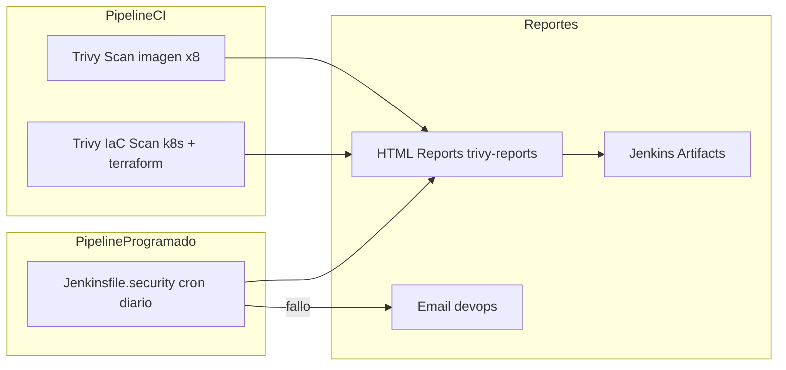
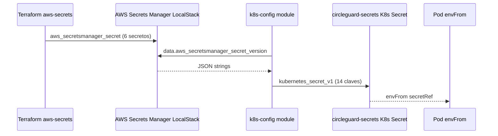
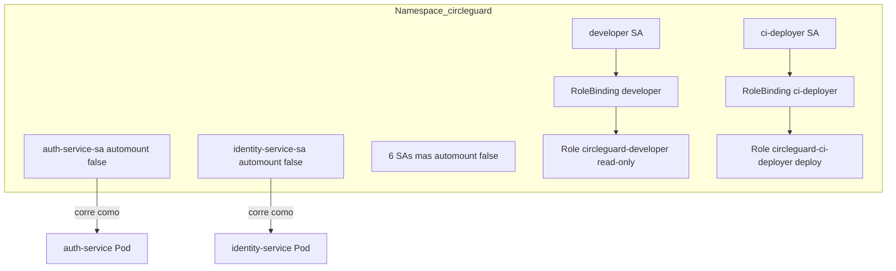
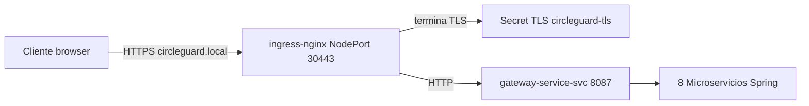

# Punto 8: Seguridad (5%)

## Resumen

Este documento describe las capacidades de Seguridad implementadas en CircleGuard para el Proyecto Final. Las cuatro capacidades exigidas se cubren así:

| Capacidad | Estado | Artefacto / Ubicación |
|---|---|---|
| **Escaneo continuo de vulnerabilidades** | Implementado | `Jenkinsfile.{dev,stage,master}` - stage `Trivy Scan` (imágenes) + `Trivy IaC Scan` (manifests) · `Jenkinsfile.security` (cron diario nocturno) · `.trivyignore` |
| **Gestión segura de secretos** | Implementado | `terraform/modules/aws-secrets/` → `k8s-config/` → `circleguard-secrets` Secret · `k8s/infra/02-secrets.yml` · secretos inline eliminados de auth/identity |
| **RBAC para acceso a recursos** | Implementado | `terraform/modules/k8s-rbac/` · `k8s/infra/18-rbac.yml` · SA dedicadas por servicio (`automountServiceAccountToken: false`) · Roles `developer` y `ci-deployer` |
| **TLS para servicios expuestos públicamente** | Implementado | `terraform/modules/k8s-ingress/` · `k8s/infra/19-ingress.yml` · ingress-nginx NodePort + cert self-signed · Ingress HTTPS `circleguard.local` → `gateway-service` |

---

## 1. Escaneo Continuo de Vulnerabilidades

### Arquitectura



### Escaneo de imágenes (stage `Trivy Scan`)

Presente en los tres Jenkinsfiles desde Punto 4. Escanea las 8 imágenes Docker buscando vulnerabilidades `HIGH` y `CRITICAL`:

```groovy
// Jenkinsfile.master - bloquea en prod si hay HIGH/CRITICAL
TRIVY_EXIT_CODE = '1'

stage('Trivy Scan') {
    steps {
        sh '''
            for svc in file gateway dashboard form notification promotion auth identity; do
                docker run --rm -v /var/run/docker.sock:/var/run/docker.sock \
                    -v "$PWD/.trivyignore":/.trivyignore \
                    aquasec/trivy:latest image \
                    --severity HIGH,CRITICAL --exit-code ${TRIVY_EXIT_CODE} \
                    --ignorefile /.trivyignore \
                    -o trivy-reports/trivy-${svc}.html \
                    ${REGISTRY}/${svc}-service:${IMAGE_TAG}
            done
        '''
    }
}
```

CVEs aceptados documentados en `.trivyignore` con justificación - política: sin entries sin comentario.

### Escaneo IaC (stage `Trivy IaC Scan`)

Nuevo en Punto 8. Detecta misconfiguraciones en manifests Kubernetes y módulos Terraform:

```groovy
stage('Trivy IaC Scan') {
    steps {
        sh '''
            docker run --rm -v "$PWD":/src aquasec/trivy:latest config \
                --severity HIGH,CRITICAL --exit-code ${TRIVY_EXIT_CODE} \
                -o trivy-reports/trivy-iac-k8s.html /src/k8s
            docker run --rm -v "$PWD":/src aquasec/trivy:latest config \
                --severity HIGH,CRITICAL --exit-code ${TRIVY_EXIT_CODE} \
                -o trivy-reports/trivy-iac-terraform.html /src/terraform
        '''
    }
}
```

Comportamiento por ambiente:

| Ambiente | `TRIVY_EXIT_CODE` | Efecto |
|---|---|---|
| dev | `0` | Reporta sin bloquear |
| stage | `0` | Reporta sin bloquear |
| prod (master) | `1` | Bloquea si HIGH/CRITICAL |

### Pipeline programado (`Jenkinsfile.security`)

Corre automáticamente cada noche (`H 2 * * *`). Ejecuta ambos tipos de escaneo independientemente del estado de despliegue, asegurando detección continua incluso sin nuevos builds:

```groovy
triggers {
    cron('H 2 * * *')  // ~02:00 AM diario
}
```

En caso de fallo envía email a `devops@circleguard.local` con lista de acciones recomendadas.

---

## 2. Gestión Segura de Secretos

### Arquitectura del flujo



### Secretos gestionados

`terraform/modules/k8s-config/main.tf` materializa el Secret `circleguard-secrets` con 15 claves (14 originales + `SPRING_LDAP_PASSWORD` añadida en Punto 8):

| Clave | Origen |
|---|---|
| `POSTGRES_USER` / `POSTGRES_PASSWORD` | `secrets["postgres"]` |
| `SPRING_DATASOURCE_USERNAME/PASSWORD` | `secrets["postgres"]` |
| `SPRING_NEO4J_AUTHENTICATION_*` | `secrets["neo4j"]` |
| `JWT_SECRET` / `QR_SECRET` | `secrets["jwt"]` |
| `TWILIO_ACCOUNT_SID` / `TWILIO_AUTH_TOKEN` | `secrets["twilio"]` |
| `VAULT_SECRET` / `VAULT_SALT` / `VAULT_HASH_SALT` | `secrets["vault"]` |
| `LDAP_ADMIN_PASSWORD` | `secrets["ldap"]` |
| `SPRING_LDAP_PASSWORD` | `secrets["ldap"]` ← **nuevo Punto 8** |

### Correcciones aplicadas en Punto 8

**Antes (inseguro):** `auth-service` y `identity-service` tenían secretos duplicados en `extra_env` inline, evadiendo el Secret:

```hcl
# ❌ Antes - valor en texto plano en el Deployment
extra_env = {
  SPRING_LDAP_PASSWORD = "admin"          # auth-service
  VAULT_SECRET         = "my-vault-..."   # identity-service
  VAULT_SALT           = "deadbeef"
  VAULT_HASH_SALT      = "12345678"
}
```

**Después (seguro):** eliminados del `extra_env`. Los valores llegan vía `envFrom: secretRef: circleguard-secrets`:

```hcl
# ✅ Después - secretos en el K8s Secret, inyectados por envFrom
extra_env = {
  SERVER_PORT           = "8180"
  SPRING_DATASOURCE_URL = "jdbc:postgresql://postgres-svc:5432/circleguard_auth"
  SPRING_LDAP_URLS      = "ldap://openldap-svc:389"
  SPRING_LDAP_BASE      = "dc=circleguard,dc=edu"
  SPRING_LDAP_USERNAME  = "cn=admin,dc=circleguard,dc=edu"
  # SPRING_LDAP_PASSWORD: viene de circleguard-secrets via envFrom
}
```

Aplicado en: `terraform/envs/{dev,stage,prod}/main.tf` y `k8s/services/{15-auth,16-identity}-service.yml`.

> **Nota sobre el manifest estático `k8s/infra/02-secrets.yml`:** El base64 commiteado es solo para el entorno de desarrollo local (kind). En un entorno real, este archivo no se commitea - los secretos se inyectan desde AWS Secrets Manager o un gestor externo (Vault, Sealed Secrets, ESO).

---

## 3. RBAC para Acceso a Recursos

### Arquitectura



### ServiceAccounts por microservicio

Cada uno de los 8 microservicios tiene su propia `ServiceAccount` con `automountServiceAccountToken: false`. Las apps Spring Boot no consumen la API de Kubernetes - montar el token del SA `default` es superficie de ataque innecesaria.

```yaml
# k8s/infra/18-rbac.yml
apiVersion: v1
kind: ServiceAccount
metadata:
  name: auth-service-sa
  namespace: circleguard
automountServiceAccountToken: false
```

En Terraform:

```hcl
# terraform/modules/k8s-rbac/main.tf
resource "kubernetes_service_account_v1" "microservices" {
  for_each = toset(var.service_names)
  metadata {
    name      = "${each.key}-sa"
    namespace = var.namespace
  }
  automount_service_account_token = false
}
```

El módulo `k8s-microservice` fue actualizado para recibir `service_account_name` y `automount_service_account_token` y propagarlos al `spec.template.spec`:

```hcl
# terraform/modules/k8s-microservice/main.tf (fragmento)
spec {
  service_account_name            = var.service_account_name
  automount_service_account_token = var.automount_service_account_token
  ...
}
```

### Roles namespaced

| Role | Permisos | Propósito |
|---|---|---|
| `circleguard-developer` | `get/list/watch` sobre pods, logs, services, configmaps, deployments | Operadores/SREs inspeccionan el cluster sin permisos de escritura |
| `circleguard-ci-deployer` | CRUD sobre deployments, services, configmaps, pods | Pipeline Jenkins aplica manifests con privilegio mínimo (sin `cluster-admin`) |

---

## 4. TLS para Servicios Expuestos Públicamente

### Arquitectura



### Controlador ingress-nginx

Instalado vía Helm con NodePorts configurados por ambiente:

```hcl
# terraform/modules/k8s-ingress/main.tf
resource "helm_release" "ingress_nginx" {
  name       = "ingress-nginx"
  repository = "https://kubernetes.github.io/ingress-nginx"
  chart      = "ingress-nginx"
  namespace  = "ingress-nginx"
  ...
  set { name = "controller.service.type";            value = "NodePort" }
  set { name = "controller.service.nodePorts.https"; value = tostring(var.nodeport_https) }
}
```

### Certificado TLS self-signed

Generado por el provider `hashicorp/tls` directamente en Terraform. CN `circleguard.local`, validez 365 días:

```hcl
resource "tls_private_key" "circleguard" { algorithm = "RSA"; rsa_bits = 2048 }

resource "tls_self_signed_cert" "circleguard" {
  private_key_pem = tls_private_key.circleguard.private_key_pem
  subject         { common_name = var.ingress_host; organization = "CircleGuard" }
  dns_names             = [var.ingress_host]
  validity_period_hours = 8760
  allowed_uses          = ["key_encipherment", "digital_signature", "server_auth"]
}

resource "kubernetes_secret_v1" "tls" {
  type = "kubernetes.io/tls"
  data = { "tls.crt" = tls_self_signed_cert.circleguard.cert_pem
           "tls.key" = tls_private_key.circleguard.private_key_pem }
}
```

### Ingress HTTPS

```hcl
resource "kubernetes_ingress_v1" "gateway" {
  spec {
    ingress_class_name = "nginx"
    tls { hosts = ["circleguard.local"]; secret_name = "circleguard-tls" }
    rule {
      host = "circleguard.local"
      http { path { path = "/()(.*)"
        backend { service { name = "gateway-service-svc"; port { number = 8087 } } } } }
    }
  }
}
```

### Acceso local

```bash
# 1. Agregar entrada DNS local
echo "127.0.0.1 circleguard.local" | sudo tee -a /etc/hosts

# 2. Probar HTTPS (cert self-signed → -k para ignorar verificación)
curl -k -H 'Host: circleguard.local' https://localhost:31443/

# 3. Verificar TLS en browser: https://circleguard.local:31443 (con -k o aceptar advertencia)
```

---

## 5. Puertos de Acceso (Ingress)

| Puerto | Protocolo | prod | dev | stage |
|---|---|---|---|---|
| Ingress HTTP | HTTP | `30080` | `31080` | `32080` |
| Ingress HTTPS | HTTPS/TLS | `30443` | `31443` | `32443` |

> Los demás servicios siguen accesibles por NodePort directo (para dev/debug). En un entorno de producción real, solo los puertos 30080/30443 estarían expuestos externamente.

---

## 6. Despliegue

### Con Terraform

```bash
# dev
cd terraform/envs/dev
terraform init
terraform apply -var="image_tag=dev"

# Verificar módulos creados
terraform output gateway_https_url   # https://localhost:31443
```

### Con manifests estáticos (k8s/)

```bash
# prod (namespace circleguard)
kubectl apply -f k8s/infra/18-rbac.yml

# Instalar ingress-nginx controller (una vez por cluster)
kubectl apply -f https://raw.githubusercontent.com/kubernetes/ingress-nginx/controller-v1.10.1/deploy/static/provider/kind/deploy.yaml
kubectl wait --namespace ingress-nginx \
  --for=condition=ready pod \
  --selector=app.kubernetes.io/component=controller \
  --timeout=90s

# Aplicar Secret TLS e Ingress
kubectl apply -f k8s/infra/19-ingress.yml

# Para dev (namespace circleguard-dev)
sed 's/namespace: circleguard/namespace: circleguard-dev/g' k8s/infra/18-rbac.yml | kubectl apply -f -
sed 's/namespace: circleguard/namespace: circleguard-dev/g' k8s/infra/19-ingress.yml | kubectl apply -f -
```

---

## 7. Archivos Modificados / Creados

### Creados

| Archivo | Descripción |
|---|---|
| `terraform/modules/k8s-rbac/main.tf` | SAs por microservicio + Roles developer/ci-deployer + RoleBindings |
| `terraform/modules/k8s-rbac/variables.tf` | namespace, service_names |
| `terraform/modules/k8s-rbac/outputs.tf` | service_account_names map |
| `terraform/modules/k8s-rbac/versions.tf` | provider kubernetes ~>2 |
| `terraform/modules/k8s-ingress/main.tf` | ingress-nginx Helm + cert TLS + Ingress |
| `terraform/modules/k8s-ingress/variables.tf` | namespace, nodeport_http/https, ingress_host |
| `terraform/modules/k8s-ingress/outputs.tf` | https_url, http_url, tls_secret_name |
| `terraform/modules/k8s-ingress/versions.tf` | providers kubernetes, helm, tls |
| `k8s/infra/18-rbac.yml` | Mirror estático - SAs, Roles, RoleBindings |
| `k8s/infra/19-ingress.yml` | Mirror estático - Secret TLS, Ingress |
| `Jenkinsfile.security` | Pipeline cron diario - Trivy image + IaC |
| `docs/10-punto8-seguridad.md` | Este documento |

### Modificados

| Archivo | Cambio |
|---|---|
| `terraform/modules/k8s-microservice/main.tf` | Añade `service_account_name` + `automount_service_account_token` al pod spec |
| `terraform/modules/k8s-microservice/variables.tf` | Nuevas variables `service_account_name` y `automount_service_account_token` |
| `terraform/modules/k8s-config/main.tf` | Añade `SPRING_LDAP_PASSWORD` al Secret |
| `terraform/envs/{dev,stage,prod}/main.tf` | Elimina secretos inline auth/identity · Añade `module "rbac"` y `module "ingress"` · Añade port mappings HTTP/HTTPS al kind cluster |
| `terraform/envs/{dev,stage,prod}/providers.tf` | Añade provider `hashicorp/tls ~>4` |
| `terraform/envs/{dev,stage,prod}/outputs.tf` | Añade `gateway_https_url` |
| `k8s/infra/02-secrets.yml` | Añade `SPRING_LDAP_PASSWORD`, `VAULT_SECRET/SALT/HASH_SALT` |
| `k8s/services/15-auth-service.yml` | Añade `serviceAccountName: auth-service-sa` · Elimina `SPRING_LDAP_PASSWORD` inline |
| `k8s/services/16-identity-service.yml` | Añade `serviceAccountName: identity-service-sa` · Elimina `VAULT_*` inline |
| `Jenkinsfile.dev` | Añade stage `Trivy IaC Scan` después de `Trivy Scan` |
| `Jenkinsfile.stage` | Añade stage `Trivy IaC Scan` después de `Trivy Scan` |
| `Jenkinsfile.master` | Añade stage `Trivy IaC Scan` después de `Trivy Scan` |
| `README.md` | Añade Punto 8 en Resumen y tabla de archivos |
| `CHANGELOG.md` | Añade entrada Keep-a-Changelog para Punto 8 |

---

## Checklist de Validación

- [ ] `terraform validate` pasa sin errores en `envs/{dev,stage,prod}/`
- [ ] `terraform apply` crea 8 ServiceAccounts en el namespace: `kubectl get sa -n circleguard-dev | grep "\-sa"`
- [ ] Pods no tienen token automontado: `kubectl get pod <pod> -n circleguard-dev -o yaml | grep automountServiceAccountToken`
- [ ] Roles existen: `kubectl get role -n circleguard-dev` muestra `circleguard-developer` y `circleguard-ci-deployer`
- [ ] Ingress-nginx controller corre: `kubectl get pods -n ingress-nginx`
- [ ] Ingress creado: `kubectl get ingress -n circleguard-dev`
- [ ] TLS funciona: `curl -k -H 'Host: circleguard.local' https://localhost:31443/` responde desde gateway
- [ ] Secret tiene `SPRING_LDAP_PASSWORD`: `kubectl get secret circleguard-secrets -n circleguard-dev -o jsonpath='{.data.SPRING_LDAP_PASSWORD}' | base64 -d`
- [ ] auth-service arranca sin error LDAP (usa secret, no inline): `kubectl logs deploy/auth-service -n circleguard-dev`
- [ ] identity-service arranca sin error vault: `kubectl logs deploy/identity-service -n circleguard-dev`
- [ ] `Jenkinsfile.security` ejecuta sin error de sintaxis en Jenkins (Build Now → verificar stages)
- [ ] Trivy IaC genera reportes HTML en `trivy-reports/trivy-iac-*.html`
